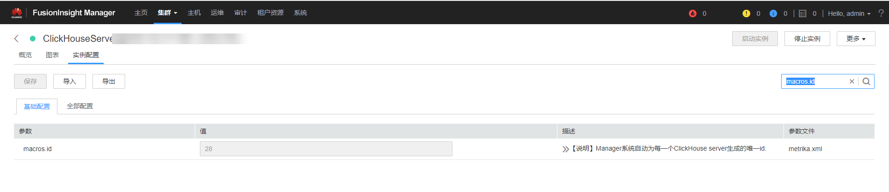

# ALM-45425 ClickHouse服务不可用

## 告警解释

告警模块按60秒周期检测ClickHouse实例状态，当检测到所有ClickHouse实例异常时，系统产生此告警。

当系统检测到任一ClickHouse实例恢复正常，且告警处理完成时，告警恢复。

## 告警属性

<table><thead align="left"><tr id="row5683496"><th class="cellrowborder" valign="top" width="33.33333333333333%" id="mcps1.1.4.1.1">
告警ID

</th>
<th class="cellrowborder" valign="top" width="33.33333333333333%" id="mcps1.1.4.1.2">
告警级别

</th>
<th class="cellrowborder" valign="top" width="33.33333333333333%" id="mcps1.1.4.1.3">
是否自动清除

</th>
</tr>
</thead>
<tbody><tr id="row60910108"><td class="cellrowborder" valign="top" width="33.33333333333333%" headers="mcps1.1.4.1.1 ">
45425

</td>
<td class="cellrowborder" valign="top" width="33.33333333333333%" headers="mcps1.1.4.1.2 ">
紧急

</td>
<td class="cellrowborder" valign="top" width="33.33333333333333%" headers="mcps1.1.4.1.3 ">
是

</td>
</tr>
</tbody>
</table>

## 告警参数

<table><thead align="left"><tr id="row40868022"><th class="cellrowborder" valign="top" width="50%" id="mcps1.1.3.1.1">
参数名称

</th>
<th class="cellrowborder" valign="top" width="50%" id="mcps1.1.3.1.2">
参数含义

</th>
</tr>
</thead>
<tbody><tr id="row594512751512"><td class="cellrowborder" valign="top" width="50%" headers="mcps1.1.3.1.1 ">
来源

</td>
<td class="cellrowborder" valign="top" width="50%" headers="mcps1.1.3.1.2 ">
产生告警的集群或系统名称

</td>
</tr>
<tr id="row31170320"><td class="cellrowborder" valign="top" width="50%" headers="mcps1.1.3.1.1 ">
服务名

</td>
<td class="cellrowborder" valign="top" width="50%" headers="mcps1.1.3.1.2 ">
产生告警的服务名称

</td>
</tr>
<tr id="row13127105964111"><td class="cellrowborder" valign="top" width="50%" headers="mcps1.1.3.1.1 ">
角色名

</td>
<td class="cellrowborder" valign="top" width="50%" headers="mcps1.1.3.1.2 ">
产生告警的角色名称

</td>
</tr>
<tr id="row722366124213"><td class="cellrowborder" valign="top" width="50%" headers="mcps1.1.3.1.1 ">
主机名

</td>
<td class="cellrowborder" valign="top" width="50%" headers="mcps1.1.3.1.2 ">
产生告警的主机名

</td>
</tr>
</tbody>
</table>

## 对系统的影响

ClickHouse服务异常，无法通过FusionInsight Manager对ClickHouse进行集群操作，无法使用ClickHouse服务功能。

## 可能原因

ClickHouse故障实例节点其组件配置目录下的**metrika.xml**配置信息和ZooKeeper中对应ClickHouse实例配置不一致。

## 处理步骤

**检查ClickHouse实例metrika.xml配置是否正常**

1.  登录FusionInsight Manager，选择“集群 \> 服务 \> ClickHouse \> 实例”，根据告警信息找到状态异常的ClickHouse实例。
    -   是，执行[2](#li237743710398)。
    -   否，执行[9](#li62779304563)。

2.  登录ClickHouse服务异常的实例主机节点，并通过**ping**其他正常ClickHouse实例节点IP的方式进行网络是否互通验证。
    -   是，执行[3](#li156597363713)。
    -   否，联系网络管理员修复网络。

1.  选择“集群 \> 服务 \> ClickHouse \> 实例”，在“角色”列下面单击对应异常的实例名称，选择“实例配置”，搜索框中搜索“macros.id”，找到当前实例macros.id对应的值。

    

2.  登录ZooKeeper客户端所在主机节点，执行以下命令登录ZooKeeper客户端工具。

    切换到客户端安装目录。

    **例如：cd /opt/client**

    执行以下命令配置环境变量。

    **source bigdata\_env**

    执行以下命令进行用户认证。\(普通模式跳过此步骤\)

    **kinit **_组件业务用户_

    执行以下命令登录客户端工具。

    **zkCli.sh -server **_ZooKeeper角色实例所在节点业务IP_**: **_clientPort_

3.  使用如下命令检查ClickHouse集群拓扑信息是否能正常获取到。

    **get /clickhouse/config/[3](#li156597363713)**_中的macros.id对应的值_**/metrika.xml**

    -   是，执行[6](#li1462431320505)。
    -   否，不能正常获取则执行[9](#li62779304563)。

1.  登录ClickHouse服务异常的实例主机节点，进入当前ClickHouse实例配置目录。

    **cd **$\{BIGDATA\_HOME\}**/FusionInsight\_ClickHouse\_**_版本号_**/**x\_x**\_ClickHouseServer/etc**

    **cat metrika.xml**

2.  检查[5](#li1377133713911)中获取的ZooKeeper上的集群拓扑信息是否与[6](#li1462431320505)中组件配置目录下的metrika.xml是否一致。
    -   是，如果确认告警还未恢复则执行[9](#li62779304563)。
    -   否，执行[8](#li113661428132312)。

3.  在FusionInsight Manager首页，选择“集群 \> 服务 \> ClickHouse \> 更多 \> 同步配置”，等待五分钟，查看服务状态是否良好，告警是否恢复。
    -   是，处理完毕。
    -   否，执行[9](#li62779304563)。

**收集故障信息**

1.  在FusionInsight Manager界面，选择“运维 \> 日志 \> 下载”。
2.  在“服务”中勾选待操作集群的“ClickHouse”。
3.  单击右上角的设置日志收集的“开始时间”和“结束时间”分别为告警产生时间的前后1小时，单击“下载”。
4.  请联系运维人员，并发送已收集的故障日志信息。

## 告警清除

此告警修复后，系统会自动清除此告警，无需手工清除。

## 参考信息

无

