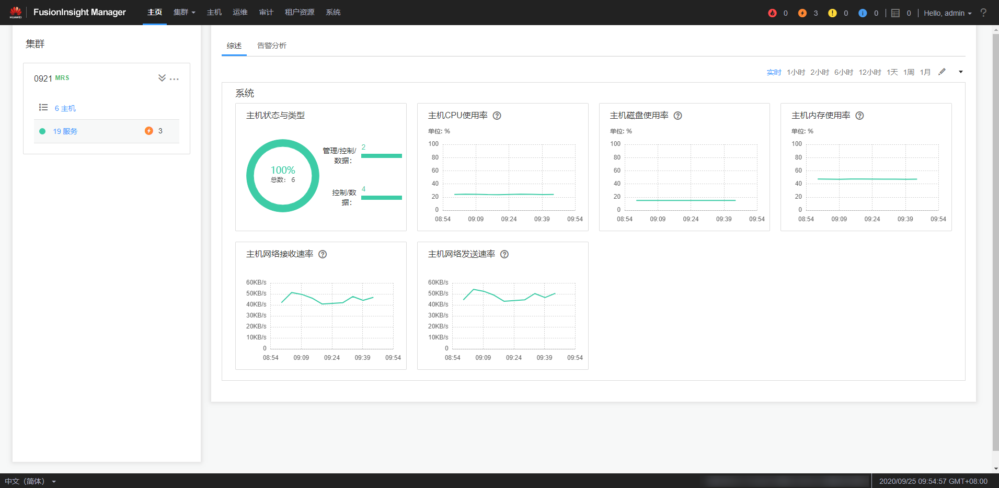

# FusionInsight Manager入门指导

## 概述

MRS为用户提供海量数据的管理及分析功能，快速从结构化和非结构化的海量数据中挖掘您所需要的价值数据。开源组件结构复杂，安装、配置、管理过程费时费力，使用FusionInsight Manager将为您提供企业级的集群的统一管理平台：

-   提供集群状态的监控功能，您能快速掌握服务及主机的运行状态。
-   提供图形化的指标监控及定制，您能及时的获取系统的关键信息。
-   提供服务属性的配置功能，满足您实际业务的性能需求。
-   提供集群、服务、角色实例的操作功能，满足您一键启停等操作需求。
-   提供权限管理及审计功能，您能设置访问控制及管理操作日志。

## 浏览器支持能力

-   Google Chrome

    推荐使用Google Chrome 90～92版本。

-   Microsoft Edge

    支持Windows 10系统自带的Microsoft Edge浏览器。

> **说明：** 
>推荐使用Windows平台的浏览器访问FusionInsight Manager。

## 系统界面简介

FusionInsight Manager提供统一的集群管理平台，帮助您快捷、直观的完成集群的运行维护。

**图 1**  FusionInsight Manager系统界面  

界面最上方为操作栏，中部为显示区，最下方为任务栏。

操作栏各操作入口的详细功能如[表1](#zh-cn_topic_0263899467_t2e8dff27d0214c0885ce9fa207af6953)所示。

**表 1**  界面操作入口功能描述

<table><thead align="left"><tr id="zh-cn_topic_0263899467_zh-cn_topic_0046736886_row34076345"><th class="cellrowborder" valign="top" width="24.240000000000002%" id="mcps1.2.3.1.1">
入口

</th>
<th class="cellrowborder" valign="top" width="75.76%" id="mcps1.2.3.1.2">
功能描述

</th>
</tr>
</thead>
<tbody><tr id="zh-cn_topic_0263899467_zh-cn_topic_0046736886_row38985771"><td class="cellrowborder" valign="top" width="24.240000000000002%" headers="mcps1.2.3.1.1 ">
主页

</td>
<td class="cellrowborder" valign="top" width="75.76%" headers="mcps1.2.3.1.2 ">
提供柱状图、折线图、表格等多种图表方式展示集群的主要监控指标、主机的状态统计。您可以定制关键监控信息面板，并拖动到任意位置。系统概览支持数据自动刷新，请参见<a href="主页.md#admin_guide_000006">主页</a>。

</td>
</tr>
<tr id="zh-cn_topic_0263899467_zh-cn_topic_0046736886_row50817438"><td class="cellrowborder" valign="top" width="24.240000000000002%" headers="mcps1.2.3.1.1 ">
集群

</td>
<td class="cellrowborder" valign="top" width="75.76%" headers="mcps1.2.3.1.2 ">
提供各集群内服务监控、服务操作向导以及服务配置，帮助您对服务进行统一管理。请参见<a href="集群.md#admin_guide_000009">集群</a>。

</td>
</tr>
<tr id="zh-cn_topic_0263899467_zh-cn_topic_0046736886_row59550034"><td class="cellrowborder" valign="top" width="24.240000000000002%" headers="mcps1.2.3.1.1 ">
主机

</td>
<td class="cellrowborder" valign="top" width="75.76%" headers="mcps1.2.3.1.2 ">
提供主机监控、主机操作向导，帮助您对主机进行统一管理。请参见<a href="主机.md#admin_guide_000049">主机</a>。

</td>
</tr>
<tr id="zh-cn_topic_0263899467_zh-cn_topic_0046736886_row44981334"><td class="cellrowborder" valign="top" width="24.240000000000002%" headers="mcps1.2.3.1.1 ">
运维

</td>
<td class="cellrowborder" valign="top" width="75.76%" headers="mcps1.2.3.1.2 ">
提供告警查询、告警处理指导功能。帮助您及时发现产品故障及潜在隐患，并进行定位排除，以保证系统正常运行。请参见<a href="运维-74.md#admin_guide_000068">运维</a>。

</td>
</tr>
<tr id="zh-cn_topic_0263899467_zh-cn_topic_0046736886_row22749082"><td class="cellrowborder" valign="top" width="24.240000000000002%" headers="mcps1.2.3.1.1 ">
审计

</td>
<td class="cellrowborder" valign="top" width="75.76%" headers="mcps1.2.3.1.2 ">
提供审计日志查询及导出功能。帮助您查阅所有用户活动及操作。请参见<a href="审计.md#admin_guide_000084">审计</a>。

</td>
</tr>
<tr id="zh-cn_topic_0263899467_zh-cn_topic_0046736886_row57767187"><td class="cellrowborder" valign="top" width="24.240000000000002%" headers="mcps1.2.3.1.1 ">
租户资源

</td>
<td class="cellrowborder" valign="top" width="75.76%" headers="mcps1.2.3.1.2 ">
提供统一租户管理平台。请参见<a href="租户资源.md#admin_guide_000087">租户资源</a>。

</td>
</tr>
<tr id="zh-cn_topic_0263899467_zh-cn_topic_0046736886_row128898"><td class="cellrowborder" valign="top" width="24.240000000000002%" headers="mcps1.2.3.1.1 ">
系统

</td>
<td class="cellrowborder" valign="top" width="75.76%" headers="mcps1.2.3.1.2 ">
提供对FusionInsight Manager的系统管理设置，例如用户权限设置。请参见<a href="系统设置.md#admin_guide_000134">系统设置</a>。

</td>
</tr>
</tbody>
</table>

