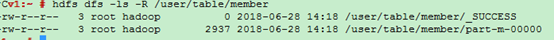

# HBase数据<a name="ZH-CN_TOPIC_0173178486"></a>

当前HBase上可以使用的数据备份主要有以下几种方式：

-   Snapshots
-   Replication
-   Export
-   CopyTable
-   HTable API
-   Offline backup of HDFS data

[表1](#table163113513341)分别从操作对集群的性能影响、数据空间消耗、业务中断影响、增量备份、易用性、可恢复性几个维度进行对比。

**表 1**  HBase上数据备份对比

<a name="table163113513341"></a>
<table><thead align="left"><tr id="row1051535113419"><th class="cellrowborder" valign="top" width="14.285714285714285%" id="mcps1.2.8.1.1"><p id="p10583523413"><a name="p10583523413"></a><a name="p10583523413"></a>备份方式</p>
</th>
<th class="cellrowborder" valign="top" width="14.285714285714285%" id="mcps1.2.8.1.2"><p id="p3523520344"><a name="p3523520344"></a><a name="p3523520344"></a><span>性能影响</span></p>
</th>
<th class="cellrowborder" valign="top" width="14.285714285714285%" id="mcps1.2.8.1.3"><p id="p185335173420"><a name="p185335173420"></a><a name="p185335173420"></a><span>数据空间消耗</span></p>
</th>
<th class="cellrowborder" valign="top" width="14.285714285714285%" id="mcps1.2.8.1.4"><p id="p051635113411"><a name="p051635113411"></a><a name="p051635113411"></a><span>业务中断影响</span></p>
</th>
<th class="cellrowborder" valign="top" width="14.285714285714285%" id="mcps1.2.8.1.5"><p id="p95203533415"><a name="p95203533415"></a><a name="p95203533415"></a><span>增量备份</span></p>
</th>
<th class="cellrowborder" valign="top" width="14.285714285714285%" id="mcps1.2.8.1.6"><p id="p45123533415"><a name="p45123533415"></a><a name="p45123533415"></a><span>易用性</span></p>
</th>
<th class="cellrowborder" valign="top" width="14.285714285714285%" id="mcps1.2.8.1.7"><p id="p10511359342"><a name="p10511359342"></a><a name="p10511359342"></a><span>可恢复性</span></p>
</th>
</tr>
</thead>
<tbody><tr id="row17512359346"><td class="cellrowborder" valign="top" width="14.285714285714285%" headers="mcps1.2.8.1.1 "><p id="p9523533413"><a name="p9523533413"></a><a name="p9523533413"></a><span>Snapshots</span></p>
</td>
<td class="cellrowborder" valign="top" width="14.285714285714285%" headers="mcps1.2.8.1.2 "><p id="p452358340"><a name="p452358340"></a><a name="p452358340"></a>低</p>
</td>
<td class="cellrowborder" valign="top" width="14.285714285714285%" headers="mcps1.2.8.1.3 "><p id="p554353343"><a name="p554353343"></a><a name="p554353343"></a>小</p>
</td>
<td class="cellrowborder" valign="top" width="14.285714285714285%" headers="mcps1.2.8.1.4 "><p id="p5573512345"><a name="p5573512345"></a><a name="p5573512345"></a>短暂中断（仅恢复时）</p>
</td>
<td class="cellrowborder" valign="top" width="14.285714285714285%" headers="mcps1.2.8.1.5 "><p id="p45183533415"><a name="p45183533415"></a><a name="p45183533415"></a>不支持</p>
</td>
<td class="cellrowborder" valign="top" width="14.285714285714285%" headers="mcps1.2.8.1.6 "><p id="p11573514347"><a name="p11573514347"></a><a name="p11573514347"></a>易</p>
</td>
<td class="cellrowborder" valign="top" width="14.285714285714285%" headers="mcps1.2.8.1.7 "><p id="p6503533416"><a name="p6503533416"></a><a name="p6503533416"></a>秒</p>
</td>
</tr>
<tr id="row2543512348"><td class="cellrowborder" valign="top" width="14.285714285714285%" headers="mcps1.2.8.1.1 "><p id="p1758357344"><a name="p1758357344"></a><a name="p1758357344"></a><span>Replication</span></p>
</td>
<td class="cellrowborder" valign="top" width="14.285714285714285%" headers="mcps1.2.8.1.2 "><p id="p155435113411"><a name="p155435113411"></a><a name="p155435113411"></a>低</p>
</td>
<td class="cellrowborder" valign="top" width="14.285714285714285%" headers="mcps1.2.8.1.3 "><p id="p35173510345"><a name="p35173510345"></a><a name="p35173510345"></a>大</p>
</td>
<td class="cellrowborder" valign="top" width="14.285714285714285%" headers="mcps1.2.8.1.4 "><p id="p13516356345"><a name="p13516356345"></a><a name="p13516356345"></a>无</p>
</td>
<td class="cellrowborder" valign="top" width="14.285714285714285%" headers="mcps1.2.8.1.5 "><p id="p175835183418"><a name="p175835183418"></a><a name="p175835183418"></a>固有</p>
</td>
<td class="cellrowborder" valign="top" width="14.285714285714285%" headers="mcps1.2.8.1.6 "><p id="p9633573417"><a name="p9633573417"></a><a name="p9633573417"></a>中</p>
</td>
<td class="cellrowborder" valign="top" width="14.285714285714285%" headers="mcps1.2.8.1.7 "><p id="p06173543418"><a name="p06173543418"></a><a name="p06173543418"></a>秒</p>
</td>
</tr>
<tr id="row10673518346"><td class="cellrowborder" valign="top" width="14.285714285714285%" headers="mcps1.2.8.1.1 "><p id="p4618353349"><a name="p4618353349"></a><a name="p4618353349"></a><span>Export</span></p>
</td>
<td class="cellrowborder" valign="top" width="14.285714285714285%" headers="mcps1.2.8.1.2 "><p id="p14633523417"><a name="p14633523417"></a><a name="p14633523417"></a>高</p>
</td>
<td class="cellrowborder" valign="top" width="14.285714285714285%" headers="mcps1.2.8.1.3 "><p id="p7178143817452"><a name="p7178143817452"></a><a name="p7178143817452"></a>大</p>
</td>
<td class="cellrowborder" valign="top" width="14.285714285714285%" headers="mcps1.2.8.1.4 "><p id="p048313275214"><a name="p048313275214"></a><a name="p048313275214"></a>无</p>
</td>
<td class="cellrowborder" valign="top" width="14.285714285714285%" headers="mcps1.2.8.1.5 "><p id="p136535143410"><a name="p136535143410"></a><a name="p136535143410"></a>支持</p>
</td>
<td class="cellrowborder" valign="top" width="14.285714285714285%" headers="mcps1.2.8.1.6 "><p id="p56123563411"><a name="p56123563411"></a><a name="p56123563411"></a>易</p>
</td>
<td class="cellrowborder" valign="top" width="14.285714285714285%" headers="mcps1.2.8.1.7 "><p id="p161835163418"><a name="p161835163418"></a><a name="p161835163418"></a>高</p>
</td>
</tr>
<tr id="row11673512348"><td class="cellrowborder" valign="top" width="14.285714285714285%" headers="mcps1.2.8.1.1 "><p id="p9616356342"><a name="p9616356342"></a><a name="p9616356342"></a><span>CopyTable</span></p>
</td>
<td class="cellrowborder" valign="top" width="14.285714285714285%" headers="mcps1.2.8.1.2 "><p id="p36173513342"><a name="p36173513342"></a><a name="p36173513342"></a>高</p>
</td>
<td class="cellrowborder" valign="top" width="14.285714285714285%" headers="mcps1.2.8.1.3 "><p id="p492039164512"><a name="p492039164512"></a><a name="p492039164512"></a>大</p>
</td>
<td class="cellrowborder" valign="top" width="14.285714285714285%" headers="mcps1.2.8.1.4 "><p id="p124347355216"><a name="p124347355216"></a><a name="p124347355216"></a>无</p>
</td>
<td class="cellrowborder" valign="top" width="14.285714285714285%" headers="mcps1.2.8.1.5 "><p id="p361435153417"><a name="p361435153417"></a><a name="p361435153417"></a>支持</p>
</td>
<td class="cellrowborder" valign="top" width="14.285714285714285%" headers="mcps1.2.8.1.6 "><p id="p176163516344"><a name="p176163516344"></a><a name="p176163516344"></a>易</p>
</td>
<td class="cellrowborder" valign="top" width="14.285714285714285%" headers="mcps1.2.8.1.7 "><p id="p15613503415"><a name="p15613503415"></a><a name="p15613503415"></a>高</p>
</td>
</tr>
<tr id="row126035133412"><td class="cellrowborder" valign="top" width="14.285714285714285%" headers="mcps1.2.8.1.1 "><p id="p1969352349"><a name="p1969352349"></a><a name="p1969352349"></a><span>HTable API</span></p>
</td>
<td class="cellrowborder" valign="top" width="14.285714285714285%" headers="mcps1.2.8.1.2 "><p id="p86193563416"><a name="p86193563416"></a><a name="p86193563416"></a>中</p>
</td>
<td class="cellrowborder" valign="top" width="14.285714285714285%" headers="mcps1.2.8.1.3 "><p id="p18859123934518"><a name="p18859123934518"></a><a name="p18859123934518"></a>大</p>
</td>
<td class="cellrowborder" valign="top" width="14.285714285714285%" headers="mcps1.2.8.1.4 "><p id="p685835175210"><a name="p685835175210"></a><a name="p685835175210"></a>无</p>
</td>
<td class="cellrowborder" valign="top" width="14.285714285714285%" headers="mcps1.2.8.1.5 "><p id="p18693583413"><a name="p18693583413"></a><a name="p18693583413"></a>支持</p>
</td>
<td class="cellrowborder" valign="top" width="14.285714285714285%" headers="mcps1.2.8.1.6 "><p id="p8617357341"><a name="p8617357341"></a><a name="p8617357341"></a>难</p>
</td>
<td class="cellrowborder" valign="top" width="14.285714285714285%" headers="mcps1.2.8.1.7 "><p id="p186183519346"><a name="p186183519346"></a><a name="p186183519346"></a>取决于用户</p>
</td>
</tr>
<tr id="row0613520347"><td class="cellrowborder" valign="top" width="14.285714285714285%" headers="mcps1.2.8.1.1 "><p id="p86193553417"><a name="p86193553417"></a><a name="p86193553417"></a><span>Offline backup of HDFS data</span></p>
</td>
<td class="cellrowborder" valign="top" width="14.285714285714285%" headers="mcps1.2.8.1.2 "><p id="p663351346"><a name="p663351346"></a><a name="p663351346"></a>-</p>
</td>
<td class="cellrowborder" valign="top" width="14.285714285714285%" headers="mcps1.2.8.1.3 "><p id="p06421840164515"><a name="p06421840164515"></a><a name="p06421840164515"></a>大</p>
</td>
<td class="cellrowborder" valign="top" width="14.285714285714285%" headers="mcps1.2.8.1.4 "><p id="p76535113411"><a name="p76535113411"></a><a name="p76535113411"></a>长时间中断</p>
</td>
<td class="cellrowborder" valign="top" width="14.285714285714285%" headers="mcps1.2.8.1.5 "><p id="p078352344"><a name="p078352344"></a><a name="p078352344"></a>不支持</p>
</td>
<td class="cellrowborder" valign="top" width="14.285714285714285%" headers="mcps1.2.8.1.6 "><p id="p117435173410"><a name="p117435173410"></a><a name="p117435173410"></a>中</p>
</td>
<td class="cellrowborder" valign="top" width="14.285714285714285%" headers="mcps1.2.8.1.7 "><p id="p187173513419"><a name="p187173513419"></a><a name="p187173513419"></a>高</p>
</td>
</tr>
</tbody>
</table>

## Snapshots<a name="section10872153821"></a>

对表执行snapshot操作生成快照，既可以作为原表的备份，当原表出现问题的时候可以回滚恢复，也可以作为跨集群的数据备份工具。执行快照会在当前HBase在HDFS上的根目录（默认为/hbase），生成” .hbase-snapshot”目录，里面有每个快照的详细信息。当执行ExportSnapshot导出快照时，会在本地提交MR任务，将快照信息以及表的HFile分别拷贝到备集群的/hbase/.hbase-snapshot和/hbase/archive中。详情请参考[http://hbase.apache.org/1.2/book.html\#ops.snapshots](http://hbase.apache.org/1.2/book.html#ops.snapshots)。

-   该方式数据备份的优点：

    单表备份效率高，在线数据本地/远程备份，不中断主集群和备集群业务，可以灵活配置map的个数和限制流量，MR的执行节点可不在主备集群（不占资源）。

-   该方式数据备份的缺点和限制：

    只能单表操作，备份的表名在snapshot中已经指定无法更改，且无法增量备份，跑MR需要占用本地集群资源。


**在主集群执行如下操作：**

1.  对表创建快照。例如对表member创建快照member\_snapshot。

    **snapshot 'member','member\_snapshot'**

2.  将快照拷贝到备集群上。

    **hbase org.apache.hadoop.hbase.snapshot.ExportSnapshot -snapshot  _member\_snapshot_  -copy-to hdfs://_备集群HDFS服务主NameNode节点IP:端口号_/hbase -mappers 3**

    -   备集群的数据目录必须为HBASE根目录（/hbase）
    -   mappers表示MR任务需要提交的map个数


**在备集群执行如下操作：**

使用restore命令在备集群自动新建表，以及与archive里的HFile建立link。

**restore\_snapshot 'member\_snapshot'**

> **说明：**   
>如果只是备份表数据的话，建议使用此种方式备份，SnapshotExport会在本地提交MR任务，将Snapshot和HFile拷贝到备集群，之后可以在备集群直接加载数据，效率比其他方式高很多。  

## Replication<a name="section89271613822"></a>

Replication备份是在HBase上建立主备集群的容灾关系，当数据写入主集群，主集群通过WAL来主动push数据到备集群上，从而达到主备集群的实时同步。详情请参考[http://hbase.apache.org/1.2/book.html\#\_cluster\_replication](http://hbase.apache.org/1.2/book.html#_cluster_replication)。

-   该方式数据备份的优点：
    -   使用replication有有别于其他几种数据备份导入方式，当配置了集群间的主备关系后，数据可以实时同步（无需人为操作）。
    -   相对而言，“备份”的动作占用集群的资源较少，对集群的性能影响小。
    -   数据同步可靠性较高，如果备集群停止一段时间后再恢复，这中间主机群的数据依然会同步到备集群。

-   该方式数据备份的缺点和限制：
    -   如果客户端写入的数据设置不写WAL，则数据无法备份到备集群。
    -   由于占用的资源少，后台是通过异步的方式同步数据，实际数据没有实时同步。
    -   对于开启表replication同步之前，主集群就已经存在的数据无法同步，需要借助其他方式导入的备集群。
    -   bulkload方式写入到主集群的数据无法同步（MRS上的HBase对replication做了增强，支持bulkload on replication）。


具体的使用和配置方法请参考[配置HBase备份](配置HBase备份.md)和[使用ReplicationSyncUp工具](使用ReplicationSyncUp工具.md)来进行备份数据。

## Export/Import<a name="section7110183416220"></a>

Export/Import主要是启动MR任务对数据的表进行扫描（scan），往远端HDFS写入SequenceFile，之后Import再把SequenceFile读出来写入HBase（put）中。

-   该方式数据备份的优点：

    在线拷贝不中断业务，由于是scan-\>put的方式写入新表，所以比CopyTable更加灵活，可灵活配置需要获取的数据，数据可增量写入。

-   该方式数据备份的缺点和限制：

    由于Export是通过MR任务往远端HDFS写入SequenceFile，之后Import再把SequenceFile读出来写入HBase，需要跑两次MR任务，实际效率不高。


**在主集群执行如下操作：**

执行Export命令导出表。

**hbase org.apache.hadoop.hbase.mapreduce.Export <tablename\> <outputdir\>**

例如：**hbase org.apache.hadoop.hbase.mapreduce.Export member hdfs://_备集群HDFS服务主NameNode节点IP:端口号_/user/table/member**

其中，member为待导出表的名称。

**在备集群执行如下操作：**

1.  主集群执行完之后可以在备集群上查看生成的目录数据如[图1](#fig148041121174318)。

    **图 1**  目录数据<a name="fig148041121174318"></a>  
    

2.  执行**create**命令在备集群上新建与主集群相同结构的表，例如member\_import。
3.  <a name="li186481362121"></a>执行Import命令生成HFile数据在HDFS上。

    **hbase org.apache.hadoop.hbase.mapreduce.Import <tablename\> <inputdir\>**

    例如：**hbase org.apache.hadoop.hbase.mapreduce.Import member\_import /user/table/member -Dimport.bulk.output=/tmp/member**

    -   member\_import为备集群上与主集群相同表结构的表
    -   Dimport.bulk.output为输出的HFile数据目录
    -   /user/table/member为从主集群上导出的数据目录

4.  执行Load操作将HFile数据写入HBase。

    **hbase org.apache.hadoop.hbase.mapreduce.LoadIncrementalHFiles /tmp/member member**

    -   /tmp/member为[3](#li186481362121)中HFile数据的输出目录
    -   member为备集群上要导入数据的表名


## CopyTable<a name="section127307364320"></a>

拷贝表功能导出功能类似，拷贝表也使用HBase API创建了一个MR任务，以便从源表读取数据。不同的地方是拷贝表的输出是hbase中的另一张表，这张表可以在本地集群，也可以在远程集群。详情请参考[http://hbase.apache.org/1.2/book.html\#copy.table](http://hbase.apache.org/1.2/book.html#copy.table)。

-   该方式数据备份的优点：

    操作简单，在线拷贝不中断业务，可以指定备份数据的startrow/endrow/timestamp。

-   该方式数据备份的缺点和限制：

    只能单表操作，远程拷贝数据量大时效率较低，MR需要占用本地资源，MR的map个数以表region的个数划分。


**在备集群执行如下操作：**

执行**create**命令在备集群上新建与主集群相同结构的表，例如member\_copy。

**在主集群执行如下操作：**

执行CopyTable的命令拷贝表。

**hbase org.apache.hadoop.hbase.mapreduce.CopyTable \[--starttime=xxxxxx\] \[--endtime=xxxxxx\] --new.name=member\_copy --peer.adr=server1,server2,server3:2181:/hbase \[--families=myOldCf:myNewCf,cf2,cf3\] TestTable**

-   starttime/endtime为待拷贝数据的时间戳
-   new.name为备集群中目的表的表名，缺省为和原来表名相同
-   peer.adr为备集群zookeeper节点的信息，格式为quorumer:port:/hbase
-   families为待拷贝的表的family列

> **说明：**   
>如果是拷贝数据到远端集群，此种方式导入数据会在主机群上提交MR任务，读取原始表的全量/部分数据之后采用put的方式写入远端集群，所以如果表的数据量很大（远程拷贝不支持bulkload），则效率会比较低。  

## HTable API<a name="section2256213648"></a>

API的方式主要也是在代码中对原始HBase表的数据导入导出，你可以使用公用的API写自己定制的客户端应用程序来直接查询表格，或通过MR任务的批量处理优势自己设计其他方法。该方式需要对Hadoop开发以及因此对生产集群带来的影响有深入的理解。应用程序开发详情请参考[MRS开发指南](https://support.huaweicloud.com/devg-mrs/mrs_06_0001.html)。

## Offline backup of HDFS data<a name="section62861113447"></a>

离线备份HDFS数据，即关闭HBase服务并手工在HDFS上拷贝数据。

-   该方式数据备份的优点：
    -   简单暴力，可以一下子把主集群上所有数据（包含元数据）整个复制到备集群。
    -   由于是通过distcp直接拷贝的，所以数据备份的效率相对较高。

    -   实际操作时可以根据具体的需求灵活拷贝，可以只拷贝其中一个表的数据，也可以拷贝region中的其中一个hfile等。

-   该方式数据备份的缺点和限制：
    -   此操作对备集群上的HDFS的数据目录会有破坏性（整个覆盖了）。
    -   如果主备集群间的HBase版本不同，HDFS目录直接拷贝可能会出现问题，例如MRS上的hbase1.3版本新增了系统表index，如果使用老版本的HDFS目录直接覆盖，会找不到该数据表。所以此种方案在执行前需要慎重考虑。
    -   此操作对用户使用HBase的能力有一定的要求，如出现异常情况需要根据实际情况执行恢复。


**在主集群执行如下操作：**

1.  执行如下命令将当前集群内存中的数据持久化到HDFS中。

    **flush 'tableName'**

2.  停止HBase服务。
3.  使用distcp命令拷贝当前集群HDFS上的数据到备集群上。

    **hadoop distcp -i /hbase/data  hdfs://_备集群HDFS服务主NameNode节点IP:端口号_/hbase**

    **hadoop distcp –update –append –delete /hbase/  hdfs://_备集群HDFS服务主NameNode节点IP:端口号_/hbase/**

    第二条命令为增量拷贝除了data目录以外的文件，例如archive里面的数据可能还有被数据目录所引用。


**在备集群执行如下操作：**

1.  重启HBase服务，使数据迁移生效。在启动过程中，HBase会加载当前HDFS上的数据并重新生成元数据。
2.  启动完成后，在Master节点客户端执行如下命令加载HBase表数据。

    ```
    $HBase_Home/bin/hbase hbck -fixMeta -fixAssignments
    ```

3.  命令执行完成后，重复执行如下命令查看HBase集群健康状态直至正常。

    ```
    hbase hbck
    ```

    > **说明：**   
    >当用户使用了HBase协处理器，自定义jar包放在主集群的regionserver/hmaster上时，在备集群重启HBase之前，需要把这些自定义jar包也拷贝过来。  


