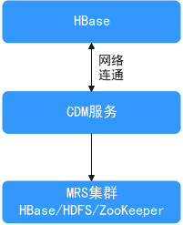
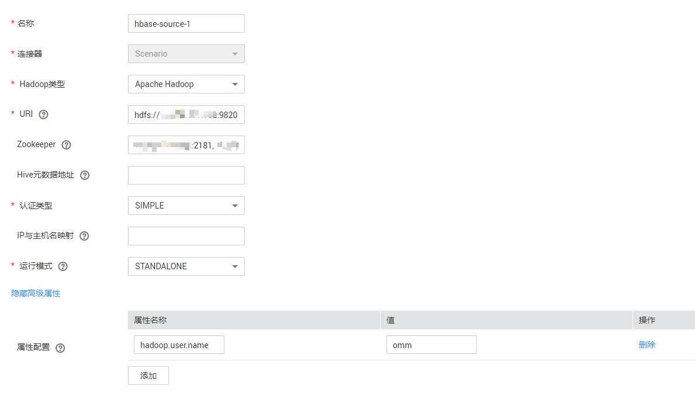
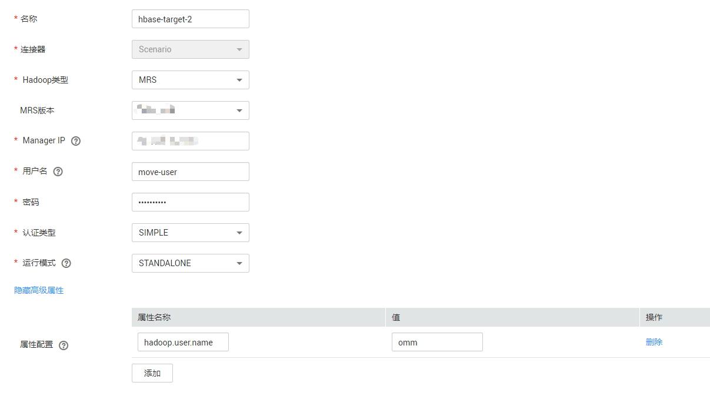
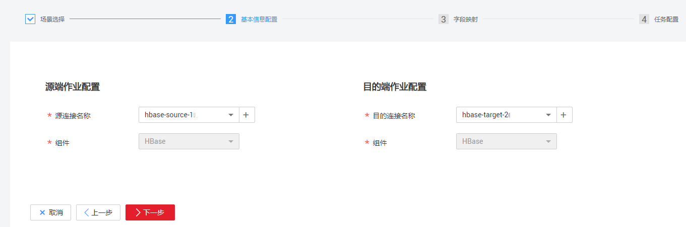
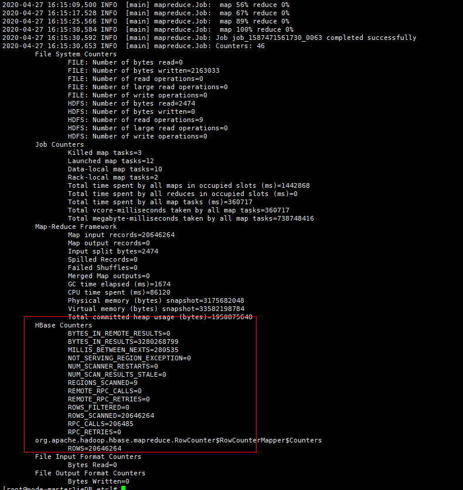
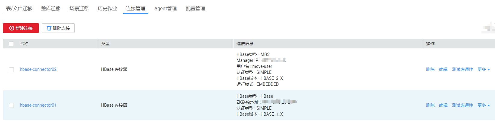
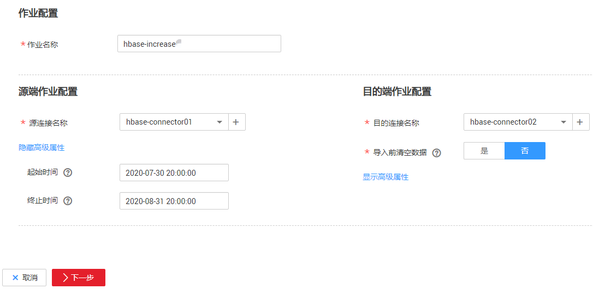

# HBase数据迁移到华为云MRS服务

## 场景介绍

本章节适用于将线下IDC机房或者公有云HBase集群中的数据（支持数据量在几十TB级别或以下的数据量级）迁移到华为云MRS服务。本章节以通过[华为云CDM服务](https://support.huaweicloud.com/productdesc-cdm/cdm_01_0143.html)进行数据迁移为例介绍。

**图 1**  HBase数据迁移示意  

Hbase会把数据存储在HDFS上，主要包括Hfile文件和WAL文件，由配置项hbase.rootdir指定在HDFS上的路径，华为云MRS的默认存储位置是/hbase文件夹下。

HBase自带的一些机制和工具命令也可以实现数据搬迁，例如：通过导出Snapshots快照，Export/Import，CopyTable方式等，可以参考Apache官网。

本文主要介绍通过华为云CDM云迁移服务进行HBase数据搬迁。

## 方案优势

场景化迁移通过迁移快照数据然后再恢复表数据的方法，能大大提升迁移效率。

## 全量数据迁移

1.  登录CDM管理控制台。
2.  [创建CDM集群](https://support.huaweicloud.com/usermanual-cdm/cdm_01_0018.html)，该CDM集群的安全组、虚拟私有云、子网需要和迁移目的端集群保持一致，保证CDM集群和MRS集群之间网络互通。
3.  在“集群管理”页面单击待操作集群对应“操作”列的“作业管理”。
4.  在“连接管理”页签，单击“新建连接”，连接器类型选择“场景迁移”。
5.  参考[CDM服务的新建连接](https://support.huaweicloud.com/usermanual-cdm/cdm_01_0023.html)页面，添加到迁移源端集群的连接，其中Hadoop类型选择“Apache Hadoop”。

    > **说明：** 
    >（可选）HBase迁移建议使用高权限用户，例如： 单击“显示高级属性”，新增迁移所需用户“hadoop.user.name = 用户名（如**omm**用户）”。

    **图 2**  到迁移源端集群的连接  
    

6.  在“连接管理”页签，单击“新建连接”，连接器类型选择“场景迁移”。
7.  参考[CDM服务的新建连接](https://support.huaweicloud.com/usermanual-cdm/cdm_01_0023.html)页面，添加到迁移目的端集群的连接，其中Hadoop类型选择“MRS”。

    > **说明：** 
    >（可选）HBase迁移建议使用高权限用户，例如： 单击“显示高级属性”，新增迁移所需用户“hadoop.user.name = 用户名（如**omm**用户）”。

    **图 3**  到迁移目的端集群的连接  
    

8.  选择“作业管理”的“场景迁移”页签，单击“新建作业”。
9.  进入作业参数配置界面。配置作业名称并选择迁移场景为“HBase快速迁移”。
10. 配置源端作业和目的端作业参数，并单击“下一步”。

    **图 4**  HBase作业配置  
    

11. 选择要迁移的数据表， 并单击“下一步”。
12. 进入任务配置页面，不做修改，直接单击“保存”。
13. 选择“作业管理”的“场景迁移”页签，在待运行作业的“操作”列单击“运行”，即可开始HBase数据迁移。
14. 迁移完成后，可以在目的端集群和源端集群，通过同样的查询语句，对比查询结果进行验证。

    例如：

    -   在目的端集群和源端集群上通过查询BTable表的记录数来确认数据条数是否一致，添加--endtime参数主要排除迁移期间源端集群上有数据更新的影响。

        **Hbase  org.apache.hadoop.hbase.mapreduce.RowCounter BTable --endtime=1587973835000**

        **图 5**  查询BTable表的记录数  
        

    -   通过HBase shell的**scan ' BTable ', \{TIMERANGE=\>\[1587973235000, 1587973835000\]\} **查询指定时间段内的数据进行对比。

## 增量数据迁移

在业务割接前，如果源端集群上有新增数据，需要定期将新增数据搬迁到目的端集群。一般每天更新的数据量在GB级别可以使用CDM的“整库迁移”指定时间段的方式每天进行HBase新增数据迁移。

当前使用CDM的“整库迁移”功能时的限制：如果源HBase集群中被删除操作的数据无法同步到目的端集群上。

“场景迁移”的HBase连接器不能与“整库迁移”共用，因此需要单独配置“HBase”连接器。

1.  参考[全量数据迁移](#section1470163110271)的[1](#li10411556193816)\~[7](#li10355441141317)步骤新增两个“HBase”连接器，选择连接器类型时分别为源端集群和目的端集群选择“MRS HBase”和“Apache HBase”。

    **图 6**  HBase增量迁移连接  
    

2.  选择“作业管理”的“整库迁移”页签，单击“新建作业”。
3.  进入作业参数配置界面，作业相关信息配置完成后单击“下一步”。

    -   作业名称：用户自定义作业名称，例如hbase-increase。
    -   源端作业配置：源连接名称请选择[1](#li31322315377)中创建的到源端集群的连接名称，并展开高级属性配置迁移数据的时间段。
    -   目的端作业配置：目的连接名称请选择[1](#li31322315377)中创建的到目的端集群的连接名称，其他不填写。

    **图 7**  HBase增量迁移作业配置  
    

4.  选择要迁移的数据表， 并单击“保存”。
5.  选择“作业管理”的“整库迁移”页签，在待运行作业的“操作”列单击“运行”，即可开始HBase数据增量迁移。

