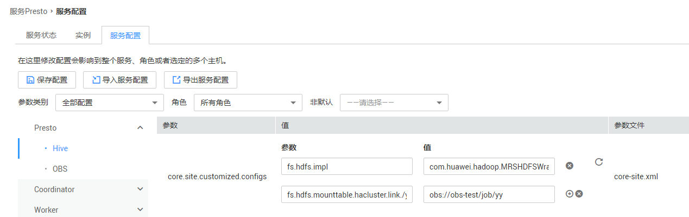
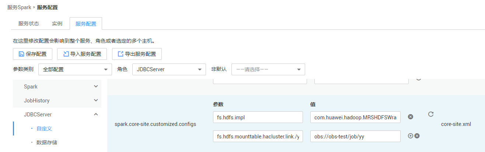

# HDFS地址映射方式访问OBS<a name="ZH-CN_TOPIC_0211887922"></a>

通过HDFS地址映射到OBS地址的方式，支持将HDFS中的数据迁移到OBS后，不需要变动业务逻辑中的数据地址，即可完成数据访问。

例如将HDFS文件系统的数据迁移到OBS服务中，通过使用HDFS地址映射功能简单配置即可实现客户端无需修改自己的的业务代码逻辑的情况下，访问存储到OBS的数据。或将元数据信息从HDFS文件系统部分迁移到OBS服务中，通过使用HDFS地址映射功能简单配置即可实现既能访问存储在OBS的数据也能访问存储在HDFS文件系统的数据。

## 通过Hadoop客户端命令操作HDFS（/path方式或hdfs://namespace/path方式）<a name="section921111193114"></a>

1.  登录Master节点。
2.  执行如下命令编辑HDFS用到的core-site.xml文件。

    **vim /opt/client/HDFS/hadoop/etc/hadoop/core-site.xml**

3.  在core-site.xml文件中增加如下内容。

    ```
    <property>
    <name>fs.hdfs.mounttable.hacluster.link./var</name>
    <value>obs://obs-test/job/yy</value>
    </property>
    <property>
    <name>fs.hdfs.impl</name>
    <value>com.huawei.hadoop.MRSHDFSWrapperFileSystem</value>
    </property>
    <property>
    <name>fs.obs.endpoint</name>
    <value>obs endpoint</value>
    </property>
    ```

    > **说明：**   
    >-   **hacluster**为core-site.xml配置中fs.defaultFS的值的namespace，若修改了默认fs.defaultFS配置的namespace，**hacluster**修改对应的值即可。  
    >-   **obs://obs-test/job/yy**为待访问的数据在OBS桶中的目录，请根据实际值修改。  
    >-   **obs endpoint**为OBS对应的endpoint，具体请从[终端节点及区域](https://developer.huaweicloud.com/endpoint?OBS)获取。  

4.  使用**hdfs://namespace/**方式访问数据。

    **hadoop fs -mkdir -p hdfs://hacluster/var/test**

    **hadoop fs -put abc.txt hdfs://hacluster/var/test/**

    **hadoop fs -ls hdfs://hacluster/var/test**

5.  使用hadoop命令行（不加namespace）方式访问数据。

    **hadoop fs -mkdir -p /var/test**

    **hadoop fs -put abc.txt /var/test/**

    **hadoop fs -ls /var/test**


## 通过Hadoop客户端命令操作HDFS（hdfs://namenodeIp:port/path）<a name="section121915376510"></a>

1.  登录Master节点。
2.  执行如下命令编辑HDFS用到的core-site.xml文件。

    **vim /opt/client/HDFS/hadoop/etc/hadoop/core-site.xml**

3.  在core-site.xml文件中增加如下内容。

    ```
    <property>
    <name>fs.hdfs.mounttable.hacluster.link./var</name>
    <value>obs://obs-test/job/yy</value>
    </property>
    <property>
    <name>fs.hdfs.mounttable.namenodeIp1:port.link./var</name>
    <value>obs://obs-test/job/yy</value>
    </property>
    <property>
    <name>fs.hdfs.mounttable.namenodeIp2:port.link./var</name>
    <value>obs://obs-test/job/yy</value>
    </property>
    <property>
    <name>fs.hdfs.impl</name>
    <value>com.huawei.hadoop.MRSHDFSWrapperFileSystem</value>
    </property>
    <property>
    <name>fs.obs.endpoint</name>
    <value>obs endpoint</value>
    </property>
    ```

    > **说明：**   
    >-   **hacluster**为core-site.xml配置中fs.defaultFS的值的namespace，若修改了默认fs.defaultFS配置的namespace，**hacluster**修改对应的值即可。  
    >-   **obs://obs-test/job/yy**为待访问的数据在OBS桶中的目录，请根据实际值修改。  
    >-   **obs endpoint**为OBS对应的endpoint，具体请从[终端节点及区域](https://developer.huaweicloud.com/endpoint?OBS)获取。  
    >-   **namenodeIp**为HDFS的NameNode实例的IP地址，**port**为HDFS的NameNode RPC端口号，默认值为9820，所有NameNode实例的IP地址均需配置在core-site.xml文件中。  


## 通过Hadoop客户端命令执行MR作业<a name="section199281166203"></a>

1.  登录Master节点。
2.  执行如下命令编辑HDFS用到的core-site.xml文件。

    **vim /opt/client/HDFS/hadoop/etc/hadoop/core-site.xml**

3.  在core-site.xml文件中增加如下内容。

    ```
    <property>
    <name>fs.hdfs.mounttable.hacluster.link./var</name>
    <value>obs://obs-test/job/yy</value>
    </property>
    <property>
    <name>fs.hdfs.impl</name>
    <value>com.huawei.hadoop.MRSHDFSWrapperFileSystem</value>
    </property>
    <property>
    <name>fs.obs.endpoint</name>
    <value>obs endpoint</value>
    </property>
    ```

    > **说明：**   
    >-   **hacluster**为core-site.xml配置中fs.defaultFS的值的namespace，若修改了默认fs.defaultFS配置的namespace，**hacluster**修改对应的值即可。  
    >-   **obs://obs-test/job/yy**为待访问的数据在OBS桶中的目录，请根据实际值修改。  
    >-   **obs endpoint**为OBS对应的endpoint，具体请从[终端节点及区域](https://developer.huaweicloud.com/endpoint?OBS)获取。  

4.  执行如下命令编辑yarn用到的core-site.xml文件。

    **vim /opt/client/Yarn/config/core-site.xml**

5.  在core-site.xml文件中增加如下内容。

    ```
    <property>
    <name>fs.hdfs.mounttable.hacluster.link./var</name>
    <value>obs://obs-test/job/yy</value>
    </property>
    <property>
    <name>fs.hdfs.impl</name>
    <value>com.huawei.hadoop.MRSHDFSWrapperFileSystem</value>
    </property>
    <property>
    <name>fs.obs.endpoint</name>
    <value>obs endpoint</value>
    </property>
    ```

    > **说明：**   
    >-   **hacluster**为core-site.xml配置中fs.defaultFS的值的namespace，若修改了默认fs.defaultFS配置的namespace，**hacluster**修改对应的值即可。  
    >-   **obs://obs-test/job/yy**为待访问的数据在OBS桶中的目录，请根据实际值修改。  
    >-   **obs endpoint**为OBS对应的endpoint，具体请从[终端节点及区域](https://developer.huaweicloud.com/endpoint?OBS)获取。  


## 通过hive beeline jdbc访问HDFS数据<a name="section1580765733215"></a>

前提条件：

-   集群默认的文件系统是HDFS。即fs.defaultFS的配置项是**hdfs：//**开始。
-   集群已配置默认委托，可参考如下步骤配置。
    1.  在集群详情页的“概览”页签，单击委托右侧的选择并绑定MRS\_ECS\_DEFAULT\_AGENCY委托。
    2.  在“节点管理”页签单击所有的节点名称，进入弹性云服务器详情页面，确保所有节点均已绑定MRS\_ECS\_DEFAULT\_AGENCY委托。


具体配置：

1.  在集群详情页，选择“组件管理”页签。

    > **说明：**   
    >-   若集群详情页面没有“组件管理”页签，请先完成IAM用户同步（在集群详情页的“概览”页签，单击“IAM用户同步“右侧的进行IAM用户同步）。  
    >-   针对MRS 2.0.1及之前版本，登录MRS Manager页面，具体请参见[访问MRS Manager](访问MRS-Manager.md)，然后选择“服务管理”。  

2.  选择“Hive \> 服务配置”。
3.  参数类别设置为“全部配置”。
4.  在“Hive \> 自定义”的“core.site.customized.configs”中增加如下配置。

    -   fs.hdfs.impl = com.huawei.hadoop.MRSHDFSWrapperFileSystem
    -   fs.hdfs.mounttable.hacluster.link./yy = obs://obs-test/job/yy

        > **说明：**   
        >-   **hacluster**为core-site.xml配置中fs.defaultFS的值的namespace，若修改了默认fs.defaultFS配置的namespace，**hacluster**修改对应的值即可。  
        >-   **obs://obs-test/job/yy**为待访问的数据在OBS桶中的目录，请根据实际值修改。  
        >-   映射的键”.link”字符串后的目录不能使用如下在Hive启动过程中使用的目录及其子目录。  
        >    -   /tmp/hive-scratch  
        >    -   /tmp/hive  
        >    -   /apps  
        >    -   /datasets  
        >    -   /mrs  
        >    -   /user  


    **图 1**  Hive自定义配置<a name="fig633732712259"></a>  
    

5.  单击“保存配置”，并勾选“重新启动受影响的服务或实例。”重启Hive服务。

## 通过presto\_cli.sh jdbc访问HDFS数据<a name="section1565512587343"></a>

前提条件：

-   集群默认的文件系统是HDFS。即fs.defaultFS的配置项是**hdfs：//**开始。
-   集群已配置默认委托，可参考如下步骤配置。
    1.  在集群详情页的“概览”页签，单击委托右侧的选择并绑定MRS\_ECS\_DEFAULT\_AGENCY委托。
    2.  在“节点管理”页签单击所有的节点名称，进入弹性云服务器详情页面，确保所有节点均已绑定MRS\_ECS\_DEFAULT\_AGENCY委托。


具体配置：

1.  在集群详情页，选择“组件管理”页签。

    > **说明：**   
    >-   若集群详情页面没有“组件管理”页签，请先完成IAM用户同步（在集群详情页的“概览”页签，单击“IAM用户同步“右侧的进行IAM用户同步）。  
    >-   针对MRS 2.0.1及之前版本，登录MRS Manager页面，具体请参见[访问MRS Manager](访问MRS-Manager.md)，然后选择“服务管理”。  

2.  选择“Presto \> 服务配置”。
3.  参数类别设置为“全部配置”。
4.  在“Presto \> Hive”的“core.site.customized.configs”中增加如下配置。

    -   fs.hdfs.impl = com.huawei.hadoop.MRSHDFSWrapperFileSystem
    -   fs.hdfs.mounttable.hacluster.link./yy = obs://obs-test/job/yy
    -   为使用虚拟机的用户增加如下对应配置：

        -   若使用root用户访问数据：fs.hdfs.mounttable.hacluster.link./tmp/presto-root = obs://obs-test/job/presto\_root/
        -   若使用omm用户访问数据：fs.hdfs.mounttable.hacluster.link./tmp/presto-omm = obs://obs-test/job/presto\_omm/
        -   若使用其他用户访问数据，替换对应用户名即可：fs.hdfs.mounttable.hacluster.link./tmp/presto-\{用户名\} = obs://obs-test/job/presto\_\{用户名\}/

        **图 2**  Presto配置<a name="fig7853193375613"></a>  
        

    > **说明：**   
    >-   **hacluster**为core-site.xml配置中fs.defaultFS的值的namespace，若修改了默认fs.defaultFS配置的namespace，**hacluster**修改对应的值即可。  
    >-   **obs://obs-test/job/yy**为待访问的数据在OBS桶中的目录，请根据实际值修改。  

5.  单击“保存配置”，并勾选“重新启动受影响的服务或实例。”重启Presto服务。

## 通过MRS服务安装的组件flink提交作业<a name="section215814228817"></a>

1.  在集群详情页，选择“组件管理”页签。

    > **说明：**   
    >-   若集群详情页面没有“组件管理”页签，请先完成IAM用户同步（在集群详情页的“概览”页签，单击“IAM用户同步“右侧的进行IAM用户同步）。  
    >-   针对MRS 2.0.1及之前版本，登录MRS Manager页面，具体请参见[访问MRS Manager](访问MRS-Manager.md)，然后选择“服务管理”。  

2.  选择“Yarn \> 服务配置”。
3.  参数类别设置为“全部配置”。
4.  在“Yarn \> 自定义”的“yarn.core-site.customized.configs”中增加如下配置。

    -   fs.hdfs.impl = com.huawei.hadoop.MRSHDFSWrapperFileSystem
    -   fs.hdfs.mounttable.hacluster.link./yy = obs://obs-test/job/yy

    **图 3**  Flink配置<a name="fig838095797"></a>  
    

    > **说明：**   
    >-   **hacluster**为core-site.xml配置中fs.defaultFS的值的namespace，若修改了默认fs.defaultFS配置的namespace，**hacluster**修改对应的值即可。  
    >-   **obs://obs-test/job/yy**为待访问的数据在OBS桶中的目录，请根据实际值修改。  

5.  单击“保存配置”，并勾选“重新启动受影响的服务或实例。”重启Yarn服务。

## 提交Spark作业或者执行Spark SQL<a name="section1354662433714"></a>

1.  登录Master节点。
2.  执行如下命令编辑Spark用到的core-site.xml文件。

    **vim /opt/client/Spark/spark/conf/core-site.xml**

3.  在core-site.xml文件中增加如下内容。

    ```
    <property>
    <name>fs.hdfs.mounttable.hacluster.link./yy</name>
    <value>obs://obs-test/job/yy</value>
    </property>
    <property>
    <name>fs.hdfs.impl</name>
    <value>com.huawei.hadoop.MRSHDFSWrapperFileSystem</value>
    </property>
    ```

    > **说明：**   
    >-   **hacluster**为core-site.xml配置中fs.defaultFS的值的namespace，若修改了默认fs.defaultFS配置的namespace，**hacluster**修改对应的值即可。  
    >-   **obs://obs-test/job/yy**为待访问的数据在OBS桶中的目录，请根据实际值修改。  


## 通过spark beeline jdbc访问HDFS数据<a name="section8988194311315"></a>

前提条件：

-   集群默认的文件系统是HDFS。即fs.defaultFS的配置项是**hdfs：//**开始。
-   集群已配置默认委托，可参考如下步骤配置。
    1.  在集群详情页的“概览”页签，单击委托右侧的选择并绑定MRS\_ECS\_DEFAULT\_AGENCY委托。
    2.  在“节点管理”页签单击所有的节点名称，进入弹性云服务器详情页面，确保所有节点均已绑定MRS\_ECS\_DEFAULT\_AGENCY委托。


具体配置：

1.  在集群详情页，选择“组件管理”页签。

    > **说明：**   
    >-   若集群详情页面没有“组件管理”页签，请先完成IAM用户同步（在集群详情页的“概览”页签，单击“IAM用户同步“右侧的进行IAM用户同步）。  
    >-   针对MRS 2.0.1及之前版本，登录MRS Manager页面，具体请参见[访问MRS Manager](访问MRS-Manager.md)，然后选择“服务管理”。  

2.  选择“Spark \> 服务配置”。
3.  参数类别设置为“全部配置”，角色设置为“JDBCServer”。
4.  在“JDBCServer \> 自定义”的“spark.core-site.customized.configs”中增加如下配置。

    -   fs.hdfs.impl = com.huawei.hadoop.MRSHDFSWrapperFileSystem
    -   fs.hdfs.mounttable.hacluster.link./yy = obs://obs-test/job/yy

    **图 4**  Spark配置<a name="fig1861054712520"></a>  
    

    > **说明：**   
    >-   **hacluster**为core-site.xml配置中fs.defaultFS的值的namespace，若修改了默认fs.defaultFS配置的namespace，**hacluster**修改对应的值即可。  
    >-   **obs://obs-test/job/yy**为待访问的数据在OBS桶中的目录，请根据实际值修改。  

5.  单击“保存配置”，并勾选“重新启动受影响的服务或实例。”重启Spark服务。

