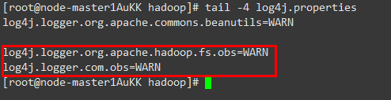

# HDFS客户端对接OBS文件系统

使用本章节前已参考[配置存算分离集群（委托方式）](配置存算分离集群（委托方式）.md)或[配置存算分离集群（AKSK方式）](配置存算分离集群（AKSK方式）.md)完成存算分离集群配置。

1.  以客户端安装用户登录安装了HDFS客户端的节点。
2.  执行以下命令，切换到客户端安装目录。

    **cd $\{client\_home\}**

3.  执行以下命令配置环境变量。

    **source bigdata\_env**

4.  如果集群为安全模式，执行以下命令进行用户认证。普通模式集群无需执行用户认证。

    **kinit **_组件业务用户_

5.  在hdfs命令行显式添加要访问的OBS文件系统。

    例如：可以使用以下命令访问OBS文件系统。

    **hdfs dfs -ls obs://**_OBS并行文件系统名称_/_路径_

> **说明：** 
>OBS文件系统打印大量日志可能导致读写性能受影响，可通过调整OBS客户端日志级别优化，日志调整方式如下：
>**cd $\{client\_home\}/HDFS/hadoop/etc/hadoop**
>**vi  log4j.properties**
>在文件中添加OBS日志级别配置
>**log4j.logger.org.apache.hadoop.fs.obs=WARN**
>**log4j.logger.com.obs=WARN**
>

