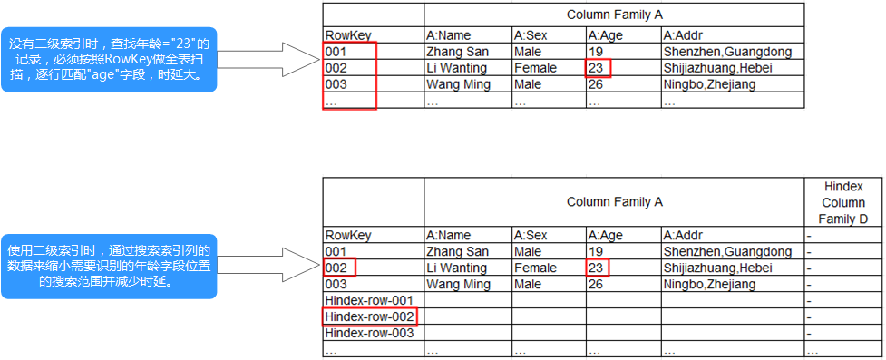

# HIndex介绍

**前提条件**

HBase HIndex功能仅在MRS1.7及其以后版本中支持。

**场景介绍**

HBase是基于Key-Value的分布式存储数据库，基于rowkeys对表中的数据按照字典进行排序。如果您根据指定的rowkey查询数据，或者scan指定rowkey范围内的数据，hbase可以快速查找到需要读取的数据，从而提高效率。在大多数实际情况下，会需要查询列值为XXX的数据。 HBase提供了Filter功能来查询具有特定列值的数据：所有数据按RowKey的顺序进行扫描，然后将数据与特定的列值进行匹配，直到找到所需的数据。 过滤器功能会scan一些不必要的数据以获取所需的数据。 基于前面的描述，Filter功能不能满足高性能标准频繁查询的要求。

这就是HBase HIndex产生的背景。如[图1](#fig1761763782914)所示，HBase HIndex为HBase提供了能够根据特定的列值进行索引的能力，使得查询会变得更快。

**图 1**  HBase HIndex  

> **说明：**   
>1.索引数据不支持滚动升级。  
>2.复合索引：用户必须将所有参与复合索引的列全部放入/删除，否则会导致数据不一致。  
>3.用户不应将任何split policy显式地配置到已建立索引的数据表中。  
>4.不支持mutation操作，如increment,append。  
>5.不支持列索引的版本maxVersions\> 1。  
>6.添加索引的列值不应超过32KB。  
>7.当用户数据由于列族级TTL失效而被删除时，相应的索引数据不会立即删除。索引数据将在major compaction期间被删除。  
>8.创建索引后，不应更改用户列族的TTL。  
>8.1.如果在创建索引后将列族TTL更改为更高值，则应删除并重新创建索引，否则某些已生成的索引数据可能比用户数据先删除。  
>8.2.如果在创建索引后将列族TTL更改为较低值，则索引可能会晚于用户数据被删除。  
>9.hbase表启动容灾之后 ，主集群新建二级索引，索引表变更不会自动同步到备集群。要实现该容灾场景，必须执行以下操作：  
>1）在主表创建二级索引之后，需要在备集群使用相同方法创建结构、名称完全相同的二级索引；  
>2）在主集群手动将索引列族（默认是d）的REPLICATION\_SCOPE设置为1。  

**参数配置**

1.  登录集群的MRS Manager。
2.  选择“服务管理  \> HBase \> 服务配置”，设置“参数类别”为“全部配置”，进入HBase配置界面。

<table><thead align="left"><tr id="row1860265013558"><th class="cellrowborder" valign="top" width="22.86%" id="mcps1.1.5.1.1">
配置入口

</th>
<th class="cellrowborder" valign="top" width="18.07%" id="mcps1.1.5.1.2">
配置项

</th>
<th class="cellrowborder" valign="top" width="19.73%" id="mcps1.1.5.1.3">
默认值

</th>
<th class="cellrowborder" valign="top" width="39.34%" id="mcps1.1.5.1.4">
描述

</th>
</tr>
</thead>
<tbody><tr id="row156031450165515"><td class="cellrowborder" valign="top" width="22.86%" headers="mcps1.1.5.1.1 ">
“HMaster &gt; 系统”

</td>
<td class="cellrowborder" valign="top" width="18.07%" headers="mcps1.1.5.1.2 ">
hbase.coprocessor.master.classes

</td>
<td class="cellrowborder" valign="top" width="19.73%" headers="mcps1.1.5.1.3 ">
org.apache.hadoop.hbase.hindex.server.master.HIndexMasterCoprocessor

</td>
<td class="cellrowborder" valign="top" width="39.34%" headers="mcps1.1.5.1.4 ">
该协处理器用于在启用Hindex功能后处理Master级的操作，比如创建索引meta表，添加索引，删除索引，删除表删除索引元数据。

</td>
</tr>
<tr id="row1603115019552"><td class="cellrowborder" rowspan="3" valign="top" width="22.86%" headers="mcps1.1.5.1.1 ">
“RegionServer &gt; RegionServer”

</td>
<td class="cellrowborder" valign="top" width="18.07%" headers="mcps1.1.5.1.2 ">
hbase.coprocessor.regionserver.classes

</td>
<td class="cellrowborder" valign="top" width="19.73%" headers="mcps1.1.5.1.3 ">
org.apache.hadoop.hbase.hindex.server.regionserver.HIndexRegionServerCoprocessor

</td>
<td class="cellrowborder" valign="top" width="39.34%" headers="mcps1.1.5.1.4 ">
该协处理器用于在启用Hindex功能后实际上处理master下发到Regionserver上的操作

</td>
</tr>
<tr id="row860415503552"><td class="cellrowborder" valign="top" headers="mcps1.1.5.1.1 ">
hbase.coprocessor.region.classes

</td>
<td class="cellrowborder" valign="top" headers="mcps1.1.5.1.2 ">
org.apache.hadoop.hbase.hindex.server.regionserver.HIndexRegionCoprocessor

</td>
<td class="cellrowborder" valign="top" headers="mcps1.1.5.1.3 ">
该协处理器用于在启用Hindex功能后实际上操作Region上的数据。

</td>
</tr>
<tr id="row6604350125520"><td class="cellrowborder" valign="top" headers="mcps1.1.5.1.1 ">
hbase.coprocessor.wal.classes

</td>
<td class="cellrowborder" valign="top" headers="mcps1.1.5.1.2 ">
org.apache.hadoop.hbase.hindex.server.regionserver.HIndexWALCoprocessor

</td>
<td class="cellrowborder" valign="top" headers="mcps1.1.5.1.3 ">
该协处理器用于Replication, 其会过滤掉索引数据以避免索引数据发送到对等集群中，对等集群中的数据索引数据将会自己生成。

</td>
</tr>
</tbody>
</table>

> **说明：**   
>1.上述默认值为启用HBase HIndex功能后需额外配置的值，当前支持HBase HIndex功能的MRS集群默认已配置。  
>2.必须确保master参数配置在hmster上，region/regionserver参数配置在regonserver上。  

**相关接口**

使用HIndex的API都在类org.apache.hadoop.hbase.hindex.client.HIndexAdmin中，相关接口介绍如下：

<table><tbody><tr id="row1708319135815"><td class="cellrowborder" valign="top" width="18%">
操作

</td>
<td class="cellrowborder" valign="top" width="14.000000000000002%">
接口

</td>
<td class="cellrowborder" valign="top" width="38%">
描述

</td>
<td class="cellrowborder" valign="top" width="30%">
注意事项

</td>
</tr>
<tr id="row270810195583"><td class="cellrowborder" rowspan="2" valign="top" width="18%">
添加索引

</td>
<td class="cellrowborder" valign="top" width="14.000000000000002%">
addIndices()

</td>
<td class="cellrowborder" valign="top" width="38%">
将索引添加到没有数据的表中。调用此接口会将用户指定的索引添加到表中，但会跳过生成索引数据。因此，在此操作之后，索引不能用于scan/filter操作。它的使用场景为用户想要在具有大量预先存在用户数据的表上批量添加索引，其具体操作为使用诸如TableIndexer工具之类的外部工具来构建索引数据。

</td>
<td class="cellrowborder" rowspan="2" valign="top" width="30%">
1.索引一旦添加则不能修改。若要修改，则需先删除旧的索引然后重新创建。

2.用户应注意不要在具有不同索引名称的相同列上创建两个索引。如果这样做，将会导致存储和处理的浪费。

3.索引不能添加到系统表中。

4.向索引列put数据时不支持append和increment操作。

5.如果客户端出现任何故障，除非发生DoNotRetryIOException，否则用户应该重试。

6.索引列族根据可用性按顺序从以下条件中选择：

6.1.默认索引列族“d”或者如果设置了属性“hindex.default.family.name”的值，则以该值为准。

6.2.符号＃，@，$或％

6.3.＃0，@ 0，$ 0，％0，＃1，@ 1 ...上至＃255，@ 255，$ 255，％255

6.4.throw Exception

7.可以通过HIndex TableIndexer工具添加索引而无需建立索引数据。

</td>
</tr>
<tr id="row670871925814"><td class="cellrowborder" valign="top">
addIndicesWithData()

</td>
<td class="cellrowborder" valign="top">
将索引添加到有数据的表中。此方法将用户指定的索引添加到表中，并会对已经存在的用户数据创建对应的索引数据，也可先调用该方法生成索引再在存入用户数据的同时生成索引数据。在此操作之后，这些索引立即可用于scan/filter操作。

</td>
</tr>
<tr id="row870821965814"><td class="cellrowborder" rowspan="2" valign="top" width="18%">
删除索引

</td>
<td class="cellrowborder" valign="top" width="14.000000000000002%">
dropIndices()

</td>
<td class="cellrowborder" valign="top" width="38%">
仅删除索引。该API从表中删除用户指定的索引，但跳过相应的索引数据。在此操作之后，索引不能用于scan/filter操作。集群在major compaction期间会自动删除旧的索引数据。

此API使用场景为表中包含大量索引数据且dropIndicesWithData()不可行。 另外，用户也可以通过TableIndexer工具删除索引以及索引数据。

</td>
<td class="cellrowborder" rowspan="2" valign="top" width="30%">
1.在索引的状态为ACTIVE，INACTIVE和DROPPING时，允许禁用索引的操作。

2.对于使用dropIndices()删除索引的操作，用户必须确保在将索引添加到具有相同索引名的表之前，相应的索引数据已被删除（即major compaction已完成）。

3.用户删除相应的索引会删除：

3.1.一个带有索引的列族。

3.2.组合索引所有列族中的任一个列族。

4.索引可以通过HIndex TableIndexer工具与索引数据一起删除。

</td>
</tr>
<tr id="row1170861975812"><td class="cellrowborder" valign="top">
dropIndicesWithData()

</td>
<td class="cellrowborder" valign="top">
删除索引数据。此API删除用户指定的索引，并删除用户表中与这些索引对应的所有索引数据。在此操作之后，删除的索引完全从表中删除，不再可用于scan/filter操作。

</td>
</tr>
<tr id="row18708319145810"><td class="cellrowborder" rowspan="2" valign="top" width="18%">
启用/禁用索引

</td>
<td class="cellrowborder" valign="top" width="14.000000000000002%">
disableIndices()

</td>
<td class="cellrowborder" valign="top" width="38%">
该API禁用所有用户指定的索引，使其不再可用于scan/filter操作。

</td>
<td class="cellrowborder" rowspan="2" valign="top" width="30%">
1.在索引的状态为ACTIVE，INACTIVE和BUILDING时允许启用索引的操作。

2.在索引的状态为ACTIVE和INACTIVE时允许禁用索引操作。

3.在禁用索引之前，用户必须确保索引数据与用户数据一致。 如果在索引处于禁用状态期间没有在表中添加新的数据，索引数据与用户数据将保持一致。

4.启用索引时，可以通过使用TableIndexer工具构建索引来保证数据一致性。

</td>
</tr>
<tr id="row0708819155814"><td class="cellrowborder" valign="top">
enableIndices()

</td>
<td class="cellrowborder" valign="top">
该API启用所有用户指定的索引，使其可用于scan/filter操作。

</td>
</tr>
<tr id="row5709101995815"><td class="cellrowborder" valign="top" width="18%">
查看已创建的索引

</td>
<td class="cellrowborder" valign="top" width="14.000000000000002%">
listIndices()

</td>
<td class="cellrowborder" valign="top" width="38%">
该API可用于列出给定表中的所有索引。

</td>
<td class="cellrowborder" valign="top" width="30%">
无

</td>
</tr>
</tbody>
</table>

**基于索引查询数据**

在具有索引的用户表中，可以使用Filter来查询数据。对于创建单索引和组合索引的用户表，使用过滤器查询的结果与没有使用索引的表相同，但数据查询性能高于没有使用索引的表。

索引的使用规则如下：

1.对于为一个或多个列创建单个索引的情况：

当将此列用于AND或OR查询筛选时，使用索引可以提高查询性能。

例如，Filter\_Condition（IndexCol1）AND / OR Filter\_Condition（IndexCol2）。

当在查询中使用“索引列和非索引列”进行过滤时，此索引可以提高查询性能。

例如，Filter\_Condition（IndexCol1）AND Filter\_Condition（IndexCol2）AND Filter\_Condition（NonIndexCol1）。

当在查询中使用“索引列或非索引列”进行筛选时，但不使用索引，查询性能不会提高。

例如，Filter\_Condition（IndexCol1）AND / OR Filter\_Condition（IndexCol2） OR Filter\_Condition（NonIndexCol1）。

2.对于为多个列创建组合索引的情况：

当用于查询的列是组合索引的全部或部分列并且与组合索引具有相同的顺序时，使用索引会提高查询性能。

例如，为C1，C2和C3创建组合索引。该索引在以下情况下生效：

Filter\_Condition（IndexCol1）AND Filter\_Condition（IndexCol2）AND Filter\_Condition（IndexCol3）

Filter\_Condition（IndexCol1）AND Filter\_Condition（IndexCol2）

FILTER\_CONDITION（IndexCol1）

该索引在下列情况下不生效：

Filter\_Condition（IndexCol2）AND Filter\_Condition（IndexCol3）

Filter\_Condition（IndexCol1）AND Filter\_Condition（IndexCol3）

FILTER\_CONDITION（IndexCol2）

FILTER\_CONDITION（IndexCol3）

当在查询中使用“索引列和非索引列”进行过滤时，使用索引可提高查询性能。

例如：

Filter\_Condition（IndexCol1）AND Filter\_Condition（NonIndexCol1）

Filter\_Condition（IndexCol1）AND Filter\_Condition（IndexCol2）AND Filter\_Condition（NonIndexCol1）

当在查询中使用“索引列或非索引列”进行筛选时，但不使用索引，查询性能不会提高。

例如：

Filter\_Condition（IndexCol1）OR Filter\_Condition（NonIndexCol1）

（Filter\_Condition（IndexCol1）AND Filter\_Condition（IndexCol2））OR（Filter\_Condition（NonIndexCol1））

当多个列用于查询时，只能为组合索引中的最后一列指定值范围，而其他列只能设置为指定值。

例如，为C1，C2和C3创建组合索引。在范围查询中，只能为C3设置数值范围，过滤条件为“C1 = XXX，C2 = XXX，C3 = 数值范围”。

**最佳查询策略**

使用SingleColumnValueFilter或SingleColumnRangeFilter，它会在一个在过滤条件中提供确定值column\_family:qualifierpair（让我们称该列为col1）。

若col1作为表上的第一个索引列，那么该表上的任何索引都可以成为查询期间使用的候选索引。例如：

如果有col1上的索引，可以将此索引作为候选索引，因为col1是此索引的第一列也是唯一的列；如果在col1和col2上有另一个索引，可以将此索引视为候选索引，因为col1是索引列列表中的第一列。另一方面，如果在col2和col1上有一个索引，则不能将此索引作为候选索引，因为索引列列表中的第一列不是col1。

现在最适合使用索引的方法是，当有多个候选索引时，需要从可能的候选索引中选择最适合scan数据的索引。

可借助以下方案来了解如何选择最佳索引策略：

1.最好可以完全匹配。

场景：有两个索引可用，一个用于col1＆col2，另一个单独用于col1。

在上面的场景中，第二个索引会比第一个索引更好，因为它会使我们scan的较少索引数据。

2.如果有多个候选多列索引，则选择具有较少索引列的索引。

场景：有两个索引可用，一个用于col1＆col2，另一个用于col1＆col2＆col3。

在这种情况下，最好使用col1和col2上的索引，因为它会使我们scan的较少索引数据。

> **说明：**   
>1.基于索引查询时索引的状态必须为ACTIVE（可通过调用listIndices\(\) API查看索引的状态）。  
>2.为了保证基于索引查询数据的正确性，用户应该确保索引数据与用户数据的一致性。  
>3.使用以下命令可通过HBase shell客户端执行复杂查询（假定此时 已为指定列建立索引）。  
>**scan 'tablename', \{FILTER =\> "SingleColumnValueFilter\(family, qualifier, compareOp, comparator, filterIfMissing, latestVersionOnly\)"\}**  
>例如：**scan 'test', \{FILTER =\> "SingleColumnValueFilter\('info', 'age', =, 'binary:26', true, true\)"\}**  
>（在以上场景中，用户希望在结果中保存没有查询到的列所在行时，不应该在任何这样的列上创建任何索引，因为如果查询的列不存在于其中时，使用SCVF 扫描索引列会过滤出一行。而使用filterIfMissingset为false（这是默认值）的SCVF扫描非索引列时，也将会在结果中返回没有查询列的行。因此，为避免查询结果不一致，建议在为索引列创建SCVF后将filterIfMissing设置为true。）  
>4.在hbase shell中可以通过以下命令查看为用户数据建立的索引数据。  
>**scan 'tablename', \{ATTRIBUTES =\> \{'FETCH\_INDEX\_DATA' =\> 'true'\}\}**  

