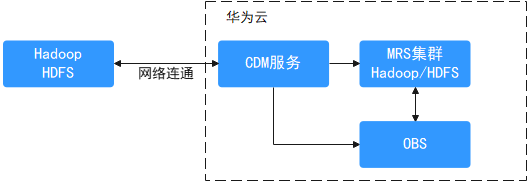
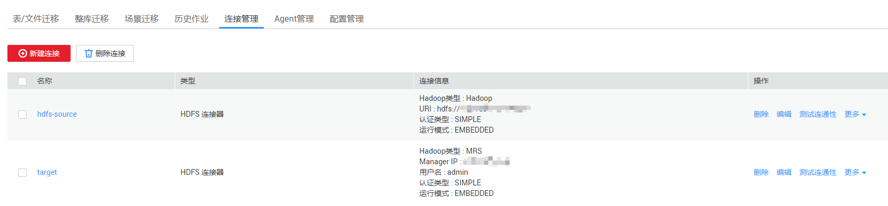
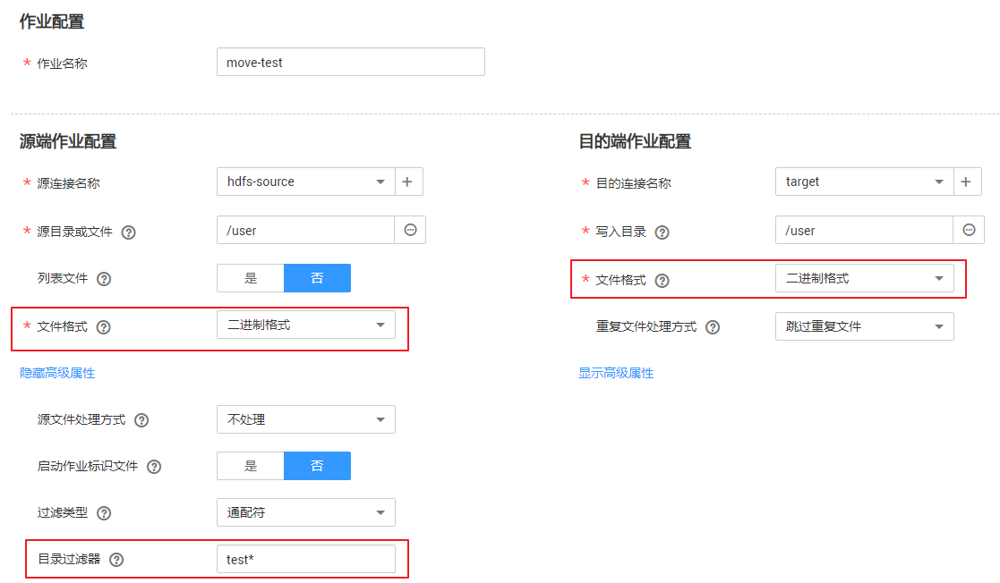
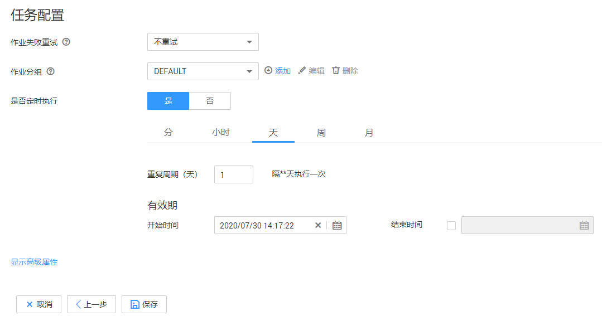
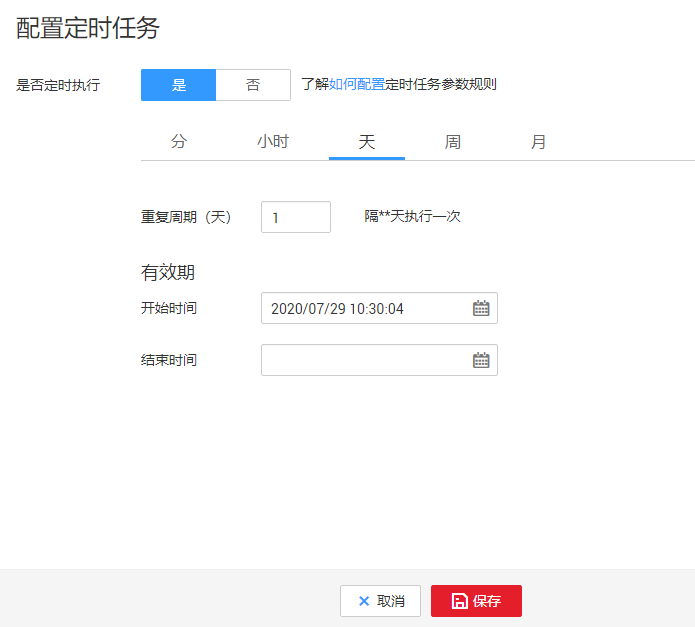

# Hadoop数据迁移到华为云MRS服务

## 场景介绍

本章节适用于将线下IDC机房或者公有云Hadoop集群中的数据（支持数据量在几十TB级别或以下的数据量级）迁移到华为云MRS服务。本章节以通过[华为云CDM服务](https://support.huaweicloud.com/productdesc-cdm/cdm_01_0143.html)进行数据迁移为例介绍。

**图 1**  Hadoop数据迁移示意  

## 方案优势

-   简单易用：免编程，向导式任务开发界面，通过简单配置几分钟即可完成迁移任务开发
-   迁移效率高： 基于分布式计算框架进行数据任务执行和数据传输优化，并针对特定数据源写入做了专项优化，迁移效率高
-   实时监控：迁移过程中可以执行自动实时监控、告警和通知操作

## 操作步骤

1.  登录CDM管理控制台。
2.  [创建CDM集群](https://support.huaweicloud.com/usermanual-cdm/cdm_01_0018.html)，该CDM集群的安全组、虚拟私有云、子网需要和迁移目的端集群保持一致，保证CDM集群和MRS集群之间网络互通。
3.  在“集群管理”页面单击待操作集群对应“操作”列的“作业管理”。
4.  在“连接管理”页签，单击“新建连接”。
5.  参考[CDM服务的新建连接](https://support.huaweicloud.com/usermanual-cdm/cdm_01_0023.html)页面，分别添加到迁移源端集群和迁移目的端集群的两个HDFS连接。

    连接类型根据实际集群来选择，如果是MRS集群，连接器类型可以选择“MRS HDFS”，如果是自建集群可以选择“Apache HDFS”。

    **图 2**  Hadoop连接  
    

6.  在“表/文件迁移” 页签，单击“新建作业”。
7.  选择源连接、目的连接：
    -   作业名称：用户自定义任务名称，名称由英文字母、下划线或者数字组成，长度必须在1到256个字符之间。
    -   源连接名称：选择迁移源端集群的HDFS连接，作业运行时将从此端复制导出数据。
    -   目的连接名称：选择迁移目的端集群的HDFS连接，作业运行时会将数据导入此端。

8.  请参见[配置HDFS源端参数](https://support.huaweicloud.com/usermanual-cdm/cdm_01_0036.html)配置源端连接的作业参数，需要迁移的文件夹可通过“路径过滤器”和“文件过滤器”参数设置符合规则的目录和文件进行迁移。例如“路径过滤器”选择test\*，迁移匹配/user/test\*的文件夹下文件。该场景下“文件格式”固定为“二进制格式”。

    **图 3**  配置作业参数  
    

9.  请参见[配置HDFS目的端参数](https://support.huaweicloud.com/usermanual-cdm/cdm_01_0045.html)配置目的端连接的作业参数。
10. 单击“下一步”进入任务配置页面。
    -   如需定期将新增数据迁移至目的端集群，可在该页面进行配置，也可在任务执行后再参考[14](#li193671635194616)配置定时任务。
    -   如无新增数据需要后续定期迁移，则跳过该页面配置直接单击“保存”回到作业管理界面。

        **图 4**  任务配置  
        

11. 选择“作业管理”的“表/文件迁移”页签，在待运行作业的“操作”列单击“运行”，即可开始HDFS文件数据迁移，并等待作业运行完成。
12. 登录迁移目的端集群主管理节点。
13. 执行**hdfs dfs –ls –h /user/**命令查看迁移目的端集群中已迁移的文件。
14. （可选）如果源端集群中有新增数据需要定期将新增数据迁移至目的端集群，则配置定期任务增量迁移数据，直到所有业务迁移至目的端集群。
    1.  在CDM集群中选择“作业管理”的“表/文件迁移”页签。
    2.  在迁移作业的“操作”列选择“更多 \> 配置定时任务”。
    3.  开启定时执行功能，根据具体业务需求设置重复周期，并设置有效期的结束时间为所有业务割接到新集群之后的时间。

        **图 5**  配置定时任务  
        

