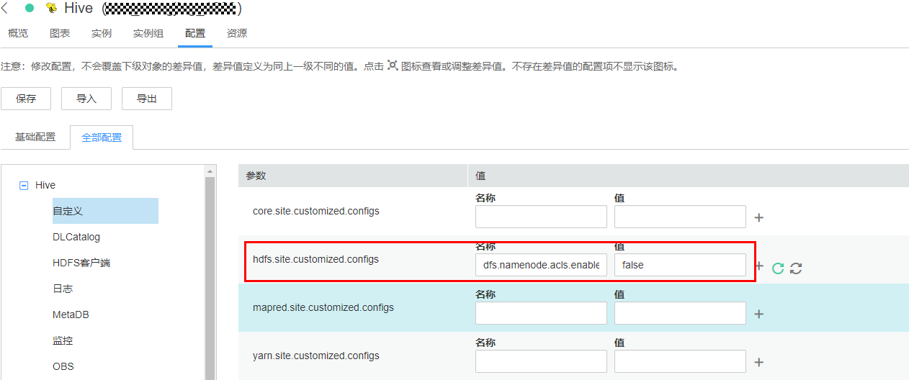
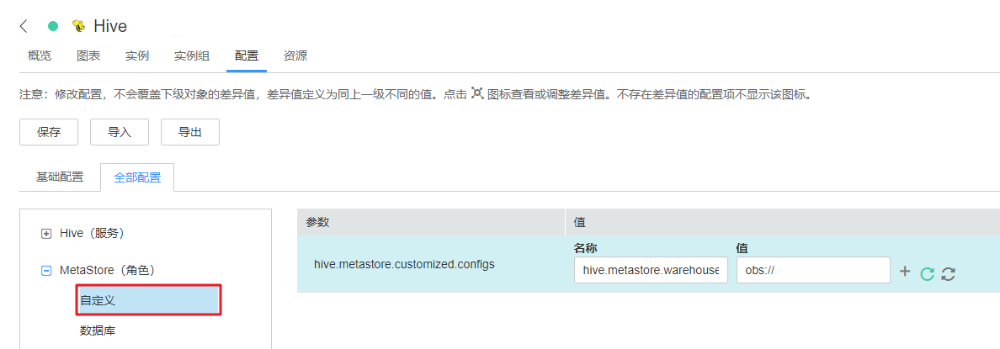
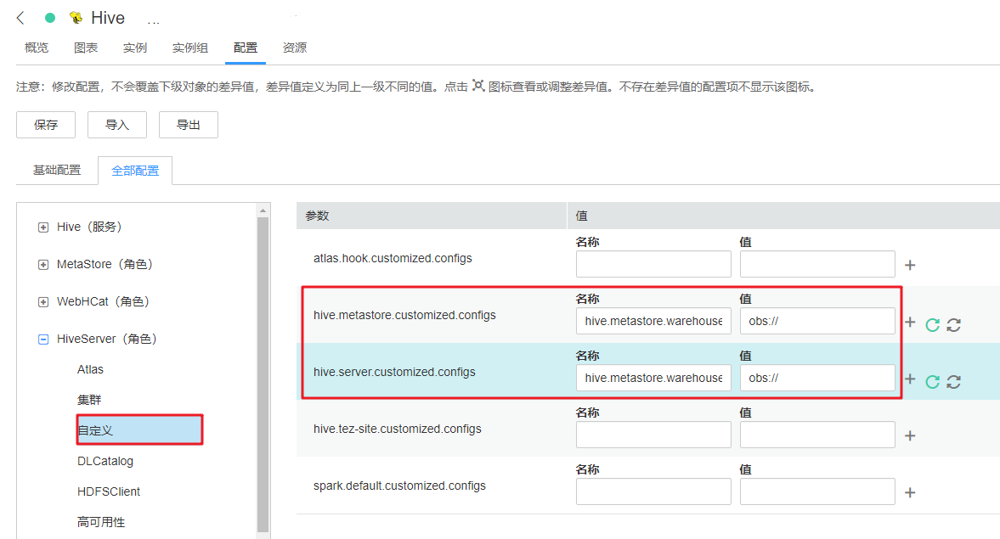

# Hive对接OBS文件系统

使用本章节前已参考[配置存算分离集群（委托方式）](配置存算分离集群（委托方式）.md)或[配置存算分离集群（AKSK方式）](配置存算分离集群（AKSK方式）.md)完成存算分离集群配置。

## 建表时指定Location为OBS路径

1.  使用安装客户端用户登录客户端安装节点。
2.  执行如下命令初始化环境变量。

    **source $\{client\_home\}/bigdata\_env**

3.  如果是安全集群，执行以下命令进行用户认证（该用户需要具有Hive操作的权限），如果当前集群未启用Kerberos认证，则无需执行此命令。

    **kinit **_Hive组件操作用户_

4.  登录FusionInsight Manager，选择“集群 \> 服务 \> Hive \> 配置 \>  全部配置”。

    在左侧的导航列表中选择“Hive \> 自定义”。在自定义配置项中，给参数“hdfs.site.customized.configs”添加配置项“dfs.namenode.acls.enabled”，设置值为“false“。

    

5.  保存并重启Hive服务。
6.  进入beeline客户端，在创建表时指定Location为OBS文件系统路径。

    **beeline**

    **create table test\(name string\) location "obs://**_OBS并行文件系统名称_**/user/hive/warehouse/test";**

    > **说明：** 
    >需要添加组件操作用户到Ranger策略中的URL策略，URL填写对象在obs上的完整路径。权限选择Read, Write 权限，其他权限不涉及URL策略。

## 指定创建的Hive表默认Location为OBS路径

1.  登录FusionInsight Manager，选择“集群 \> 服务 \> Hive \> 配置 \>  全部配置”。
2.  在左侧的导航列表中选择“MetaStore \> 自定义”。在自定义配置项中，给参数“hive.metastore.customized.configs”添加配置项“hive.metastore.warehouse.dir”，设置值为OBS路径。

    **图 1**  hive.metastore.warehouse.dir配置  
    

3.  在左侧的导航列表中选择“HiveServer \> 自定义”。在自定义配置项中，给参数“hive.metastore.customized.configs”和“hive.server.customized.configs”添加配置项“hive.metastore.warehouse.dir”，设置值为OBS路径。

    **图 2**  hive.metastore.warehouse.dir配置  
    

4.  保存并重启Hive服务。
5.  进入beeline客户端，创建表并确认Location为OBS路径。

    **beeline**

    **create table test\(name string\);**

    **desc formatted test;**

