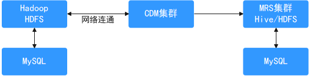
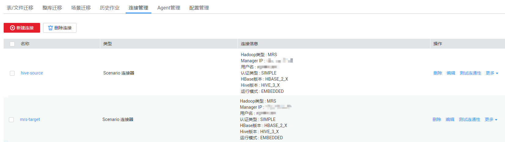
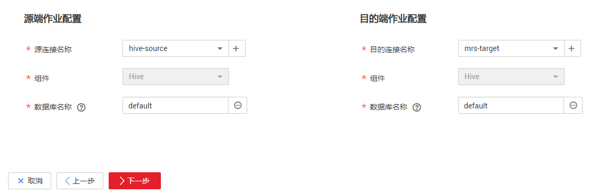
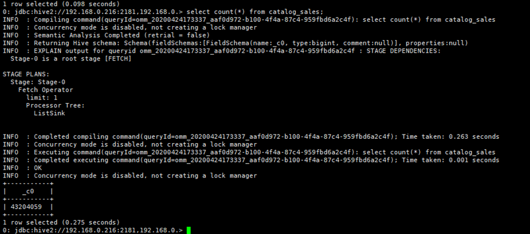
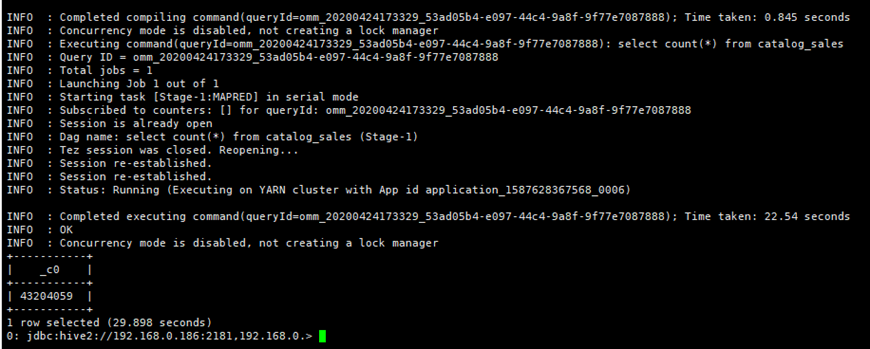

# Hive数据迁移到华为云MRS服务

## 场景介绍

本章节适用于将线下IDC机房或者公有云Hive集群中的数据（支持数据量在几十TB级别或以下的数据量级）迁移到华为云MRS服务。本章节以通过[华为云CDM服务](https://support.huaweicloud.com/productdesc-cdm/cdm_01_0143.html)进行数据迁移为例介绍。

Hive数据迁移分两部分内容：

-   Hive的元数据信息，存储在mysql等数据库中。MRS Hive集群的元数据会默认存储到MRS DBService（华为的Gaussdb数据库），也可以选择RDS（mysql）作为外置元数据库。
-   Hive的业务数据，存储在HDFS文件系统或OBS对象存储中。

使用华为云CDM服务“场景迁移功能”可以一键式便捷地完成Hive数据的迁移。

**图 1**  Hive数据迁移示意  

## 方案优势

场景化迁移通过迁移快照数据然后再恢复表数据的方法，能大大提升迁移效率。

## 操作步骤

1.  登录CDM管理控制台。
2.  [创建CDM集群](https://support.huaweicloud.com/usermanual-cdm/cdm_01_0018.html)，该CDM集群的安全组、虚拟私有云、子网需要和迁移目的端集群保持一致，保证CDM集群和MRS集群之间网络互通。
3.  在“集群管理”页面单击待操作集群对应“操作”列的“作业管理”。
4.  在“连接管理”页签，单击“新建连接”。
5.  参考[CDM服务的新建连接](https://support.huaweicloud.com/usermanual-cdm/cdm_01_0023.html)页面，分别添加到迁移源端集群和迁移目的端集群的连接，其中连接器类型选择“场景迁移”。

    连接类型根据实际集群来选择，如果是MRS集群，Hadoop类型可以选择“MRS”，如果是自建集群可以选择“Apache Hadoop”。

    **图 2**  Hive连接  
    

6.  在迁移目的端集群中创建数据迁移后的存储数据库。
7.  选择“作业管理”的“场景迁移”页签，单击“新建作业”。
8.  进入作业参数配置界面。配置作业名称并选择迁移场景为“Hive快速迁移”，并单击“下一步”。
9.  分别为源连接和目的连接选择[5](#li832616541539)中创建的对应数据连接并选择要迁移的数据库，并单击“下一步”。

    **图 3**  Hive作业配置  
    

10. 选择要迁移的数据表， 并单击“下一步”。
11. 进入任务配置页面，不做修改，直接单击“保存”。
12. 选择“作业管理”的“场景迁移”页签，在待运行作业的“操作”列单击“运行”，即可开始Hive数据迁移。
13. 迁移完成后，可以在目的端集群和源端集群，通过同样的查询语句，对比查询结果进行验证。

    例如：在目的端集群和源端集群上通过查询catalog\_sales表的记录数来确认数据条数是否一致

    **select count\(\*\) from catalog\_sales;**

    **图 4**  源端集群数据记录  
    

    **图 5**  目的端集群数据记录  
    

14. （可选）如果源端集群中有新增数据需要定期将新增数据迁移至目的端集群，则根据数据新增方式进行不同方式的迁移。配置定期任务增量迁移数据，直到所有业务迁移至目的端集群。
    -   Hive表数据修改，未新增删除表，未修改已有表的数据结构：此时Hive表已经创建好，仅需迁移Hive存储在HDFS或OBS上的文件即可，请参考[Hadoop数据迁移到华为云MRS服务](Hadoop数据迁移到华为云MRS服务.md)页面新增数据迁移方式进行数据迁移。
    -   Hive表有新增：请选择“作业管理”的“场景迁移”页签，在Hive迁移作业的“操作”列单击“编辑”，选择新增的数据表进行数据迁移。
    -   Hive表有删除或已有表的数据结构有修改：请在目的端集群中手动删除对应表或手动更新变更的表结构。

