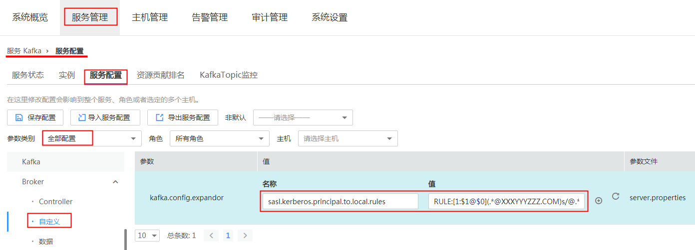

# Kafka数据

当我们需要在两个Kafka集群间做数据同步，或者将原有Kafka集群上的数据搬迁到新的Kafka集群上时就需要用到Kafka数据同步的利器——MirrorMaker。MirrorMaker是Kafka内嵌的一个工具，其内部实际上是集成了Kafka的Consumer和Producer，它可以从一个Kafka集群消费数据然后写入另一个Kafka集群，从而实现Kafka集群间的数据同步。

本章节介绍利用MRS服务提供的MirroMaker工具实现Kafka集群数据同步、迁移的方法，请先参考[打通数据传输通道](HDFS数据.md#section2349182854814)完成两个集群的网络互通后再参考本章节操作Kafka数据迁移。

## 操作步骤

1.  配置集群Kerberos互信，具体配置方式请参考[配置跨集群互信](配置跨集群互信.md)。
2.  若计划在源集群使用MirrorMaker工具，请登录目的集群的集群详情页面，选择“组件管理”。若计划在目的集群使用MirrorMaker工具，请登录源集群的集群详情页面，选择“组件管理”。

    > **说明：**   
    >针对MRS 2.0.1及之前版本的集群，若计划在源集群使用MirrorMaker工具，请登录目的集群的MRS Manager页面，选择“服务管理”。若计划在目的集群使用MirrorMaker工具，请登录源集群的MRS Manager页面，选择“服务管理”。  

3.  选择“Kafka \> 服务配置”，设置“参数类别”为“全部配置”。
4.  选择“自定义”配置项增加如下规则。

    **sasl.kerberos.principal.to.local.rules = RULE:\[1:$1@$0\]\(.\*@XXXYYYZZZ.COM\)s/@.\*//,RULE:\[2:$1@$0\]\(.\*@ XXXYYYZZZ.COM\)s/@.\*//,DEFAULT**

    其中：XXXYYYZZZ.COM为数据发送端集群（源集群）的域名\(字母需大写\)。

    **图 1**  增加规则  
    

5.  单击“保存配置”，按照提示选择“重新启动受影响的服务或实例。”并单击“是”，重启Kafka服务。

    > **说明：**   
    >开启Kerberos认证的安全集群需要执行步骤[1](#li1980875616292)-[5](#li854919509282)，未开启Kerberos认证的普通集群请跳过步骤[1](#li1980875616292)-[5](#li854919509282)，直接从[6](#li3402143084520)开始执行。  

6.  在计划使用MirrorMaker工具的集群，登录集群详情页面，选择“组件管理”。

    > **说明：**   
    >针对MRS 2.0.1及之前版本的集群，登录MRS Manager页面，选择“服务管理”。  

7.  选择“Kafka \> 服务配置”，设置“参数类别”为“全部配置”，“角色”为“MirrorMaker”。

    **图 2**  配置Kafka服务的MirrorMaker参数  
    

    配置参数说明：

    -   source和dest标签中的bootstrap.servers参数分别是源Kafka集群和目的Kafka集群的broker节点列表及端口信息
    -   source和dest标签中的security.protocol参数请根据源Kafka集群和目的Kafka集群的服务端的实际配置情况自行选择
    -   如果源Kafka集群（source）或者目的Kafka集群（dest）为安全集群则需要配置source和dest标签中的kerberos.domain.name（如果是本机可不配置，非本机根据实际值进行配置）和sasl.kerberos.service.name（默认：kafka）参数
    -   在mirror标签中设置whitelist，即需要同步的topic名称。

8.  单击“保存配置”，按照提示选择“重新启动受影响的服务或实例。”并单击“是”，重启MirrorMaker实例。

    待MirrorMaker重启完成后，数据迁移任务即已启动，可通过[KafkaManager](KafkaManager介绍.md)或者命令行工具监控MirrorMaker数据同步进度。

