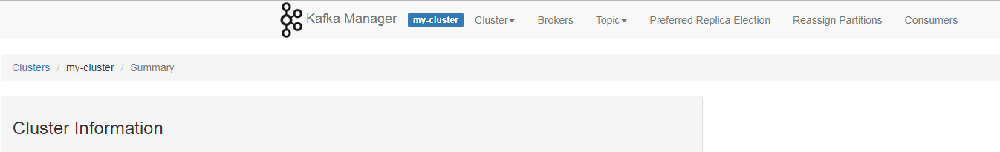
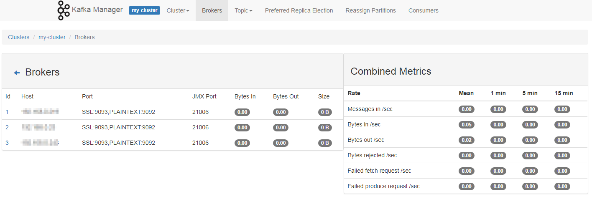
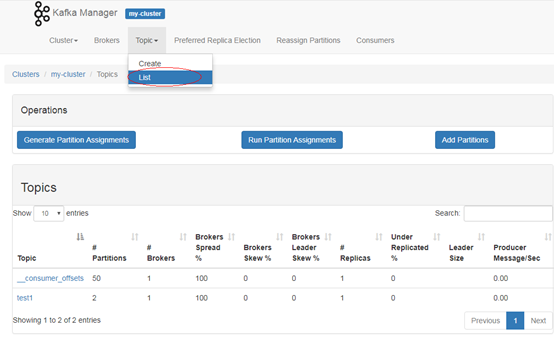
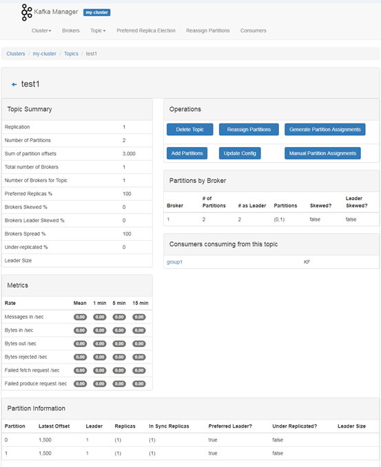
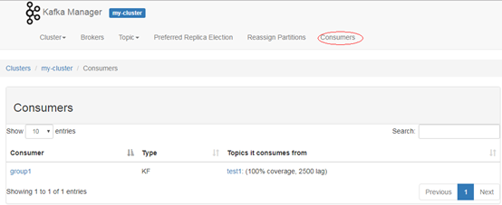
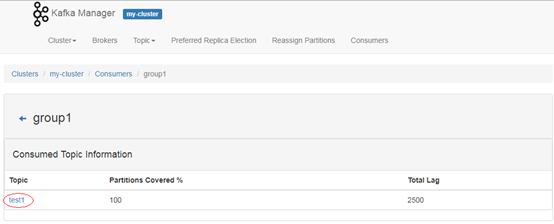
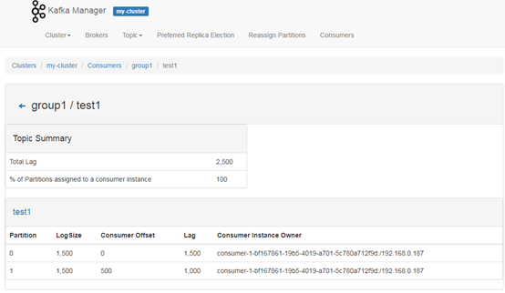
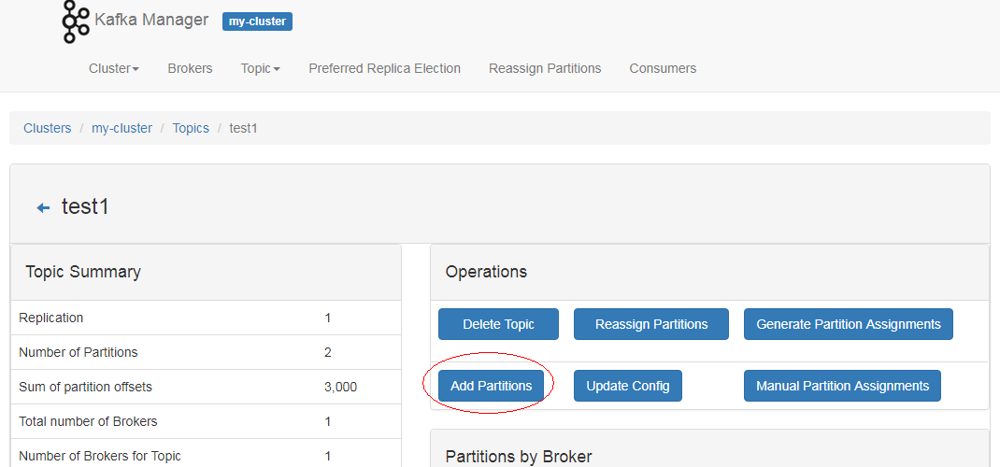
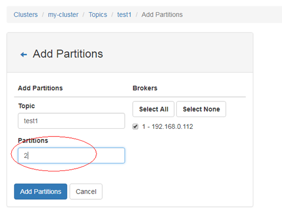
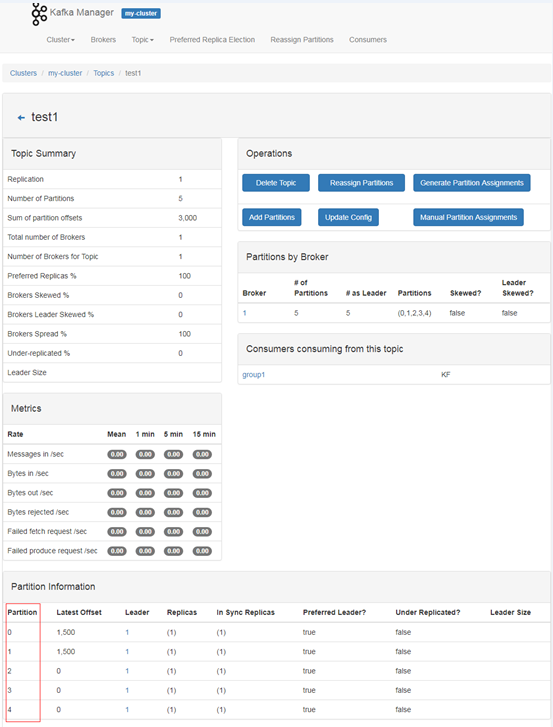

# Kafka集群监控管理

Kafka集群监控管理包含以下内容：

-   [查看Broker信息](#section1254019150558)
-   [查看Topic信息](#section2384151125912)
-   [查看Consumers信息](#section517576022)
-   [通过KafkaManager修改Topic的partition](#section195268241735)

## 查看Broker信息

1.  登录KafkaManager的WebUI界面。
2.  在集群列表页面单击对应集群名称进入集群Summary页面。

    **图 1**  集群Summary页面  
    

3.  单击“Brokers“进入Broker监控页面，该页面包括Broker列表和Broker节点的IO统计信息。

    **图 2**  Broker监控页面  
    

## 查看Topic信息

1.  登录KafkaManager的WebUI界面。
2.  在集群列表页面单击对应集群名称进入集群Summary页面。
3.  单击“Topic \> List“查看当前集群的Topic列表及每个Topic的相关信息。

    **图 3**  Topic列表  
    

4.  单击具体的Topic名称查看该Topic的详细信息。

    **图 4**  Topic的详细信息  
    

## 查看Consumers信息

1.  登录KafkaManager的WebUI界面。
2.  在集群列表页面单击对应集群名称进入集群Summary页面。
3.  单击“Consumers“查看当前集群的Consumers列表及每个Consumer的消费信息。

    **图 5**  Consumers列表  
    

4.  单击Consumer的名称查看消费的Topic列表。

    **图 6**  Consumer消费的Topic列表  
    

5.  单击Consumer下Topic列表中的Topic名称，查看该Consumer对Topic的具体消费情况。

    **图 7**  Consumer对Topic的具体消费情况  
    

## 通过KafkaManager修改Topic的partition

1.  登录KafkaManager的WebUI界面。
2.  在集群列表页面单击对应集群名称进入集群Summary页面。
3.  单击“Topic \> List“进入当前集群的Topic列表页面。
4.  单击具体的Topic名称进入Topic Summary页面。
5.  单击“add partitions“，进入添加分区页面。

    **图 8**  添加分区  
    

6.  确认Topic名称并修改“Partitions“数量，单击“Add Partitions“进行分区添加。

    **图 9**  修改Partitions数量  
    

7.  分区添加成功后，单击“Go to topic view.“返回Topic Summary页面。
8.  在Topic Summary页面的下方“Partition Information“中确认partition数量。

    **图 10**  Partition Information  
    

9.  （可选）若对分配的分区不满意，可以执行Partition的重新分配功能来重新自动分配分区。
    1.  在Topic Summary页面单击“Generate Partition Assignments“。
    2.  勾选broker实例，单击“Generate Partition Assignments“生成分区。
    3.  分区生成完成，单击“Go to topic view.“返回Topic Summary页面。
    4.  在Topic Summary页面单击“Reassign Partitions“可以在集群的broker实例上重新自动分配分区。
    5.  单击“Go to reassign partitions.“查看重新分配的分区详情。

10. （可选）若对自动分配的分区不满意，可以执行手动分配来重新分配分区。
    1.  在Topic Summary页面单击“Manual Partition Assignments“进入手动分配分区页面。
    2.  手动为每个分区的副本分配Broker id，然后单击“Save Partition Assignment“保存修改。
    3.  单击“Go to topic view.“返回Topic Summary页面，查看分区详情。

