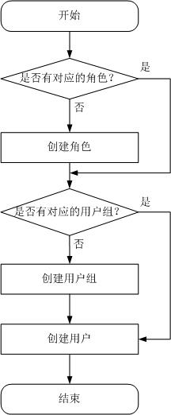

# Kerberos认证集群中的用户与权限

## 概述

-   **MRS集群用户**

    MRS Manager中的安全帐号，包含用户名、密码等属性，MRS集群的使用者通过这类用户访问集群中的资源。每个启用Kerberos认证的MRS集群可以有多个用户。

-   **MRS集群角色**

    用户在实际使用MRS集群时需根据业务场景获取访问资源的权限，访问资源的权限是定义到MRS集群对象上的。集群的角色就是包含一个或者多个权限的集合。例如，HDFS中某个目录的访问权限，需要在指定的目录上配置，并保存在角色中。

MRS Manager支持MRS集群用户权限管理功能，使权限管理与用户管理更加直观、易用。

-   权限管理：使用RBAC（Role-Based Access Control）方式，即基于角色授予权限，形成权限的集合。用户通过分配一个或多个已授权的角色取得对应的权限。
-   用户管理：使用Manager统一管理MRS集群用户，并通过Kerberos协议认证用户，LDAP协议存储用户信息。

## 权限管理

MRS集群提供的权限包括MRS Manager和各组件（例如HDFS、HBase、Hive和Yarn等）的操作维护权限，在实际应用时需根据业务场景为各用户分别配置不同权限。为了提升权限管理的易用性，MRS Manager引入角色的功能，通过选取指定的权限并统一授予角色，以权限集合的形式实现了权限集中查看和管理，提升了权限管理的易用性和用户体验。

角色可以理解为集中一个或多个权限的逻辑体，角色被授予指定的权限，用户通过绑定角色获得对应的权限。

一个角色可以有多个权限，一个用户可以绑定多个角色。

-   角色1：授予操作权限A和B，用户a和用户b通过绑定角色1取得对应的权限。
-   角色2：授予操作权限C，用户c和用户d通过绑定角色2取得对应的权限。
-   角色3：授予操作权限D和F，用户a通过绑定配角色3取得对应的权限。

例如，MRS集群用户绑定了管理员角色，那么这个用户成为MRS集群的管理员用户。

MRS Manager界面显示系统默认创建的角色如[表1](#zh-cn_topic_0043021163_table52563166113718)所示。

**表 1**  Manager默认角色与描述

<table><thead align="left"><tr id="zh-cn_topic_0043021163_row17438475113718"><th class="cellrowborder" valign="top" width="30.5%" id="mcps1.2.3.1.1">
<strong id="zh-cn_topic_0043021163_b50894640114316">默认角色</strong>

</th>
<th class="cellrowborder" valign="top" width="69.5%" id="mcps1.2.3.1.2">
<strong id="zh-cn_topic_0043021163_b28825136114316">角色描述</strong>

</th>
</tr>
</thead>
<tbody><tr id="zh-cn_topic_0043021163_row55300845113718"><td class="cellrowborder" valign="top" width="30.5%" headers="mcps1.2.3.1.1 ">
default

</td>
<td class="cellrowborder" valign="top" width="69.5%" headers="mcps1.2.3.1.2 ">
为租户创建的角色。

</td>
</tr>
<tr id="zh-cn_topic_0043021163_row9439425113718"><td class="cellrowborder" valign="top" width="30.5%" headers="mcps1.2.3.1.1 ">
Manager_administrator

</td>
<td class="cellrowborder" valign="top" width="69.5%" headers="mcps1.2.3.1.2 ">
Manager管理员，具有Manager的管理权限。

</td>
</tr>
<tr id="zh-cn_topic_0043021163_row49515408113718"><td class="cellrowborder" valign="top" width="30.5%" headers="mcps1.2.3.1.1 ">
Manager_auditor

</td>
<td class="cellrowborder" valign="top" width="69.5%" headers="mcps1.2.3.1.2 ">
Manager审计员，具有查看和管理审计信息的权限。

</td>
</tr>
<tr id="zh-cn_topic_0043021163_row36398481113718"><td class="cellrowborder" valign="top" width="30.5%" headers="mcps1.2.3.1.1 ">
Manager_operator

</td>
<td class="cellrowborder" valign="top" width="69.5%" headers="mcps1.2.3.1.2 ">
Manager操作员，具有除租户管理、配置管理和集群管理功能以外的权限。

</td>
</tr>
<tr id="zh-cn_topic_0043021163_row65466816113718"><td class="cellrowborder" valign="top" width="30.5%" headers="mcps1.2.3.1.1 ">
Manager_viewer

</td>
<td class="cellrowborder" valign="top" width="69.5%" headers="mcps1.2.3.1.2 ">
Manager查看员，具有查看系统概览，服务，主机，告警，审计日志等信息的权限。

</td>
</tr>
<tr id="zh-cn_topic_0043021163_row11046690113718"><td class="cellrowborder" valign="top" width="30.5%" headers="mcps1.2.3.1.1 ">
System_administrator

</td>
<td class="cellrowborder" valign="top" width="69.5%" headers="mcps1.2.3.1.2 ">
系统管理员，具有Manager的管理权限及所有服务管理员的所有权限。

</td>
</tr>
<tr id="zh-cn_topic_0043021163_row64976388113718"><td class="cellrowborder" valign="top" width="30.5%" headers="mcps1.2.3.1.1 ">
Manager_tenant

</td>
<td class="cellrowborder" valign="top" width="69.5%" headers="mcps1.2.3.1.2 ">
Manager租户管理页面查看角色，具有Manager“租户管理”页面查看权限。

</td>
</tr>
</tbody>
</table>

通过MRS Manager创建角色时支持对Manager和组件进行授权管理，如[表2](#zh-cn_topic_0043021163_table734810114141)所示。

**表 2**  Manager与组件授权管理

<table><thead align="left"><tr id="zh-cn_topic_0043021163_row37513948114141"><th class="cellrowborder" valign="top" width="30.5%" id="mcps1.2.3.1.1">
<strong id="zh-cn_topic_0043021163_b65109519114313">授权类型</strong>

</th>
<th class="cellrowborder" valign="top" width="69.5%" id="mcps1.2.3.1.2">
<strong id="zh-cn_topic_0043021163_b39379673114313">授权描述</strong>

</th>
</tr>
</thead>
<tbody><tr id="zh-cn_topic_0043021163_row17199960114141"><td class="cellrowborder" valign="top" width="30.5%" headers="mcps1.2.3.1.1 ">
Manager

</td>
<td class="cellrowborder" valign="top" width="69.5%" headers="mcps1.2.3.1.2 ">
Manager访问与登录权限。

</td>
</tr>
<tr id="zh-cn_topic_0043021163_row219178114141"><td class="cellrowborder" valign="top" width="30.5%" headers="mcps1.2.3.1.1 ">
HBase

</td>
<td class="cellrowborder" valign="top" width="69.5%" headers="mcps1.2.3.1.2 ">
HBase管理员权限设置和表、列族授权。

</td>
</tr>
<tr id="zh-cn_topic_0043021163_row57340871114141"><td class="cellrowborder" valign="top" width="30.5%" headers="mcps1.2.3.1.1 ">
HDFS

</td>
<td class="cellrowborder" valign="top" width="69.5%" headers="mcps1.2.3.1.2 ">
HDFS中的目录和文件授权。

</td>
</tr>
<tr id="zh-cn_topic_0043021163_row5169418114149"><td class="cellrowborder" valign="top" width="30.5%" headers="mcps1.2.3.1.1 ">
Hive

</td>
<td class="cellrowborder" valign="top" width="69.5%" headers="mcps1.2.3.1.2 "><ul id="zh-cn_topic_0043021163_ul48139190114219"><li>Hive Admin Privilege
Hive管理员权限。

</li><li>Hive Read Write Privileges
Hive数据表管理权限，可设置与管理已创建的表的数据操作权限。

</li></ul>
</td>
</tr>
<tr id="row3228907510047"><td class="cellrowborder" valign="top" width="30.5%" headers="mcps1.2.3.1.1 ">
Hue

</td>
<td class="cellrowborder" valign="top" width="69.5%" headers="mcps1.2.3.1.2 ">
存储策略管理员权限。

</td>
</tr>
<tr id="zh-cn_topic_0043021163_row13858501114149"><td class="cellrowborder" valign="top" width="30.5%" headers="mcps1.2.3.1.1 ">
Yarn

</td>
<td class="cellrowborder" valign="top" width="69.5%" headers="mcps1.2.3.1.2 "><ul id="zh-cn_topic_0043021163_ul20531139114212"><li>Cluster Admin Operations
Yarn管理员权限。

</li><li>Scheduler Queue
队列资源管理。

</li></ul>
</td>
</tr>
</tbody>
</table>

## 用户管理

支持Kerberos认证的MRS集群使用Kerberos协议和LDAP（Lightweight Directory Access Protocol）协议来配合工作，实现用户管理：

-   Kerberos用于在用户登录MRS Manager与使用组件客户端时认证用户身份，未启用Kerberos认证的集群则不认证用户身份。
-   LDAP用于存储用户记录、用户组信息与权限信息等用户信息。

MRS集群支持在MRS Manager执行创建用户或者修改用户等任务时，系统自动完成更新Kerberos和LDAP的用户数据，用户登录MRS Manager或使用组件客户端时，系统自动完成认证用户身份和获取用户信息。这样一方面保证了用户管理的安全性，另一方面简化了用户管理的操作任务。MRS Manager还提供了用户组功能，可对单个或多个用户进行分类管理：

-   用户组为一批用户的集合，可对用户进行分类管理。系统中的用户可以单独存在也可以加入到某个用户组中。
-   对已分配角色的用户组来说，当用户添加到该组时，用户组分配的角色权限将授权给用户。

MRS Manager界面显示系统默认创建的用户组如所示。

**表 3**  Manager默认用户组与描述

<table><thead align="left"><tr id="zh-cn_topic_0043021163_row1165911814739"><th class="cellrowborder" valign="top" width="30.693069306930692%" id="mcps1.2.3.1.1">
<strong id="zh-cn_topic_0043021163_b248510514747">用户组名称</strong>

</th>
<th class="cellrowborder" valign="top" width="69.3069306930693%" id="mcps1.2.3.1.2">
<strong id="zh-cn_topic_0043021163_b6681131014747">描述</strong>

</th>
</tr>
</thead>
<tbody><tr id="zh-cn_topic_0043021163_row3937457814739"><td class="cellrowborder" valign="top" width="30.693069306930692%" headers="mcps1.2.3.1.1 ">
hadoop

</td>
<td class="cellrowborder" valign="top" width="69.3069306930693%" headers="mcps1.2.3.1.2 ">
将用户加入此用户组，可获得所有Yarn队列的任务提交权限。

</td>
</tr>
<tr id="zh-cn_topic_0043021163_row4287053814739"><td class="cellrowborder" valign="top" width="30.693069306930692%" headers="mcps1.2.3.1.1 ">
hbase

</td>
<td class="cellrowborder" valign="top" width="69.3069306930693%" headers="mcps1.2.3.1.2 ">
普通用户组，将用户加入此用户组不会获得额外的权限。

</td>
</tr>
<tr id="zh-cn_topic_0043021163_row3017088214739"><td class="cellrowborder" valign="top" width="30.693069306930692%" headers="mcps1.2.3.1.1 ">
hive

</td>
<td class="cellrowborder" valign="top" width="69.3069306930693%" headers="mcps1.2.3.1.2 ">
将用户加入此用户组，可以使用Hive。

</td>
</tr>
<tr id="zh-cn_topic_0043021163_row1655753414739"><td class="cellrowborder" valign="top" width="30.693069306930692%" headers="mcps1.2.3.1.1 ">
supergroup

</td>
<td class="cellrowborder" valign="top" width="69.3069306930693%" headers="mcps1.2.3.1.2 ">
将用户加入此用户组，可获得HBase、HDFS和Yarn的管理员权限，并可以使用Hive。

</td>
</tr>
<tr id="row4213721515591"><td class="cellrowborder" valign="top" width="30.693069306930692%" headers="mcps1.2.3.1.1 ">
flume

</td>
<td class="cellrowborder" valign="top" width="69.3069306930693%" headers="mcps1.2.3.1.2 ">
普通用户组。添加到该用户组的用户无任何额外权限。

</td>
</tr>
<tr id="row25758293172716"><td class="cellrowborder" valign="top" width="30.693069306930692%" headers="mcps1.2.3.1.1 ">
kafka

</td>
<td class="cellrowborder" valign="top" width="69.3069306930693%" headers="mcps1.2.3.1.2 ">
Kafka普通用户组。添加入本组的用户，需要被kafkaadmin组用户授予特定Topic的读写权限,才能访问对应Topic。

</td>
</tr>
<tr id="row63807695172720"><td class="cellrowborder" valign="top" width="30.693069306930692%" headers="mcps1.2.3.1.1 ">
kafkasuperuser

</td>
<td class="cellrowborder" valign="top" width="69.3069306930693%" headers="mcps1.2.3.1.2 ">
添加入本组的用户，拥有所有Topic的读写权限。

</td>
</tr>
<tr id="row19151905172724"><td class="cellrowborder" valign="top" width="30.693069306930692%" headers="mcps1.2.3.1.1 ">
kafkaadmin

</td>
<td class="cellrowborder" valign="top" width="69.3069306930693%" headers="mcps1.2.3.1.2 ">
Kafka管理员用户组。添加入本组的用户，拥有所有Topic的创建，删除，授权及读写权限。

</td>
</tr>
<tr id="row6240879172730"><td class="cellrowborder" valign="top" width="30.693069306930692%" headers="mcps1.2.3.1.1 ">
storm

</td>
<td class="cellrowborder" valign="top" width="69.3069306930693%" headers="mcps1.2.3.1.2 ">
Storm的普通用户组，属于该组的用户拥有提交拓扑和管理属于自己的拓扑的权限。

</td>
</tr>
<tr id="row39302212172734"><td class="cellrowborder" valign="top" width="30.693069306930692%" headers="mcps1.2.3.1.1 ">
stormadmin

</td>
<td class="cellrowborder" valign="top" width="69.3069306930693%" headers="mcps1.2.3.1.2 ">
Storm的管理员用户组，属于该组的用户拥有提交拓扑和管理所有拓扑的权限。

</td>
</tr>
</tbody>
</table>

启用Kerberos认证的MRS集群默认创建“admin“用户帐号，用于集群管理员维护集群。

## 流程概述

在实际业务中，MRS集群用户需要先明确大数据的业务场景，规划集群用户对应的权限。然后在Manager界面创建角色，并设置角色包含的权限以匹配业务的需求。如果需要统一管理单个或多个相同业务场景中的用户，MRS Manager提供了用户组的功能，管理员可以创建用户组。

> **说明：**   
>如果角色设置HDFS、HBase、Hive或Yarn各组件的权限，仅可以使用组件自身功能。如果还需要使用MRS Manager，请在角色中添加对应的Manager权限。  

**图 1**  创建用户流程示意  

