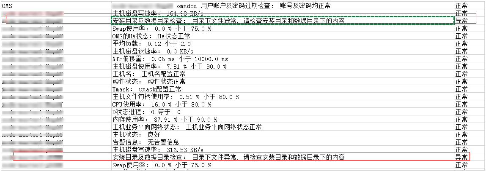

# MRS 1.7.1.3补丁说明

## 补丁基本信息

**表 1**  补丁基本信息

<table><tbody><tr id="row1285014971914"><th class="firstcol" valign="top" width="15%" id="mcps1.2.3.1.1">
补丁号

</th>
<td class="cellrowborder" valign="top" width="85%" headers="mcps1.2.3.1.1 ">
MRS 1.7.1.3

</td>
</tr>
<tr id="row13850119191916"><th class="firstcol" valign="top" width="15%" id="mcps1.2.3.2.1">
发布时间

</th>
<td class="cellrowborder" valign="top" width="85%" headers="mcps1.2.3.2.1 ">
2018-09-18

</td>
</tr>
<tr id="row15661112573315"><th class="firstcol" rowspan="3" valign="top" width="15%" id="mcps1.2.3.3.1">
解决的问题

</th>
<td class="cellrowborder" valign="top" width="85%" headers="mcps1.2.3.3.1 ">
<strong id="b1577811173342">MRS Manager</strong>

<ul id="ul180323516343"><li>MRS Manager新增运维通道功能。</li><li>MRS Manager点击审计日志详细信息下载报错。</li><li>MRS Manager界面中主机列表下的磁盘使用率计算优化。</li></ul>
</td>
</tr>
<tr id="row208501697196"><td class="cellrowborder" valign="top" headers="mcps1.2.3.3.1 ">
<strong id="b02498042018">Kafka组件问题</strong>

<ul id="ul15648182715207"><li>KAFKA-5413 Kafka日志清理失败：segment文件offset跨度过大。</li><li>KAFKA-6529 客户端异常断开场景，Broker内存泄露。</li><li>KAFKA-5417 并发场景下，客户端连接状态不一致。</li></ul>
</td>
</tr>
<tr id="row13444137203110"><td class="cellrowborder" valign="top" headers="mcps1.2.3.3.1 ">
<strong id="b112495018204">Hbase问题</strong>

<ul id="ul142251101216"><li>HBase解决每次执行balance命令，重复计算region location的问题。</li></ul>
</td>
</tr>
<tr id="row17850997197"><th class="firstcol" valign="top" width="15%" id="mcps1.2.3.6.1">
补丁兼容关系

</th>
<td class="cellrowborder" valign="top" width="85%" headers="mcps1.2.3.6.1 ">
包含1.7.1.3及之前发布的所有补丁解决的问题。

</td>
</tr>
</tbody>
</table>

## 注意事项

由于1.7.1 集群的健康检查中存在一项误报，而补丁安装前会进行集群的健康检查。从而导致客户第一次提交安装补丁后，提示集群异常，补丁安装终止。在确认报错是误报后，客户可以再次提交安装补丁请求，第二次安装补丁会跳过健康检查，进行补丁安装。

误报内容可以通过如下方式确认：

[查看并导出健康检查报告](查看并导出检查报告.md)，健康检查结果上只存在这两个主机报错：“安装目录及数据目录检查： 目录下文件异常. 请检查安装目录和数据目录下的内容“。

**图 1**  健康检查的结果  

## 安装补丁的影响

-   安装补丁后需要重启服务才能生效，重启服务期间引起服务暂不可用。
-   安装补丁后，需要重新下载安装全量的客户端，包含Master节点的原始客户端和虚拟私有云的其他节点使用的客户端（即您自行搭建的客户端）。
-   主Master节点的原始客户端全量更新，请参见[全量更新主Master节点的原始客户端](更新客户端.md#section92959464575)。
-   备Master节点的原始客户端全量更新，请参见[全量更新备Master节点的原始客户端](更新客户端.md#section1129715468573)。
-   自行搭建的客户端全量安装方法，请参见[在虚拟私有云的其他节点使用客户端](在虚拟私有云的其他节点使用客户端.md)。

> **说明：**   
>-   重新安装客户端前建议先对老客户端进行备份。  
>-   若您根据业务场景修改过客户端配置，请重装客户端后再次修改客户端配置。  

