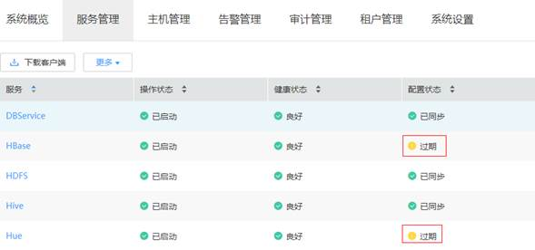

# MRS 1.7.1.6补丁说明

## 补丁基本信息

**表 1**  补丁基本信息

<table><tbody><tr id="row1285014971914"><th class="firstcol" valign="top" width="15%" id="mcps1.2.3.1.1">
补丁号

</th>
<td class="cellrowborder" valign="top" width="85%" headers="mcps1.2.3.1.1 ">
MRS 1.7.1.6

</td>
</tr>
<tr id="row13850119191916"><th class="firstcol" valign="top" width="15%" id="mcps1.2.3.2.1">
发布时间

</th>
<td class="cellrowborder" valign="top" width="85%" headers="mcps1.2.3.2.1 ">
2019-01-24

</td>
</tr>
<tr id="row15661112573315"><th class="firstcol" rowspan="5" valign="top" width="15%" id="mcps1.2.3.3.1">
解决的问题

</th>
<td class="cellrowborder" valign="top" width="85%" headers="mcps1.2.3.3.1 ">
<strong id="b14441152817392">MRS 1.7.1.6修复问题列表：</strong>

<strong id="b129346019415">MRS Manager</strong>

MRS服务启动、停止及重启支持显示依赖关系，并自定义重启哪些服务。

MRS Manager查看HBase集群运行状态时，增加集群维度的监控项。

<strong id="b19157121161811">MRS 大数据组件</strong>

MRS hue支持Yarn任务的管理功能，如停止应用。

MRS 支持HBase压缩队列告警。

</td>
</tr>
<tr id="row1669315403315"><td class="cellrowborder" valign="top" headers="mcps1.2.3.3.1 ">
<strong id="b105041224203918">MRS 1.7.1.5 修复问题列表：</strong>

<strong id="b72548257412">MRS Manager</strong>

MRS Manager UI界面排版优化

MRS Manager 操作及显示易用性优化

MRS Manager 增加大数据服务滚动重启能力

MRS Manager 新增文件句柄数量监控

MRS Manager 新增大数据组件发生重启事件上报

<strong id="b9254132518415">MRS 镜像</strong>

解决ECS VNC登录不停打印输出问题

解决操作系统日志转储配置问题

</td>
</tr>
<tr id="row871417448378"><td class="cellrowborder" valign="top" headers="mcps1.2.3.3.1 ">
<strong id="b10192157182414">MRS 1.7.1.3 修复问题列表：</strong>

MRS Manager新增运维通道功能。

</td>
</tr>
<tr id="row326134219379"><td class="cellrowborder" valign="top" headers="mcps1.2.3.3.1 ">
<strong id="b118616122518">MRS 1.7.1.2 修复问题列表：</strong>

<strong id="b1325516251840">MRS Manager</strong>

MRS Manager点击审计日志详细信息下载报错。

MRS Manager界面中主机列表下的磁盘使用率计算优化。

</td>
</tr>
<tr id="row19430103563710"><td class="cellrowborder" valign="top" headers="mcps1.2.3.3.1 ">
<strong id="b6538134492520">MRS 1.7.1.1 修复问题列表：</strong>

<strong id="b725502513410">Kafka组件问题</strong>

KAFKA-5413 Kafka日志清理失败：segment文件offset跨度过大。

KAFKA-6529 客户端异常断开场景，Broker内存泄露。

KAFKA-5417 并发场景下，客户端连接状态不一致。

<strong id="b1825517258413">HBase问题</strong>

HBase解决每次执行balance命令，重复计算region location的问题

</td>
</tr>
<tr id="row17850997197"><th class="firstcol" valign="top" width="15%" id="mcps1.2.3.8.1">
补丁兼容关系

</th>
<td class="cellrowborder" valign="top" width="85%" headers="mcps1.2.3.8.1 ">
MRS 1.7.1.6补丁包中包含MRS 1.7.1.1，MRS 1.7.1.2，MRS 1.7.1.3 和MRS 1.7.1.5补丁包的全部内容。

</td>
</tr>
</tbody>
</table>

## 注意事项

-   MRS 1.7.1.6补丁安装之后，HBase和Hue的配置状态会变成过期状态，需要手动在MRS Manager页面执行滚动重启HBase服务和Hue服务。具体操作请参考[支持滚动重启](支持滚动重启.md)。

    **图 1**  HBase服务和Hue服务状态  
    

-   新增弹性公网IP访问MRS Manager功能，弹性公网IP使用及注意事项说明参考[访问MRS Manager（MRS 2.x及之前版本）](访问MRS-Manager（MRS-2-x及之前版本）.md)。
-   普通集群（Kerberos关闭）增加了登录MRS Manager认证功能，默认初始帐号为：admin 密码为MrsDefault@123，首次登录请及时修改登录密码。安全集群登录MRS Manager认证的帐号名密码为用户自己设定值。
-   由于1.7.1 集群的健康检查中存在一项误报，而补丁安装前会进行集群的健康检查。从而导致客户第一次提交安装补丁后，提示集群异常，补丁安装终止。在确认报错是误报后，客户可以再次提交安装补丁请求，第二次安装补丁会跳过健康检查，进行补丁安装。

    误报内容可以通过如下方式确认：

    [查看并导出检查报告](查看并导出检查报告.md)，健康检查结果上只存在这两个主机报错：“安装目录及数据目录检查： 目录下文件异常. 请检查安装目录和数据目录下的内容“。

    **图 2**  健康检查结果表  
    

## 安装补丁的影响

-   安装MRS 1.7.1.1，MRS 1.7.1.2补丁期间会重启服务，重启服务期间会引起服务暂时不可用。如果已经安装了MRS 1.7.1.2补丁之后，从MRS 1.7.1.2升级其他补丁不会重启服务，业务不断服。
-   MRS 1.7.1.1，MRS 1.7.1.2补丁安装后，需要重新下载安装全量的客户端，包含Master节点的原始客户端和虚拟私有云的其他节点使用的客户端（即您自行搭建的客户端）。
-   主Master节点的原始客户端全量更新，请参见[全量更新主Master节点的原始客户端](更新客户端（3-x之前版本）.md#section92959464575)。
-   备Master节点的原始客户端全量更新，请参见[全量更新备Master节点的原始客户端](更新客户端（3-x之前版本）.md#section1129715468573)。
-   自行搭建的客户端全量安装方法，请参见[安装客户端（3.x之前版本）](安装客户端（3-x之前版本）.md)。

> **说明：** 
>-   重新安装客户端前建议先对老客户端进行备份。
>-   若您根据业务场景修改过客户端配置，请重装客户端后再次修改客户端配置。

