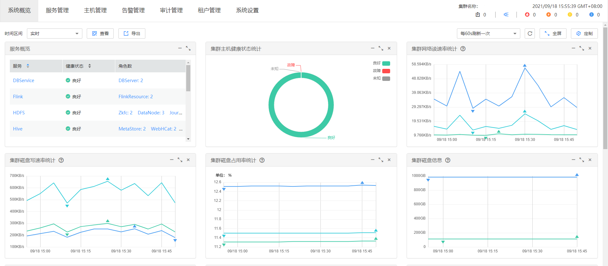

# MRS Manager简介

## 概述

MRS为用户提供海量数据的管理及分析功能，快速从结构化和非结构化的海量数据中挖掘您所需要的价值数据。开源组件结构复杂，安装、配置、管理过程费时费力，MRS Manager提供了企业级的大数据集群的统一管理平台：

-   提供集群状态的监控功能，您能快速掌握服务及主机的健康状态。
-   提供图形化的指标监控及定制，您能及时的获取系统的关键信息。
-   提供服务属性的配置功能，满足您实际业务的性能需求。
-   提供集群、服务、角色实例的操作功能，满足您一键启停等操作需求。

## 系统界面简介

MRS Manager提供统一的集群管理平台，帮助用户快捷、直观的完成集群的运行维护。MRS Manager请参考[访问Manager](访问Manager-2.md)页面访问。

各操作入口的详细功能如[表1](#zh-cn_topic_0035209593_table13549662121428)所示。

**图 1**  MRS Manager界面  

**表 1**  界面操作入口功能描述

<table><thead align="left"><tr id="zh-cn_topic_0035209593_row22155541121428"><th class="cellrowborder" valign="top" width="24.5%" id="mcps1.2.3.1.1">
界面

</th>
<th class="cellrowborder" valign="top" width="75.5%" id="mcps1.2.3.1.2">
功能描述

</th>
</tr>
</thead>
<tbody><tr id="zh-cn_topic_0035209593_row45841979121428"><td class="cellrowborder" valign="top" width="24.5%" headers="mcps1.2.3.1.1 ">
系统概览

</td>
<td class="cellrowborder" valign="top" width="75.5%" headers="mcps1.2.3.1.2 ">
提供柱状图、折线图、表格等多种图表方式展示所有服务的状态、各服务的主要监控指标、主机的状态统计。用户可以定制关键监控信息面板，并拖动到任意位置。系统概览支持数据自动刷新。

</td>
</tr>
<tr id="zh-cn_topic_0035209593_row44824869121428"><td class="cellrowborder" valign="top" width="24.5%" headers="mcps1.2.3.1.1 ">
服务管理

</td>
<td class="cellrowborder" valign="top" width="75.5%" headers="mcps1.2.3.1.2 ">
提供服务监控、服务操作向导以及服务配置，帮助用户对服务进行统一管理。

</td>
</tr>
<tr id="zh-cn_topic_0035209593_row51986413121428"><td class="cellrowborder" valign="top" width="24.5%" headers="mcps1.2.3.1.1 ">
主机管理

</td>
<td class="cellrowborder" valign="top" width="75.5%" headers="mcps1.2.3.1.2 ">
提供主机监控、主机操作向导，帮助用户对主机进行统一管理。

</td>
</tr>
<tr id="zh-cn_topic_0035209593_row57526262121428"><td class="cellrowborder" valign="top" width="24.5%" headers="mcps1.2.3.1.1 ">
告警管理

</td>
<td class="cellrowborder" valign="top" width="75.5%" headers="mcps1.2.3.1.2 ">
提供告警查询、告警处理指导功能。帮助用户及时发现产品故障及潜在隐患，并进行定位排除，以保证系统正常运行。

</td>
</tr>
<tr id="zh-cn_topic_0035209593_row56361512121428"><td class="cellrowborder" valign="top" width="24.5%" headers="mcps1.2.3.1.1 ">
审计管理

</td>
<td class="cellrowborder" valign="top" width="75.5%" headers="mcps1.2.3.1.2 ">
提供审计日志查询及导出功能。帮助用户查阅所有用户活动及操作。

</td>
</tr>
<tr id="zh-cn_topic_0035209593_row42645073202928"><td class="cellrowborder" valign="top" width="24.5%" headers="mcps1.2.3.1.1 ">
租户管理

</td>
<td class="cellrowborder" valign="top" width="75.5%" headers="mcps1.2.3.1.2 ">
提供统一租户管理平台。

</td>
</tr>
<tr id="zh-cn_topic_0035209593_row17780935121428"><td class="cellrowborder" valign="top" width="24.5%" headers="mcps1.2.3.1.1 ">
系统设置

</td>
<td class="cellrowborder" valign="top" width="75.5%" headers="mcps1.2.3.1.2 ">
用户可以进行监控和告警配置管理、备份管理。

</td>
</tr>
</tbody>
</table>

当用户进入到“系统设置”的各子功能页面后，提供快捷方式跳转到其他System子功能页面，如[表2](#zh-cn_topic_0035209593_table5212148312126)所示。

快捷跳转操作示例如下所示。

1.  在MRS Manager，单击“系统设置”。
2.  在“系统设置”界面，任意单击一个功能链接，进入具体功能界面。

    例如在“备份恢复管理”区域中单击“备份管理”，进入到“备份管理”界面。

3.  将鼠标移动到浏览器窗口的左边界，弹出“系统设置“黑色快捷菜单。鼠标移出该菜单后，该菜单收起。
4.  在弹出的快捷菜单上，可以单击某个功能链接直接跳转到对应的功能界面。

    例如选择“维护 \> 日志导出“，进入“日志导出”界面。

**表 2**  集群的System快捷菜单

<table><thead align="left"><tr id="zh-cn_topic_0035209593_row4143668412126"><th class="cellrowborder" valign="top" width="50%" id="mcps1.2.3.1.1">
菜单子标题

</th>
<th class="cellrowborder" valign="top" width="50%" id="mcps1.2.3.1.2">
功能链接

</th>
</tr>
</thead>
<tbody><tr id="zh-cn_topic_0035209593_row5044035312126"><td class="cellrowborder" rowspan="2" valign="top" width="50%" headers="mcps1.2.3.1.1 ">
备份恢复管理

</td>
<td class="cellrowborder" valign="top" width="50%" headers="mcps1.2.3.1.2 ">
备份管理

</td>
</tr>
<tr id="zh-cn_topic_0035209593_row2684757312126"><td class="cellrowborder" valign="top" headers="mcps1.2.3.1.1 ">
恢复管理

</td>
</tr>
<tr id="zh-cn_topic_0035209593_row968636112126"><td class="cellrowborder" rowspan="3" valign="top" width="50%" headers="mcps1.2.3.1.1 ">
维护

</td>
<td class="cellrowborder" valign="top" width="50%" headers="mcps1.2.3.1.2 ">
日志导出

</td>
</tr>
<tr id="zh-cn_topic_0035209593_row112998712126"><td class="cellrowborder" valign="top" headers="mcps1.2.3.1.1 ">
审计日志导出

</td>
</tr>
<tr id="zh-cn_topic_0035209593_row1839166212126"><td class="cellrowborder" valign="top" headers="mcps1.2.3.1.1 ">
健康检查

</td>
</tr>
<tr id="zh-cn_topic_0035209593_row5363168012126"><td class="cellrowborder" rowspan="5" valign="top" width="50%" headers="mcps1.2.3.1.1 ">
监控和告警配置

</td>
<td class="cellrowborder" valign="top" width="50%" headers="mcps1.2.3.1.2 ">
Syslog配置

</td>
</tr>
<tr id="zh-cn_topic_0035209593_row2982640712126"><td class="cellrowborder" valign="top" headers="mcps1.2.3.1.1 ">
阈值管理

</td>
</tr>
<tr id="zh-cn_topic_0035209593_row1450146312126"><td class="cellrowborder" valign="top" headers="mcps1.2.3.1.1 ">
SNMP配置

</td>
</tr>
<tr id="zh-cn_topic_0035209593_row5489671612126"><td class="cellrowborder" valign="top" headers="mcps1.2.3.1.1 ">
监控指标转储配置

</td>
</tr>
<tr id="zh-cn_topic_0035209593_row3677799712126"><td class="cellrowborder" valign="top" headers="mcps1.2.3.1.1 ">
资源贡献排名配置

</td>
</tr>
<tr id="zh-cn_topic_0035209593_row6115575012126"><td class="cellrowborder" rowspan="5" valign="top" width="50%" headers="mcps1.2.3.1.1 ">
权限配置

</td>
<td class="cellrowborder" valign="top" width="50%" headers="mcps1.2.3.1.2 ">
用户管理

</td>
</tr>
<tr id="zh-cn_topic_0035209593_row5796446112126"><td class="cellrowborder" valign="top" headers="mcps1.2.3.1.1 ">
用户组管理

</td>
</tr>
<tr id="zh-cn_topic_0035209593_row5718335712126"><td class="cellrowborder" valign="top" headers="mcps1.2.3.1.1 ">
角色管理

</td>
</tr>
<tr id="zh-cn_topic_0035209593_row3758220412126"><td class="cellrowborder" valign="top" headers="mcps1.2.3.1.1 ">
密码策略配置

</td>
</tr>
<tr id="zh-cn_topic_0035209593_row3570287212126"><td class="cellrowborder" valign="top" headers="mcps1.2.3.1.1 ">
OMS数据库密码修改

</td>
</tr>
<tr id="zh-cn_topic_0035209593_row6106374912126"><td class="cellrowborder" valign="top" width="50%" headers="mcps1.2.3.1.1 ">
补丁管理

</td>
<td class="cellrowborder" valign="top" width="50%" headers="mcps1.2.3.1.2 ">
补丁管理

</td>
</tr>
</tbody>
</table>

## 参考信息

MapReduce服务是公有云的一项数据分析服务，用于海量数据的管理和分析，简称MRS。

MRS通过MRS Manager管理大数据组件，例如Hadoop生态体系中的组件。因此，公有云MRS和MRS Manager管理界面上的部分概念需要区别，具体解释如[表3](#zh-cn_topic_0035209593_table39303837105524)：

**表 3**  差异对比参考

<table><thead align="left"><tr id="zh-cn_topic_0035209593_row36661318105524"><th class="cellrowborder" valign="top" width="25.542554255425543%" id="mcps1.2.4.1.1">
名词概念

</th>
<th class="cellrowborder" valign="top" width="39.31393139313931%" id="mcps1.2.4.1.2">
公有云MRS

</th>
<th class="cellrowborder" valign="top" width="35.14351435143514%" id="mcps1.2.4.1.3">
MRS Manager

</th>
</tr>
</thead>
<tbody><tr id="zh-cn_topic_0035209593_row60614430105524"><td class="cellrowborder" valign="top" width="25.542554255425543%" headers="mcps1.2.4.1.1 ">
MapReduce服务

</td>
<td class="cellrowborder" valign="top" width="39.31393139313931%" headers="mcps1.2.4.1.2 ">
表示公有云上的数据分析云服务，简称为MRS，包括Hive、Spark、Yarn、HDFS和ZooKeeper等组件。

</td>
<td class="cellrowborder" valign="top" width="35.14351435143514%" headers="mcps1.2.4.1.3 ">
为租户集群中的大数据组件提供的统一管理平台。

</td>
</tr>
</tbody>
</table>

