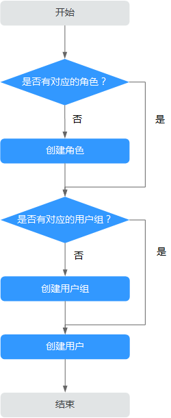

# MRS集群中的用户与权限

## 概述

-   **MRS集群用户**

    Manager中的安全帐号，包含用户名、密码等属性，MRS集群的使用者通过这类用户访问集群中的资源。每个启用Kerberos认证的MRS集群可以有多个用户。

-   **MRS集群角色**

    用户在实际使用MRS集群时需根据业务场景获取访问资源的权限，访问资源的权限是定义到MRS集群对象上的。集群的角色就是包含一个或者多个权限的集合。例如，HDFS中某个目录的访问权限，需要在指定的目录上配置，并保存在角色中。

Manager支持MRS集群用户权限管理功能，使权限管理与用户管理更加直观、易用。

-   权限管理：使用RBAC（Role-Based Access Control）方式，即基于角色授予权限，形成权限的集合。用户通过分配一个或多个已授权的角色取得对应的权限。
-   用户管理：使用Manager统一管理MRS集群用户，并通过Kerberos协议认证用户，LDAP协议存储用户信息。

## 权限管理

MRS集群提供的权限包括Manager和各组件（例如HDFS、HBase、Hive和Yarn等）的操作维护权限，在实际应用时需根据业务场景为各用户分别配置不同权限。为了提升权限管理的易用性，Manager引入角色的功能，通过选取指定的权限并统一授予角色，以权限集合的形式实现了权限集中查看和管理，提升了权限管理的易用性和用户体验。

角色可以理解为集中一个或多个权限的逻辑体，角色被授予指定的权限，用户通过绑定角色获得对应的权限。

一个角色可以有多个权限，一个用户可以绑定多个角色。

-   角色1：授予操作权限A和B，用户a和用户b通过绑定角色1取得对应的权限。
-   角色2：授予操作权限C，用户c和用户d通过绑定角色2取得对应的权限。
-   角色3：授予操作权限D和F，用户a通过绑定配角色3取得对应的权限。

例如，MRS集群用户绑定了管理员角色，那么这个用户成为MRS集群的管理员用户。

Manager界面显示系统默认创建的角色如[表1](#te7b79730a8de49dc9a52be8196677697)所示。

**表 1**  Manager默认角色与描述

<table><thead align="left"><tr id="r1fbd785ba3e74fb8a41303a12ad301da"><th class="cellrowborder" valign="top" width="30.5%" id="mcps1.2.3.1.1">
<strong id="a4364bc0e0c4a45aabd673f6ab094c715">默认角色</strong>

</th>
<th class="cellrowborder" valign="top" width="69.5%" id="mcps1.2.3.1.2">
<strong id="a1043ce6f96374c1f84da9d9a945fbd22">角色描述</strong>

</th>
</tr>
</thead>
<tbody><tr id="r82ce0ebc84e94e64863ede4af89f419b"><td class="cellrowborder" valign="top" width="30.5%" headers="mcps1.2.3.1.1 ">
default

</td>
<td class="cellrowborder" valign="top" width="69.5%" headers="mcps1.2.3.1.2 ">
为租户创建的角色。

</td>
</tr>
<tr id="r544e22b6ccc9428fa6cf564f62e8cd75"><td class="cellrowborder" valign="top" width="30.5%" headers="mcps1.2.3.1.1 ">
Manager_administrator

</td>
<td class="cellrowborder" valign="top" width="69.5%" headers="mcps1.2.3.1.2 ">
Manager管理员，具有Manager的管理权限。

</td>
</tr>
<tr id="r8abefdfd49ec41d8ab0e39bd08a16058"><td class="cellrowborder" valign="top" width="30.5%" headers="mcps1.2.3.1.1 ">
Manager_auditor

</td>
<td class="cellrowborder" valign="top" width="69.5%" headers="mcps1.2.3.1.2 ">
Manager审计员，具有查看和管理审计信息的权限。

</td>
</tr>
<tr id="r31186eb7c5d44ad094b3df28a126777e"><td class="cellrowborder" valign="top" width="30.5%" headers="mcps1.2.3.1.1 ">
Manager_operator

</td>
<td class="cellrowborder" valign="top" width="69.5%" headers="mcps1.2.3.1.2 ">
Manager操作员，具有除租户管理、配置管理和集群管理功能以外的权限。

</td>
</tr>
<tr id="r0e4f5f9e99514a7684e8e4e8751dc195"><td class="cellrowborder" valign="top" width="30.5%" headers="mcps1.2.3.1.1 ">
Manager_viewer

</td>
<td class="cellrowborder" valign="top" width="69.5%" headers="mcps1.2.3.1.2 ">
Manager查看员，具有查看系统概览，服务，主机，告警，审计日志等信息的权限。

</td>
</tr>
<tr id="r47f630a5cf8b44fa981f8d3d0802b93f"><td class="cellrowborder" valign="top" width="30.5%" headers="mcps1.2.3.1.1 ">
System_administrator

</td>
<td class="cellrowborder" valign="top" width="69.5%" headers="mcps1.2.3.1.2 ">
系统管理员，具有Manager的管理权限及所有服务管理员的所有权限。

</td>
</tr>
<tr id="r1767dac05c0843928dd73eb14c617849"><td class="cellrowborder" valign="top" width="30.5%" headers="mcps1.2.3.1.1 ">
Manager_tenant

</td>
<td class="cellrowborder" valign="top" width="69.5%" headers="mcps1.2.3.1.2 ">
Manager租户管理页面查看角色，具有Manager“租户管理”页面查看权限。

</td>
</tr>
</tbody>
</table>

通过Manager创建角色时支持对Manager和组件进行授权管理，如[表2](#t1eebab7f372e49fbb70f1802069f1001)所示。

**表 2**  Manager与组件授权管理

<table><thead align="left"><tr id="r39784088a2774ecbb9fcdb3d066e4f69"><th class="cellrowborder" valign="top" width="30.5%" id="mcps1.2.3.1.1">
<strong id="a00df0f1a07994ff383eb4aa7c3739b63">授权类型</strong>

</th>
<th class="cellrowborder" valign="top" width="69.5%" id="mcps1.2.3.1.2">
<strong id="aed5db03a231544a4a6348b222a103bc4">授权描述</strong>

</th>
</tr>
</thead>
<tbody><tr id="r9454b0b2768c402fa4921f67cc5770ac"><td class="cellrowborder" valign="top" width="30.5%" headers="mcps1.2.3.1.1 ">
Manager

</td>
<td class="cellrowborder" valign="top" width="69.5%" headers="mcps1.2.3.1.2 ">
Manager访问与登录权限。

</td>
</tr>
<tr id="r210bd779b1114cc4b22d7823a39803ef"><td class="cellrowborder" valign="top" width="30.5%" headers="mcps1.2.3.1.1 ">
HBase

</td>
<td class="cellrowborder" valign="top" width="69.5%" headers="mcps1.2.3.1.2 ">
HBase管理员权限设置和表、列族授权。

</td>
</tr>
<tr id="r5a65baca7a4d4b4c8a4b5b936686289c"><td class="cellrowborder" valign="top" width="30.5%" headers="mcps1.2.3.1.1 ">
HDFS

</td>
<td class="cellrowborder" valign="top" width="69.5%" headers="mcps1.2.3.1.2 ">
HDFS中的目录和文件授权。

</td>
</tr>
<tr id="rc156133b2b084b80b9d77605348751ec"><td class="cellrowborder" valign="top" width="30.5%" headers="mcps1.2.3.1.1 ">
Hive

</td>
<td class="cellrowborder" valign="top" width="69.5%" headers="mcps1.2.3.1.2 "><ul id="u152dfabcac93410bb1fd0b99568bb241"><li>Hive Admin Privilege
Hive管理员权限。

</li><li>Hive Read Write Privileges
Hive数据表管理权限，可设置与管理已创建的表的数据操作权限。

</li></ul>
</td>
</tr>
<tr id="row3228907510047"><td class="cellrowborder" valign="top" width="30.5%" headers="mcps1.2.3.1.1 ">
Hue

</td>
<td class="cellrowborder" valign="top" width="69.5%" headers="mcps1.2.3.1.2 ">
存储策略管理员权限。

</td>
</tr>
<tr id="r38c7b1a7bc5a49eb92a15b9610f136f3"><td class="cellrowborder" valign="top" width="30.5%" headers="mcps1.2.3.1.1 ">
Yarn

</td>
<td class="cellrowborder" valign="top" width="69.5%" headers="mcps1.2.3.1.2 "><ul id="u69d9287a1aca4746be7a4c69dea38dc6"><li>Cluster Admin Operations
Yarn管理员权限。

</li><li>Scheduler Queue
队列资源管理。

</li></ul>
</td>
</tr>
</tbody>
</table>

## 用户管理

支持Kerberos认证的MRS集群使用Kerberos协议和LDAP（Lightweight Directory Access Protocol）协议来配合工作，实现用户管理：

-   Kerberos用于在用户登录Manager与使用组件客户端时认证用户身份，未启用Kerberos认证的集群则不认证用户身份。
-   LDAP用于存储用户记录、用户组信息与权限信息等用户信息。

MRS集群支持在Manager执行创建用户或者修改用户等任务时，系统自动完成更新Kerberos和LDAP的用户数据，用户登录Manager或使用组件客户端时，系统自动完成认证用户身份和获取用户信息。这样一方面保证了用户管理的安全性，另一方面简化了用户管理的操作任务。Manager还提供了用户组功能，可对单个或多个用户进行分类管理：

-   用户组为一批用户的集合，可对用户进行分类管理。系统中的用户可以单独存在也可以加入到某个用户组中。
-   对已分配角色的用户组来说，当用户添加到该组时，用户组分配的角色权限将授权给用户。

MRS 3.x之前版本集群MRS Manager界面显示系统默认创建的用户组如[表3](#td676ae12a3a64c008ec055b498a52d78)所示。

MRS 3.x及之后版本集群FusionInsight Manager界面显示系统默认创建的用户组请参考[用户组](默认权限信息一览.md#zh-cn_topic_0263899337_section1031812876)。

**表 3**  Manager默认用户组与描述

<table><thead align="left"><tr id="r92c51b79570b4196a45be4fe35b3a3c5"><th class="cellrowborder" valign="top" width="30.693069306930692%" id="mcps1.2.3.1.1">
<strong id="zh-cn_topic_0043021163_b248510514747">用户组名称</strong>

</th>
<th class="cellrowborder" valign="top" width="69.3069306930693%" id="mcps1.2.3.1.2">
<strong id="aca5ef23651a04b3dbcd27e1b0d4b3a15">描述</strong>

</th>
</tr>
</thead>
<tbody><tr id="rc0ae883bba1144d1a090b7c62d1213b8"><td class="cellrowborder" valign="top" width="30.693069306930692%" headers="mcps1.2.3.1.1 ">
hadoop

</td>
<td class="cellrowborder" valign="top" width="69.3069306930693%" headers="mcps1.2.3.1.2 ">
将用户加入此用户组，可获得所有Yarn队列的任务提交权限。

</td>
</tr>
<tr id="rcf29043ac8b840ac8d05e00beb289b6b"><td class="cellrowborder" valign="top" width="30.693069306930692%" headers="mcps1.2.3.1.1 ">
hbase

</td>
<td class="cellrowborder" valign="top" width="69.3069306930693%" headers="mcps1.2.3.1.2 ">
普通用户组，将用户加入此用户组不会获得额外的权限。

</td>
</tr>
<tr id="r021484b01b7441bcbccc07289a07df17"><td class="cellrowborder" valign="top" width="30.693069306930692%" headers="mcps1.2.3.1.1 ">
hive

</td>
<td class="cellrowborder" valign="top" width="69.3069306930693%" headers="mcps1.2.3.1.2 ">
将用户加入此用户组，可以使用Hive。

</td>
</tr>
<tr id="r125f6208d20c483daa9e4bacacc87713"><td class="cellrowborder" valign="top" width="30.693069306930692%" headers="mcps1.2.3.1.1 ">
spark

</td>
<td class="cellrowborder" valign="top" width="69.3069306930693%" headers="mcps1.2.3.1.2 ">
普通用户组，将用户加入此用户组不会获得额外的权限。

</td>
</tr>
<tr id="r1f5a7d097dd04f6c9856b7fa01baadcb"><td class="cellrowborder" valign="top" width="30.693069306930692%" headers="mcps1.2.3.1.1 ">
supergroup

</td>
<td class="cellrowborder" valign="top" width="69.3069306930693%" headers="mcps1.2.3.1.2 ">
将用户加入此用户组，可获得HBase、HDFS和Yarn的管理员权限，并可以使用Hive。

</td>
</tr>
<tr id="row4213721515591"><td class="cellrowborder" valign="top" width="30.693069306930692%" headers="mcps1.2.3.1.1 ">
flume

</td>
<td class="cellrowborder" valign="top" width="69.3069306930693%" headers="mcps1.2.3.1.2 ">
普通用户组。添加到该用户组的用户无任何额外权限。

</td>
</tr>
<tr id="row25758293172716"><td class="cellrowborder" valign="top" width="30.693069306930692%" headers="mcps1.2.3.1.1 ">
kafka

</td>
<td class="cellrowborder" valign="top" width="69.3069306930693%" headers="mcps1.2.3.1.2 ">
Kafka普通用户组。添加入本组的用户，需要被kafkaadmin组用户授予特定Topic的读写权限,才能访问对应Topic。

</td>
</tr>
<tr id="row63807695172720"><td class="cellrowborder" valign="top" width="30.693069306930692%" headers="mcps1.2.3.1.1 ">
kafkasuperuser

</td>
<td class="cellrowborder" valign="top" width="69.3069306930693%" headers="mcps1.2.3.1.2 ">
添加入本组的用户，拥有所有Topic的读写权限。

</td>
</tr>
<tr id="row19151905172724"><td class="cellrowborder" valign="top" width="30.693069306930692%" headers="mcps1.2.3.1.1 ">
kafkaadmin

</td>
<td class="cellrowborder" valign="top" width="69.3069306930693%" headers="mcps1.2.3.1.2 ">
Kafka管理员用户组。添加入本组的用户，拥有所有Topic的创建，删除，授权及读写权限。

</td>
</tr>
<tr id="row6240879172730"><td class="cellrowborder" valign="top" width="30.693069306930692%" headers="mcps1.2.3.1.1 ">
storm

</td>
<td class="cellrowborder" valign="top" width="69.3069306930693%" headers="mcps1.2.3.1.2 ">
Storm的普通用户组，属于该组的用户拥有提交拓扑和管理属于自己的拓扑的权限。

</td>
</tr>
<tr id="row39302212172734"><td class="cellrowborder" valign="top" width="30.693069306930692%" headers="mcps1.2.3.1.1 ">
stormadmin

</td>
<td class="cellrowborder" valign="top" width="69.3069306930693%" headers="mcps1.2.3.1.2 ">
Storm的管理员用户组，属于该组的用户拥有提交拓扑和管理所有拓扑的权限。

</td>
</tr>
</tbody>
</table>

启用Kerberos认证的MRS集群默认创建“admin“用户帐号，用于集群管理员维护集群。

## 流程概述

在实际业务中，MRS集群用户需要先明确大数据的业务场景，规划集群用户对应的权限。然后在Manager界面创建角色，并设置角色包含的权限以匹配业务的需求。如果需要统一管理单个或多个相同业务场景中的用户，Manager提供了用户组的功能，管理员可以创建用户组。

> **说明：** 
>如果角色设置HDFS、HBase、Hive或Yarn各组件的权限，仅可以使用组件自身功能。如果还需要使用Manager，请在角色中添加对应的Manager权限。

**图 1**  创建用户流程示意  

