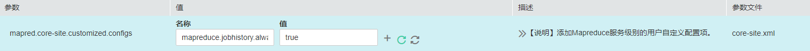

# MapReduce对接OBS文件系统

使用本章节前已参考[配置存算分离集群（委托方式）](配置存算分离集群（委托方式）.md)或[配置存算分离集群（AKSK方式）](配置存算分离集群（AKSK方式）.md)完成存算分离集群配置。

1.  登录MRS管理控制台，单击集群名称进入集群详情页面。
2.  选择“组件管理 \> Mapreduce”，进入Mapreduce服务“全部配置”页面，在左侧的导航列表中选择“Mapreduce \> 自定义”。在自定义配置项中，给参数文件“core-site.xml“添加配置项“mapreduce.jobhistory.always-scan-user-dir”，设置值为“true“。

    

3.  保存配置，并重启Mapreduce服务。

