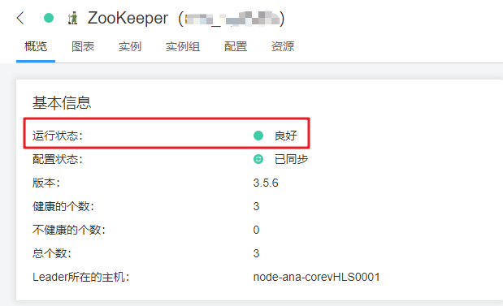
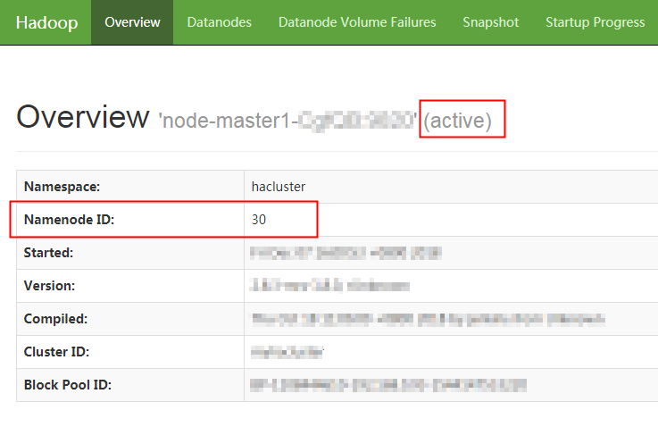
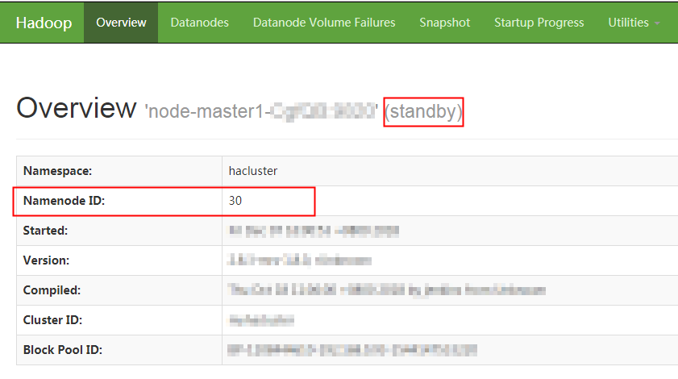
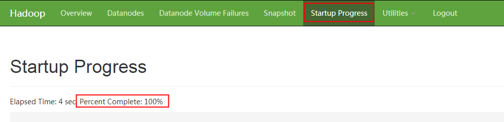

# Master节点规格升级<a name="ZH-CN_TOPIC_0136413751"></a>

随着用户业务的增长，Core节点的扩容，CPU使用率变高，而Master节点规格已经不满足用户需求时，则需要升级Master节点规格。本章节介绍Master节点规格升级的操作流程。仅支持开启集群高可用开关的集群进行Master节点规格升级。

## MRS 1.8.2及之后版本集群Master节点规格升级<a name="section9102175113472"></a>

1.  登录MRS管理控制台。
2.  选择  “集群列表  \>  现有集群“  ，选中需要升级Master节点规格的集群并单击集群名，进入集群信息页面。
3.  在“节点信息“页签选择“升级Master规格“，进入“升级Master规格“页面。

    **图 1**  升级Master节点的规格<a name="fig1111118124920"></a>  
    

4.  选择升级后的规格，单击“提交订单“成功提交升级Master规格任务。

    节点规格升级过程需要时间，升级成功后集群状态更新为“运行中”，请您耐心等待。

    **图 2**  升级Master规格<a name="fig11899145814116"></a>  
    


## MRS 1.8.2之前版本集群Master节点规格升级<a name="section43251723164812"></a>

**Master节点规格升级前准备**

1.  <a name="li487181481727"></a>登录MRS管理控制台。
2.  选择  “集群列表  \>  现有集群“  ，选中需要升级Master节点规格的集群并单击集群名，进入集群信息页面。
3.  查看集群状态，确保集群状态为“运行中”。
4.  在“节点信息“页签查看各节点状态，确保集群所有节点的状态为“运行中”。
5.  登录MRS Manager，进入集群管理页面，具体请参见[访问MRS Manager](访问MRS-Manager.md)或[访问支持Kerberos认证的Manager](访问支持Kerberos认证的Manager.md)。
6.  选择“服务管理 \> ZooKeeper \> 服务状态”，确保ZooKeeper服务的“健康状态“为“良好“。

    **图 3**  ZooKeeper服务状态<a name="fig13948230194818"></a>  
    

7.  用户根据自己的需要更新服务参数配置，具体请参考[配置服务参数](配置服务参数.md)。

    > **说明：**   
    >该步骤仅在升级备Master节点前操作一次即可。  

8.  <a name="li36491855204611"></a>选择“服务管理 \> HDFS \> 实例”。
9.  <a name="li3448141413114"></a>记录“NameNode\(备\)“的业务IP，当升级主Master节点规格时请记录“NameNode\(主\)“的业务IP，如[图4](#fig12363132192817)所示。

    **图 4**  NameNode业务IP<a name="fig12363132192817"></a>  
    

    > **说明：**   
    >仅当集群类型为分析集群时执行[8](#li36491855204611)-[9](#li3448141413114)分别记录主备节点的IP。  

10. 在MRS Manager页面右上方查看图形的右侧数字，确保该数字显示为“0”表示集群的运行任务数为0。
11. 单击“主机管理 ”，若集群类型为分析集群，则勾选[9](#li3448141413114)记录的“NameNode“的业务IP所对应的主机前的复选框。若集群类型为流式集群，则不区分主备节点，分别选择主机升级即可。
12. <a name="li12169193211415"></a>选择“更多\> 停止所有角色”，并等待所有角色停止完成。

    > **说明：**   
    >-   当升级MRS Manager所在的节点时，可能出现MRS Manager无法登录问题，是MRS Manager所在的节点在进行主备倒换的正常现象，请稍后重新登录即可。若长时间无法登录，请联系运维人员处理。  
    >-   停止所有角色后，可能出现如下告警，Master节点规格升级完成并启动所有角色后，告警将自动恢复。  
    >    -   [ALM-12006 节点故障](ALM-12006-节点故障.md)  
    >    -   [ALM-12010 Manager主备节点间心跳中断](ALM-12010-Manager主备节点间心跳中断.md)  
    >    -   [ALM-12039 GaussDB主备数据不同步](ALM-12039-GaussDB主备数据不同步.md)  
    >    -   [ALM-14000 HDFS服务不可用](ALM-14000-HDFS服务不可用.md)  
    >    -   [ALM-14010 NameService服务异常](ALM-14010-NameService服务异常.md)  
    >    -   [ALM-14012 HDFS Journalnode数据不同步](ALM-14012-HDFS-Journalnode数据不同步.md)  
    >    -   [ALM-16004 Hive服务不可用](ALM-16004-Hive服务不可用.md)  
    >    -   [ALM-18000 Yarn服务不可用](ALM-18000-Yarn服务不可用.md)  
    >    -   [ALM-19000 HBase服务不可用](ALM-19000-HBase服务不可用.md)  
    >    -   [ALM-20002 Hue服务不可用](ALM-20002-Hue服务不可用.md)  
    >    -   [ALM-23001 Loader服务不可用](ALM-23001-Loader服务不可用.md)  
    >    -   [ALM-27001 DBService服务不可用](ALM-27001-DBService服务不可用.md)  
    >    -   [ALM-27003 DBService主备节点间心跳中断](ALM-27003-DBService主备节点间心跳中断.md)  
    >    -   [ALM-27004 DBService主备数据不同步](ALM-27004-DBService主备数据不同步.md)  
    >    -   [ALM-43001 Spark服务不可用](ALM-43001-Spark服务不可用.md)  


**Master节点规格升级操作**

1.  登录MRS管理控制台。
2.  选择  “集群列表  \>  现有集群“  ，选中需要升级Master节点规格的集群并单击集群名，进入集群信息页面。
3.  在“节点信息“页签选择“升级Master规格“。

    **图 5**  升级Master节点规格<a name="fig1182495353014"></a>  
    

4.  选择升级后的规格，单击“下一步“。

    **图 6**  选择升级后Master规格<a name="fig138415522612"></a>  
    

5.  在弹出的“确认“页面确认升级后的节点规格及费用，确认无误后单击“确认“。
6.  确保已停止备Master节点的所有服务（详细操作请参考**Master节点规格升级前准备**的[1](#li487181481727)-[12](#li12169193211415)），在“升级Master规格“页面勾选“我已确认关闭备master节点上的所有服务“和“若升级前未成功停止所有服务，可能导致数据保存失败或损坏“两项提示内容，并单击“提交订单“。

    **图 7**  选择升级备Master节点<a name="fig15289115320139"></a>  
    

7.  在弹出的“警告“页面，再次确认已确认关闭备master节点上的所有服务，然后单击“确定“开始升级备Master节点的规格。

    节点规格升级需要时间，请耐心等待。升级成功后集群状态更新为“Master备节点升级完成”，否则请联系运维人员处理。

8.  备Master节点升级成功后，参考****Master节点规格升级后操作****的[1](#li1571022151014)-[11](#li47118211017)完成备Master节点所有服务的启动及参数配置。
9.  备Master节点服务启动正常后，进行NameNode主备倒换。仅当集群类型为分析集群时执行该步骤，流式集群跳过该步骤。
    1.  分别访问主备节点的NameNode WebUI界面，NameNode WebUI访问方法请参考[11](#li47118211017)。
    2.  <a name="li67484244318"></a>分别在NameNode WebUI页面的标题栏选择“Overview”，查看并记录主备节点的Namenode ID。记录后不要关闭该页面。

        **图 8**  主节点的Namenode ID<a name="fig72881017493"></a>  
        

    3.  任意登录一个Master节点的弹性云服务器，执行如下命令配置环境变量。

        ```
        source /opt/client/bigdata_env
        ```

    4.  如果当前集群已启用Kerberos认证，执行以下命令认证当前用户。如果当前集群未启用Kerberos认证，则无需执行此命令。

        ```
        kinit MRS集群用户
        ```

        例如,  **kinit admin**.

    5.  执行如下命令进行NameNode主备倒换。

        ```
        hdfs haadmin -failover <主节点Namenode ID> <备节点Namenode ID>
        ```

    6.  进入[9.b](#li67484244318)中未关闭的NameNode WebUI页面，然后刷新该页面，可以看到该NameNode已经主备倒换完成。

        **图 9**  NameNode<a name="fig3872103795519"></a>  
        


10. 参考**Master节点规格升级前准备**的[1](#li487181481727)-[12](#li12169193211415)，停止主Master节点的所有服务。
11. 在“升级Master规格“页面勾选“我已确认启动备master节点上的所有服务“和“我已确认关闭主master节点的所有服务“，并单击“提交主节点升级订单“。

    **图 10**  备节点升级成功<a name="fig165215581408"></a>  
    

12. 在弹出的“确认“页面再次确认已停止主Master节点的所有服务，然后单击“确定“开始升级主Master节点的规格。

    节点规格升级过程需要时间，请您耐心等待。升级成功后集群状态更新为“Master升级规格成功”，否则请联系运维人员处理。

13. 参考**Master节点规格升级后操作**的[1](#li1571022151014)-[11](#li47118211017)完成主Master节点所有服务的启动及参数配置。
14. 在“升级Master规格“页面勾选“我已确认启动主master节点上的所有服务“，并单击“确定“完成Master规格升级。

    **图 11**  主Master节点规格升级成功<a name="fig2341161665417"></a>  
    


**Master节点规格升级后操作**

1.  <a name="li1571022151014"></a>登录MRS Manager，进入集群管理页面，具体请参见[访问MRS Manager](访问MRS-Manager.md)或[访问支持Kerberos认证的Manager](访问支持Kerberos认证的Manager.md)。
2.  单击“主机管理 ”，查看Master节点规格升级前准备中[9](#li3448141413114)记录的“NameNode“的业务IP所对应的主机是否满足“健康状态“是为“良好“，“磁盘使用率“、“内存使用率“、“CPU使用率“显示正常（有数值），若满足执行[9](#li1271115271019)。若不满足执行下一步。
3.  远程登录备Master节点，详情请参见[登录弹性云服务器（VNC方式）](登录弹性云服务器（VNC方式）.md)。
4.  执行以下命令切换为omm用户。

    ```
    su - omm
    ```

5.  执行以下命令启动Agent。

    ```
    sh /opt/Bigdata/nodeagent/bin/start-agent.sh
    ```

6.  执行以下命令确认Agent启动成功。

    ```
    jps | grep NodeAgent
    ```

7.  登录MRS Manager，进入集群管理页面，具体请参考[访问MRS Manager](访问MRS-Manager.md)或[访问支持Kerberos认证的Manager](访问支持Kerberos认证的Manager.md)。
8.  单击“主机管理 ”，查看Master节点规格升级前准备中[9](#li3448141413114)记录的“NameNode“的业务IP所对应的主机，确保其“健康状态“是为“良好“，“磁盘使用率“、“内存使用率“、“CPU使用率“显示正常（有数值）。

    > **说明：**   
    >Agent成功启动到主机状态显示正常，最长可能需要3分钟时间生效，请耐心等待。若长时间显示异常，请联系运维人员处理。  

9.  <a name="li1271115271019"></a>在MRS Manager单击“主机管理 ”，勾选Master节点规格升级前准备中[9](#li3448141413114)记录的“NameNode“的业务IP所对应的主机前的复选框。
10. 选择“更多\> 启动所有角色”，并等待所有角色启动完成。
11. <a name="li47118211017"></a>访问NameNode WebUI界面，查看NameNode启动状态。

    -   针对MRS 1.8.0及之后版本
        1.  选择“服务管理 \> HDFS \> 服务状态”。
        2.  在“HDFS 概述”栏目，单击“NameNode WebUI“右侧升级完成的备节点或主节点的“NameNode“。
        3.  进入NameNode WebUI界面，在标题栏选择“Startup Progress”，确保Percent Complete显示100%后再执行下一步，如[图12](#fig111356111213)所示。

            **图 12**  NameNode的启动状态<a name="fig111356111213"></a>  
            


    -   针对MRS 1.8.0之前版本
        1.  在MRS管理控制台，单击“集群列表“。
        2.  在  “现有集群“  列表中，单击指定的集群名称。

            记录集群的“可用分区“、“虚拟私有云“、“集群控制台地址“，以及Master节点的“默认安全组“。

        3.  在ECS管理控制台，创建一个新的弹性云服务器。

            -   弹性云服务器的“可用分区“、“虚拟私有云“、“安全组“，需要和待访问集群的配置相同。
            -   选择一个Windows系统的公共镜像。例如，选择一个标准镜像“Windows Server 2012 R2 Standard 64bit\(40GB\)“。
            -   其他配置参数详细信息，请参见“弹性云服务器  \>  快速入门  \>  购买并登录Windows  \>  弹性云服务器“

            > **说明：**   
            >如果ECS的安全组和Master节点的“默认安全组“不同，用户可以选择以下任一种方法修改配置：  
            >-   将ECS的安全组修改为Master节点的默认安全组，请参见“弹性云服务器  \>  用户指南  \>  网络  \>  更改安全组“。  
            >-   在集群Master节点和Core节点的安全组添加两条安全组规则使ECS可以访问集群，“协议“需选择为“TCP“，“端口“需分别选择“28443“和“20009“。请参见“虚拟私有云  \>  用户指南  \>  安全性  \>  安全组  \>  添加安全组规则“。  

        4.  在VPC管理控制台，申请一个弹性IP地址，并与ECS绑定。

            具体请参见“虚拟私有云  \>  用户指南  \>  弹性公网IP  \>  为弹性云服务器申请和绑定弹性公网IP“。

        5.  登录ECS。

            登录ECS需要Windows系统的帐号、密码，弹性IP地址以及配置安全组规则。具体请参见“弹性云服务器  \>  用户指南  \>  实例  \>  登录Windows弹性云服务器“。

        6.  在Windows的远程桌面中，打开浏览器访问NameNode WebUI界面。

            例如Windows 2012操作系统可以使用Internet Explorer 11。

            NameNode WebUI界面访问地址形式为：

            -   适用于MRS 1.6.3及以前版本

                http://主NameNode角色实例IP地址:25002/dfshealth.html\#tab-overview


            -   适用于MRS 1.6.3以后MRS 1.8.0之前的版本

                http://主NameNode角色实例IP地址:9870/dfshealth.html\#tab-overview


        7.  进入NameNode WebUI界面，在标题栏选择“Startup Progress”，确保Percent Complete显示100%后再执行下一步，如[图13](#zh-cn_topic_0136413751_fig111356111213)所示。

            **图 13**  NameNode的启动状态<a name="zh-cn_topic_0136413751_fig111356111213"></a>  
            


    > **说明：**   
    >仅当集群类型为分析集群时执行[11](#li47118211017)，流式集群跳过该步骤。  


