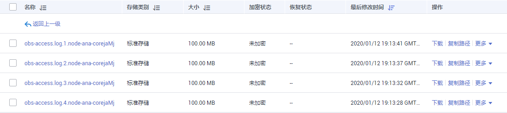

# OBS访问日志转储至OBS

集群创建后，MRS支持各节点将Presto、Hadoop、Yarn、Hive、Alluixo、Spark对OBS服务的访问日志汇聚的单个日志，并转储到OBS服务中，以便于用户查看。

目前仅MRS 1.9.2版本支持该功能。

## 转储OBS访问日志

1.  在集群详情页面，选择“组件管理 \> meta \> 服务配置”。
2.  将“基础配置”切换为“全部配置”。
3.  在左侧导航栏选择“LocalLogServer \> 日志收集”。
4.  配置日志文件的输出信息。
    -   log4j.appender.obslog.File：日志文件的输出路径，保持默认值不变。
    -   log4j.appender.obslog.MaxBackupIndex：日志文件的最大数目。OBS上保存的最大文件数目与该值保持一致，请酌情调整。
    -   log4j.appender.obslog.MaxFileSize：日志文件的最大大小。

5.  在左侧导航栏选择“LocalLogMonitor \> 日志转储”。
6.  配置日志文件的转储信息。
    -   obs.access.log.destination：日志文件在OBS上的存储目录。
    -   obs.access.log.pattern：转储的日志文件名称所需符合的规则，保持默认值不变。
    -   obs.access.log.source.folder：转储文件在本地的存储目录，即日志文件输出信息中**log4j.appender.obslog.File**设置的文件所在目录，例如**/var/log/Bigdata/OBS/**。

7.  单击“保存配置”，勾选“重新启动受影响的服务或实例。”并单击“确定”重启服务。
8.  当OBS访问日志达到单个日志文件的上限即**log4j.appender.obslog.MaxFileSize**的值时，日志会上传至设置的obs存储地址上，格式为<本地文件名\>.<节点名称\>。

    **图 1**  OBS桶中转储的文件  
    

    > **说明：**   
    >通过如上操作进行配置后，有如下限制：  
    >-   当使用集群外节点客户端直接访问OBS时，访问日志无法被收集和转储。  
    >-   若对本地日志文件进行修改，修改后的文件会转储并覆盖OBS上已有的同名文件。  
    >-   OBS仅转储格式符合obs.access.log.pattern参数设置的文件，即若对集群进行缩容，被缩容的节点的obs.access.log不会转储到OBS上。  

