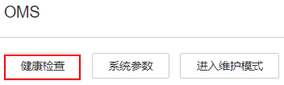

# OMS维护页面概述

## 总览

登录FusionInsight Manager以后，选择“系统  \>  OMS“后，打开OMS维护页面，管理员可以在此页面对OMS进行维护操作，包含查看基本信息、查看OMS业务模块的服务状态，也可以手工触发健康检查。

## 基本信息

FusionInsight Manager支持显示当前OMS的关联信息，包含如[表1](#table14579151510169)所示内容：

**表 1**  OMS信息说明

<table><thead align="left"><tr id="row165801215161612"><th class="cellrowborder" valign="top" width="25%" id="mcps1.2.3.1.1">
项目

</th>
<th class="cellrowborder" valign="top" width="75%" id="mcps1.2.3.1.2">
说明

</th>
</tr>
</thead>
<tbody><tr id="row658051511616"><td class="cellrowborder" valign="top" width="25%" headers="mcps1.2.3.1.1 ">
版本

</td>
<td class="cellrowborder" valign="top" width="75%" headers="mcps1.2.3.1.2 ">
表示OMS版本，与FusionInsight Manager版本相同。

</td>
</tr>
<tr id="row5992182015577"><td class="cellrowborder" valign="top" width="25%" headers="mcps1.2.3.1.1 ">
IP模式

</td>
<td class="cellrowborder" valign="top" width="75%" headers="mcps1.2.3.1.2 ">
表示当前集群网络的IP地址模式。

</td>
</tr>
<tr id="row358011591619"><td class="cellrowborder" valign="top" width="25%" headers="mcps1.2.3.1.1 ">
HA模式

</td>
<td class="cellrowborder" valign="top" width="75%" headers="mcps1.2.3.1.2 ">
表示OMS工作模式，由安装FusionInsight Manager时的配置文件指定。

</td>
</tr>
<tr id="row20626135101719"><td class="cellrowborder" valign="top" width="25%" headers="mcps1.2.3.1.1 ">
当前主用

</td>
<td class="cellrowborder" valign="top" width="75%" headers="mcps1.2.3.1.2 ">
表示OMS主进程节点主机名，即主管理节点主机名。单击主机名可进入对应的主机详情页面。

</td>
</tr>
<tr id="row697310159181"><td class="cellrowborder" valign="top" width="25%" headers="mcps1.2.3.1.1 ">
当前备用

</td>
<td class="cellrowborder" valign="top" width="75%" headers="mcps1.2.3.1.2 ">
表示OMS备进程节点主机名，即备管理节点主机名。单击主机名可进入对应的主机详情页面。

</td>
</tr>
<tr id="row5251576197"><td class="cellrowborder" valign="top" width="25%" headers="mcps1.2.3.1.1 ">
持续时间

</td>
<td class="cellrowborder" valign="top" width="75%" headers="mcps1.2.3.1.2 ">
表示OMS进程启动持续的时间。

</td>
</tr>
</tbody>
</table>

## OMS服务状态

FusionInsight Manager支持显示OMS所有业务模块的运行状态，每个业务模块的状态显示为表示运行正常。

## 健康检查

管理员可以在OMS维护页面单击“健康检查”开始为OMS的状态进行检查。如果某些检查项存在问题，可直接打开检查说明进行处理。

**图 1**  健康检查  

## 进入/退出维护模式

配置OMS进入或退出维护模式。

## 系统参数

在大集群场景下对接DMPS集群。

