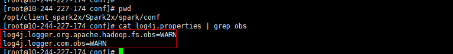

# Spark2x对接OBS文件系统<a name="mrs_01_1289"></a>

MRS集群支持Spark2x在集群安装完成后对接OBS文件系统。

使用本章节前已参考[配置存算分离集群（委托方式）](配置存算分离集群（委托方式）.md)或[配置存算分离集群（AKSK方式）](配置存算分离集群（AKSK方式）.md)完成存算分离集群配置。

## 集群安装后使用spark beeline<a name="zh-cn_topic_0000001133181918_section1966410360106"></a>

1.  登录FusionInsight Manager，选择“集群 \> 服务 \> Spark2x \> 配置 \>  全部配置”。

    在左侧的导航列表中选择“JDBCServer2x \> 自定义”。在参数“spark.hdfs-site.customized.configs”中添加配置项“dfs.namenode.acls.enabled”，值为“false“。

    

2.  保存配置并重启JDBCServer2x实例。
3.  使用安装客户端用户登录客户端安装节点。
4.  配置环境变量。

    **source $\{client\_home\}/bigdata\_env**

5.  如果是安全集群，使用以下命令用户进行用户认证，如果当前集群未启用Kerberos认证，则无需执行此命令。

    **kinit **_用户名_

6.  在spark-beeline中访问OBS，例如在“obs://mrs-word001/table/“目录中创建表“test“。

    **create table test\(id int\) location '**_obs://mrs-word001/table/_**';**

7.  执行如下命令查询所有表，返回结果中存在表test，即表示访问OBS成功。

    **show tables;**

    **图 1**  Spark2x验证返回已创建的表名<a name="zh-cn_topic_0000001133181918_fig1769121782810"></a>  
    

8.  使用“Ctrl + C”退出spark beeline。

## 集群安装后使用spark sql<a name="zh-cn_topic_0000001133181918_section78997382219"></a>

1.  使用安装客户端用户登录客户端安装节点。
2.  配置环境变量。

    **source $\{client\_home\}/bigdata\_env**

3.  修改配置文件：

    **vim $\{client\_home\}/Spark2x/spark/conf/hdfs-site.xml**

    ```
    <property>
    <name>dfs.namenode.acls.enabled</name>
    <value>false</value>
    </property>
    ```

4.  如果是安全集群，使用以下命令用户进行用户认证，如果当前集群未启用Kerberos认证，则无需执行此命令。

    **kinit **_用户名_

5.  在spark-sql中访问OBS，例如在“obs://mrs-word001/table/“目录中创建表“test“。
6.  进入spark bin目录：**cd $\{client\_home\}/Spark2x/spark/bin**，执行**./spark-sql**登录spark-sql命令行。
7.  在spark-sql命令行执行以下命令：

    **create table test\(id int\) location '**_obs://mrs-word001/table/_**';**

8.  执行语句**show tables;**查看表是否存在。
9.  执行**exit;**退出spark-sql命令行。

    > **说明：** 
    >OBS文件系统打印大量日志可能导致读写性能受影响，可通过调整OBS客户端日志级别优化，日志调整方式如下：
    >**cd $\{client\_home\}/Spark2x/spark/conf**
    >**vi  log4j.properties**
    >在文件中添加OBS日志级别配置
    >**log4j.logger.org.apache.hadoop.fs.obs=WARN**
    >**log4j.logger.com.obs=WARN**
    >


