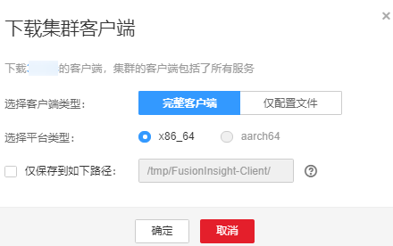

# 下载客户端

## 操作场景

MRS集群提供了默认的客户端，用户可以通过客户端执行管理操作、运行业务或进行二次开发。使用客户端前需要下载客户端软件包。

## 操作步骤

1.  登录FusionInsight Manager。
2.  选择“集群  \>  _待操作集群的名称_  \> 概览 \> 更多  \>  下载客户端“。

    界面显示“下载集群客户端“对话框。

    **图 1**  下载集群客户端  
    

3.  在“选择客户端类型”选择一个类型。

    -   “完整客户端“表示下载包中包含了脚本、编译文件和配置文件。
    -   “仅配置文件“表示下载包仅包含客户端配置文件。

        一般适用于应用开发任务。例如完整客户端已下载并安装后，管理员通过Manager界面修改了服务配置，开发人员需要更新客户端配置文件的场景。

    > **说明：** 
    >平台类型包括x86\_64和aarch64两种，可分别在x86和TaiShan节点上安装使用。默认情况下，下载的客户端平台类型和服务端保持一致。

4.  是否在集群的节点中生成客户端软件包文件？

    -   是，勾选“仅保存到如下路径”，单击“确定”开始生成客户端文件。

        文件生成后默认保存在主管理节点“/tmp/FusionInsight-Client/”。支持修改为其他目录且**omm**用户拥有目录的读、写与执行权限。如果路径中已存在客户端文件，会覆盖路径下已有的客户端文件。

        等待文件生成后，使用**omm**用户或客户端安装用户将获取的下载包复制到其他目录，例如“/opt/Bigdata/client”。

    -   否，单击“确定”，下载客户端文件至本地。

        开始下载客户端软件包，并等待下载完成。

    客户端下载成功后，参考[安装客户端](安装客户端-31.md)进行客户端的安装。

