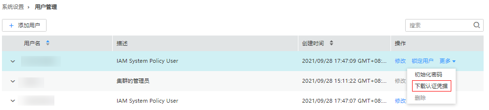

# 下载用户认证文件

## 操作场景

用户开发大数据应用程序并在支持Kerberos认证的MRS集群中运行此程序时，需要准备访问MRS集群的“机机”用户认证文件。认证文件中的keytab文件可用于认证用户身份。

该任务指导管理员用户通过Manager下载“机机”用户认证文件并导出keytab文件。开启Kerberos认证的集群或开启弹性公网IP功能的普通集群支持该操作。

> **说明：** 
>如果选择下载“人机”用户的认证文件，在下载前需要使用Manager修改过一次此用户的密码使管理员设置的初始密码失效，否则导出的keytab文件无法使用。请参见[修改操作用户密码](修改操作用户密码-161.md)。
>该章节操作仅适用于**MRS 3.x**之前版本集群。
>**MRS 3.x**及之后版本集群请参考[导出认证凭据文件](导出认证凭据文件.md)章节。

## 操作步骤

1.  访问MRS Manager，详细操作请参见[访问MRS Manager（MRS 2.x及之前版本）](访问MRS-Manager（MRS-2-x及之前版本）.md)。
2.  在MRS Manager，单击“系统设置”。
3.  在“权限配置”区域，单击“用户管理”。
4.  在需导出keytab文件用户所在的行，选择“更多  \>  下载认证凭据“下载认证文件，待文件自动生成后指定保存位置，并妥善保管该文件。

    

5.  使用解压程序打开认证文件。
    -   “user.keytab“表示用户keytab文件，用于认证用户身份。
    -   “krb5.conf“表示认证服务器配置文件，应用程序在进行用户认证身份时根据该文件的配置信息连接认证服务器。

