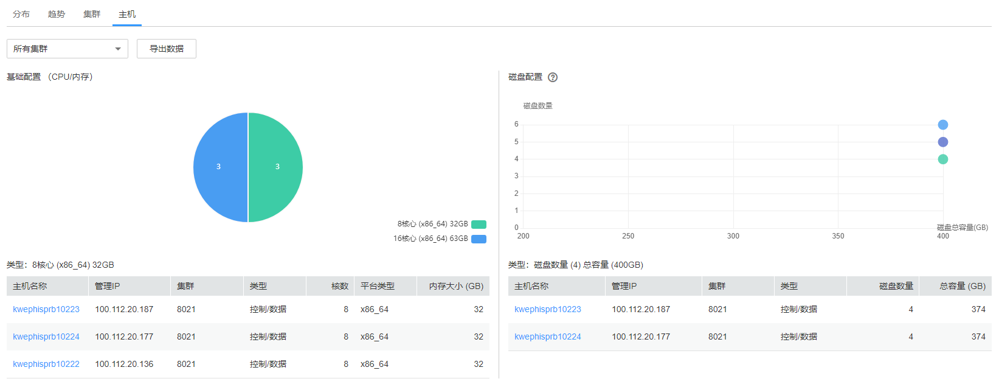

# 主机

选择“主机 \> 资源概况 \> 主机”，可查看主机资源概况，分为基础配置（CPU/内存）和磁盘配置两部分，如[图1](#fig182365351415)所示。

单击“导出数据“，可导出集群中所有主机的配置列表，包括主机名称、管理IP、主机类型、核数、平台类型、内存容量、磁盘大小等。

**图 1**  主机资源概况  

## 基础配置（CPU/内存）

鼠标放置饼图上会显示当前区域集群中各节点不同硬件配置下的配置信息及数量，格式为：_核数（平台类型）内存大小：数量_。

单击相应区域，会在下方显示相应的主机列表。

## 磁盘配置

横轴为节点上磁盘总容量（包含OS盘），纵轴为逻辑磁盘数量（包含OS盘）。

鼠标放置圆点上会显示处于当前配置状态下的磁盘信息，包括磁盘数量、总容量、主机数。

单击相应圆点，会在下方显示相应的主机列表。

