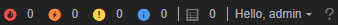
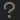
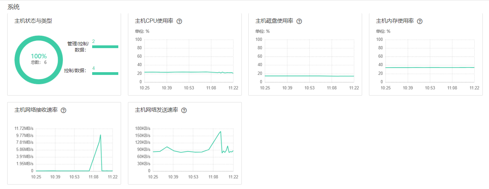
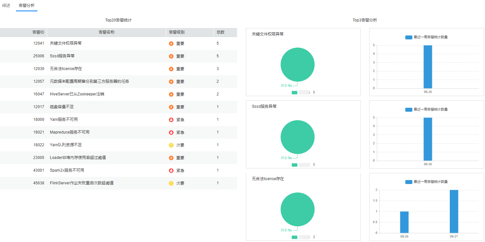

# 主页概述

登录FusionInsight Manager以后，Manager界面将默认显示“主页“标签中的内容，“综述”页面提供各集群服务状态预览区及监控状态报表，“告警分析”页面展示TOP告警统计及分析。

-   主页右侧可查看集群的不同级别告警个数、运行任务个数、当前用户和帮助信息等内容，如[图1](#fig1460911563391)所示。

    **图 1**  集群状态信息  
    

    -   单击可查看“任务管理中心”中近100次操作任务的任务名、集群、状态、进度、开始时间和结束时间。

        > **说明：** 
        >对于启动、停止、重启以及滚动重启操作，在任务执行过程中，单击任务列表中的对应任务名称，单击“中止”按钮，根据界面提示输入管理员密码后，用户可中止该任务。中止后，任务将不再继续执行。

    -   单击可获得帮助信息，如[表1](#table1699215112105)所示。

        **表 1**  帮助信息一览表

        
        <table><thead align="left"><tr id="row1099375141014"><th class="cellrowborder" valign="top" width="25%" id="mcps1.2.3.1.1">
项目

        </th>
        <th class="cellrowborder" valign="top" width="75%" id="mcps1.2.3.1.2">
描述

        </th>
        </tr>
        </thead>
        <tbody><tr id="row132256295125"><td class="cellrowborder" valign="top" width="25%" headers="mcps1.2.3.1.1 ">
“关于”

        </td>
        <td class="cellrowborder" valign="top" width="75%" headers="mcps1.2.3.1.2 ">
提供FusionInsight Manager版本号信息。

        </td>
        </tr>
        </tbody>
        </table>

-   主页底部任务栏显示FusionInsight Manager的语言选项和当前集群时间及时区信息，可切换系统语言。

    **图 2**  主页底部任务栏  
    

## 服务状态预览区

主页界面的左侧展示各集群主机个数及已安装服务个数，可通过单击，展开对应集群的全部服务信息，查看当前集群已安装各服务的状态和告警情况。

通过单击，对当前集群进行基本的运维管理操作，详情请参考[表1](集群管理概述.md#table17943743105914)。

每个服务名称左侧的表示当前该服务运行状态良好，表示当前服务启动失败，表示当前服务未启动。

同时服务名称右侧可查看当前该服务是否产生了告警，如果存在告警，则以图标区分告警的级别并显示告警数。

对于支持多服务特性的组件，若在同一集群中安装了多个服务，服务的右侧会显示安装的个数。

如果服务右侧显示则表示该服务配置已过期。

## 监控状态报表

主页界面的右侧为图表区，包含关键监控状态的报表，例如集群中所有主机的状态、主机CPU使用率、主机内存使用率等。用户可以自定义在图表区展示的监控报表，管理监控指标请参考[管理监控指标数据报表](管理监控指标数据报表.md)。

监控图表的数据来源可在图表的左下方查看，每个监控报表可以放大查看具体数值，也可以关闭不再显示。

**图 3**  监控状态的报表  

## 告警分析

“告警分析”页面展示“Top20告警统计”表和“Top3告警分析”图。单击“Top20告警统计”中的告警名称，可以在告警分析中只展示该告警信息。该功能支持告警统计，可以展示TOP告警以及发生的时间规律，可以有针对性地解决告警，提升系统稳定性。

**图 4**  告警分析  

