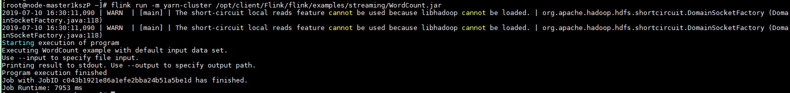
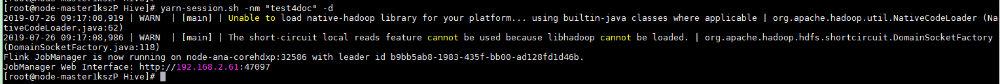
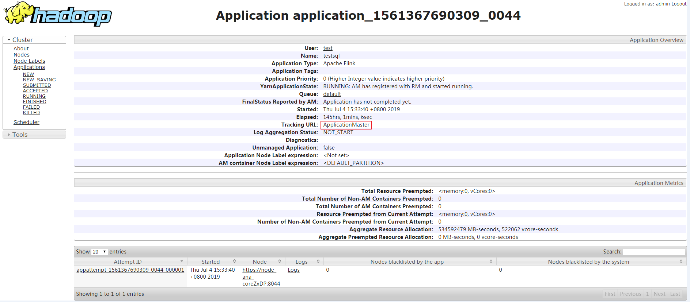

# 从零开始使用Flink

本节提供使用Flink运行wordcount作业的操作指导。

## 前提条件

MRS集群中已安装Flink组件。

## 操作步骤

1.  下载并登录MRS客户端，具体请参见[全量更新主Master节点的原始客户端](更新客户端.md#section92959464575)。

    > **说明：**   
    >若节点上已有客户端，则跳过该步骤。  

2.  执行如下命令初始化环境变量。

    **source /opt/client/bigdata\_env**

3.  若集群开启Kerberos认证，需要执行以下步骤，若集群未开启Kerberos认证请跳过该步骤。
    1.  准备一个提交Flink作业的用户，具体请参考[准备开发用户](https://support.huaweicloud.com/devg-mrs/mrs_06_0389.html)。
    2.  使用新创建的用户登录MRS Manager页面，选择“系统设置 \> 用户管理”，在已增加用户所在行的“操作”列，单击“更多 \> 下载认证凭据”。
    3.  将下载的认证凭据压缩包解压缩，并将得到user.keytab文件拷贝到客户端节点中，例如客户端节点的“/opt/client/Flink/flink/conf“目录下。
    4.  配置安全认证，在/opt/client/Flink/flink/flink-conf.yaml配置文件中的对应配置添加keytab路径以及用户名。

        **security.kerberos.login.keytab: <user.keytab文件路径\>**

        **security.kerberos.login.principal: <用户名\>**

        例如：

        **security.kerberos.login.keytab: /opt/client/Flink/flink/conf/user.keytab**

        **security.kerberos.login.principal: test**

    5.  在Flink的客户端bin目录下，执行如下命令进行安全加固，其中password请重新设置为一个用于提交作业的密码。

        **sh generate\_keystore.sh <password\>**

        该脚本会自动替换 /opt/client/Flink/flink/conf/flink-conf.yaml中关于SSL的值，安全集群默认没有开启外部SSL，用户如果需要启用外部SSL，请参考[安全加固](安全加固.md)进行配置后再次运行该脚本即可。

    6.  客户端访问flink.keystore和flink.truststore文件的路径配置。
        -   绝对路径：执行该脚本后，在flink-conf.yaml文件中将flink.keystore和flink.truststore文件路径自动配置为绝对路径/opt/client/Flink/flink/conf/，此时需要将conf目录中的flink.keystore和flink.truststore文件分别放置在Flink Client以及Yarn各个节点的该绝对路径上。
        -   相对路径：请执行如下步骤配置flink.keystore和flink.truststore文件路径为相对路径，并确保Flink Client执行命令的目录可以直接访问该相对路径。
            1.  在/opt/client/Flink/flink/conf/目录下新建目录，例如ssl。
            2.  移动flink.keystore和flink.truststore文件到/opt/client/Flink/flink/conf/ssl/中。
            3.  修改flink-conf.yaml文件中如下两个参数为相对路径。

                security.ssl.internal.keystore: ./ssl/flink.keystore

                security.ssl.internal.truststore: ./ssl/flink.truststore

4.  运行wordcount作业。
    -   普通集群（未开启Kerberos认证）
        -   执行如下命令启动session，并在session中提交作业。

            **yarn-session.sh -nm "session-name"**

            **flink run /opt/client/Flink/flink/examples/streaming/WordCount.jar**

        -   执行如下命令在Yarn上提交单个作业。

            **flink run -m yarn-cluster /opt/client/Flink/flink/examples/streaming/WordCount.jar**

    -   安全集群（开启Kerberos认证）
        -   flink.keystore和flink.truststore文件路径为绝对路径时：
            -   执行如下命令启动session，并在session中提交作业。

                **yarn-session.sh -nm "session-name"**

                **flink run /opt/client/Flink/flink/examples/streaming/WordCount.jar**

            -   执行如下命令在Yarn上提交单个作业。

                **flink run -m yarn-cluster /opt/client/Flink/flink/examples/streaming/WordCount.jar**

        -   flink.keystore和flink.truststore文件路径为相对路径时：
            -   执行如下命令启动session，并在session中提交作业。

                **yarn-session.sh -t ssl/ -nm "session-name"**

                **flink run /opt/client/Flink/flink/examples/streaming/WordCount.jar**

            -   执行如下命令在Yarn上提交单个作业。

                **flink run -m yarn-cluster -yt ssl/ /opt/client/Flink/flink/examples/streaming/WordCount.jar**

5.  作业提交成功后，客户端界面显示如下。

    **图 1**  在Yarn上提交作业成功  
    

    **图 2**  启动session成功  
    

    **图 3**  在session中提交作业成功  
    

6.  登录集群详情页面，选择“组件管理 \> Yarn”。

    > **说明：**   
    >针对MRS 2.0.1及之前版本，登录MRS Manager页面，具体请参见[访问MRS Manager](访问MRS-Manager.md)，然后选择“服务管理 \> Yarn”。  

7.  在“服务状态 \> Yarn 概述”区域，单击“ResourceManager WebUI”对应的“ResourceManager \(主\)”。

    **图 4**  登录ResourceManager \(主\)  
    .png "登录ResourceManager-(主)")

8.  进入Yarn服务的原生页面，找到对应作业的application，单击application名称，进入到作业详情页面。
    -   若作业尚未结束，可单击“Tracking URL”链接进入到Flink的原生页面，查看作业的运行信息。
    -   若作业已运行结束，对于在session中提交的作业，可以单击“Tracking URL”链接登录Flink 原生页面查看作业信息。

        **图 5**  application  
        

