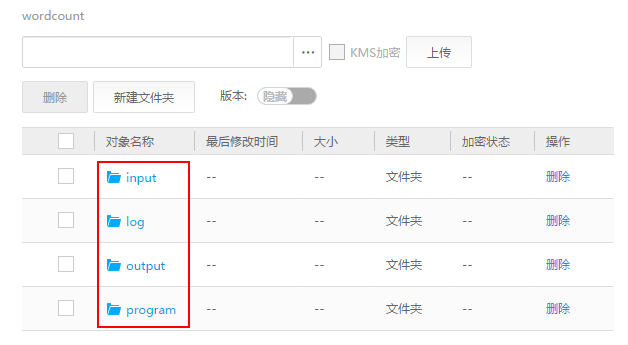
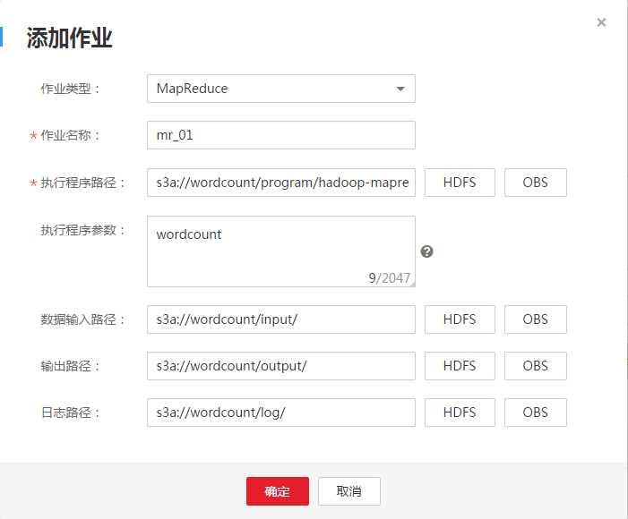
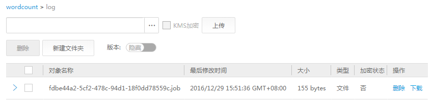

# 从零开始使用Hadoop<a name="ZH-CN_TOPIC_0087146495"></a>

本章节提供从零开始使用Hadoop提交wordcount作业的操作指导，wordcount是最经典的Hadoop作业，它用来统计海量文本的单词数量。

## 操作步骤<a name="zh-cn_topic_0023976402_section2975251916558"></a>

1.  准备wordcount程序。

    开源的Hadoop的样例程序包含多个例子，其中包含wordcount。可以从[https://dist.apache.org/repos/dist/release/hadoop/common/](https://dist.apache.org/repos/dist/release/hadoop/common/)中下载Hadoop的样例程序。

    例如，选择hadoop-2.7.x版本，下载“hadoop-2.7.x.tar.gz“，解压后在“hadoop-2.7.x\\share\\hadoop\\mapreduce“路径下获取“hadoop-mapreduce-examples-2.7.x.jar“，即为Hadoop的样例程序。“hadoop-mapreduce-examples-2.7.x.jar“样例程序包含了wordcount程序。

    > **说明：**   
    >hadoop-2.7.x表示Hadoop的版本号。  

2.  准备数据文件。

    数据文件无格式要求，准备一个或多个txt文件即可，如下内容为txt文件样例：

    ```
    qwsdfhoedfrffrofhuncckgktpmhutopmma
    jjpsffjfjorgjgtyiuyjmhombmbogohoyhm
    jhheyeombdhuaqqiquyebchdhmamdhdemmj
    doeyhjwedcrfvtgbmojiyhhqssddddddfkf
    kjhhjkehdeiyrudjhfhfhffooqweopuyyyy
    ```

3.  上传数据至OBS。
    1.  登录OBS控制台。
    2.  单击“创建桶“，创建一个名称为wordcount的桶。

        wordcount仅为示例，桶名称必须全局唯一，否则会创建桶失败。

    3.  <a name="zh-cn_topic_0023976402_li1665853162019"></a>在wordcount桶下单击“新建文件夹“，分别创建program、input、output和log文件夹，创建完成后如[图1](#zh-cn_topic_0023976402_fig730855516217)所示。

        **图 1**  wordcount桶文件夹列表<a name="zh-cn_topic_0023976402_fig730855516217"></a>  
        

        -   program：存放用户程序
        -   input：存放用户数据文件
        -   output：存放作业输出的文件
        -   log：存放作业输出的日志文件

    4.  进入program文件夹，单击，从本地选择[1](从零开始使用Hadoop.md#zh-cn_topic_0023976402_li1162925161421)中下载的程序包，然后单击“上传“，上传完成后如[图2](#zh-cn_topic_0023976402_fig63158979162142)所示。

        **图 2**  程序列表<a name="zh-cn_topic_0023976402_fig63158979162142"></a>  
        

    5.  进入input文件夹，将[2](从零开始使用Hadoop.md#zh-cn_topic_0023976402_li44606399161436)中准备的数据文件上传到input文件夹，上传完成后如[图3](#zh-cn_topic_0023976402_fig21460496162155)所示。

        **图 3**  数据文件列表<a name="zh-cn_topic_0023976402_fig21460496162155"></a>  
        


4.  登录MRS控制台，在左侧导航栏选择“集群列表 \> 现有集群”，单击名称为“mrs\_20160907“的集群。“mrs\_20160907“集群为[创建集群](创建集群-入门.md#ZH-CN_TOPIC_0043125076)中创建的集群。
5.  提交wordcount作业。
    1.  在MRS控制台选择“作业管理“页签，然后在“作业“页签中单击“添加“，进入“添加作业“页面，如[图4](#zh-cn_topic_0023976402_fig20655289162628)所示。

        只有“mrs\_20160907“集群处于“运行中“状态时才能提交作业。

        **图 4**  添加MapReduce作业<a name="zh-cn_topic_0023976402_fig20655289162628"></a>  
        

        作业参数详细配置信息如[表1](#zh-cn_topic_0023976402_table2345327142256)所示。作业参数配置样例如下：

        -   作业类型：选择“MapReduce“。
        -   作业名称：mr\_01
        -   执行程序路径：配置为OBS上实际存放程序的地址，地址中的桶和文件夹名称为[3.c](#zh-cn_topic_0023976402_li1665853162019)中创建的名称。例如：s3a://wordcount/program/hadoop-mapreduce-examples-2.7.x.jar
        -   执行程序参数：此参数是指执行程序的主函数（main class）。例如：wordcount
        -   数据输入路径：配置为OBS上实际存放数据文件的地址，地址中的桶和文件夹名称为[3.c](#zh-cn_topic_0023976402_li1665853162019)中创建的名称。例如：s3a://wordcount/input
        -   输出路径：配置为OBS上用于存放作业输出文件的地址。

            > **说明：**   
            >-   配置输出路径参数时，选择“OBS“或“HDFS“，单击“浏览“并选择文件目录，或者手动输入文件目录，然后单击“确定“。  
            >-   若添加hadoop-mapreduce-examples-x.x.x.jar样例程序或和hadoop-mapreduce-examples-x.x.x.jar类似的程序，请手动输入一个不存在的目录。  

        -   日志路径：配置为OBS上用于存放作业日志文件的地址，地址中的桶和文件夹名称为[3.c](#zh-cn_topic_0023976402_li1665853162019)中创建的名称。例如：s3a://wordcount/log

        作业提交成功后默认为“运行中“状态，不需要用户手动执行作业。

        **表 1**  作业配置信息

        <a name="zh-cn_topic_0023976402_table2345327142256"></a>
        <table><thead align="left"><tr id="zh-cn_topic_0023976402_zh-cn_topic_0012808240_zh-cn_topic_0012807343_row2385663595546"><th class="cellrowborder" valign="top" width="20%" id="mcps1.2.3.1.1"><p id="zh-cn_topic_0023976402_zh-cn_topic_0012808240_zh-cn_topic_0012807343_p5333928795546"><a name="zh-cn_topic_0023976402_zh-cn_topic_0012808240_zh-cn_topic_0012807343_p5333928795546"></a><a name="zh-cn_topic_0023976402_zh-cn_topic_0012808240_zh-cn_topic_0012807343_p5333928795546"></a>参数</p>
        </th>
        <th class="cellrowborder" valign="top" width="80%" id="mcps1.2.3.1.2"><p id="zh-cn_topic_0023976402_zh-cn_topic_0012808240_zh-cn_topic_0012807343_p2551498795546"><a name="zh-cn_topic_0023976402_zh-cn_topic_0012808240_zh-cn_topic_0012807343_p2551498795546"></a><a name="zh-cn_topic_0023976402_zh-cn_topic_0012808240_zh-cn_topic_0012807343_p2551498795546"></a>参数说明</p>
        </th>
        </tr>
        </thead>
        <tbody><tr id="zh-cn_topic_0023976402_zh-cn_topic_0012808240_zh-cn_topic_0012807343_row5344809695546"><td class="cellrowborder" valign="top" width="20%" headers="mcps1.2.3.1.1 "><p id="zh-cn_topic_0023976402_zh-cn_topic_0012808240_zh-cn_topic_0012807343_p3432854295546"><a name="zh-cn_topic_0023976402_zh-cn_topic_0012808240_zh-cn_topic_0012807343_p3432854295546"></a><a name="zh-cn_topic_0023976402_zh-cn_topic_0012808240_zh-cn_topic_0012807343_p3432854295546"></a>作业类型</p>
        </td>
        <td class="cellrowborder" valign="top" width="80%" headers="mcps1.2.3.1.2 "><p id="zh-cn_topic_0023976402_zh-cn_topic_0012808240_zh-cn_topic_0012807343_p19187781102343"><a name="zh-cn_topic_0023976402_zh-cn_topic_0012808240_zh-cn_topic_0012807343_p19187781102343"></a><a name="zh-cn_topic_0023976402_zh-cn_topic_0012808240_zh-cn_topic_0012807343_p19187781102343"></a>支持的作业类型，请根据业务类型选择：</p>
        <a name="zh-cn_topic_0023976402_zh-cn_topic_0012808240_zh-cn_topic_0012807343_ul16035663102539"></a><a name="zh-cn_topic_0023976402_zh-cn_topic_0012808240_zh-cn_topic_0012807343_ul16035663102539"></a><ul id="zh-cn_topic_0023976402_zh-cn_topic_0012808240_zh-cn_topic_0012807343_ul16035663102539"><li>MapReduce</li><li>Spark</li><li>Spark Script</li><li>Hive Script<div class="note" id="zh-cn_topic_0023976402_zh-cn_topic_0012808240_note6412416195513"><a name="zh-cn_topic_0023976402_zh-cn_topic_0012808240_note6412416195513"></a><a name="zh-cn_topic_0023976402_zh-cn_topic_0012808240_note6412416195513"></a><span class="notetitle"> 说明： </span><div class="notebody"><p id="zh-cn_topic_0023976402_zh-cn_topic_0012808240_p1413716175517"><a name="zh-cn_topic_0023976402_zh-cn_topic_0012808240_p1413716175517"></a><a name="zh-cn_topic_0023976402_zh-cn_topic_0012808240_p1413716175517"></a>只有创建集群时选择了Spark和Hive组件，并且集群处于运行中，才能新增Spark和Hive类型的作业。Spark Script作业只支持运行Spark SQL程序，Spark支持运行Spark Core、Spark SQL程序。</p>
        </div></div>
        </li></ul>
        </td>
        </tr>
        <tr id="zh-cn_topic_0023976402_zh-cn_topic_0012808240_zh-cn_topic_0012807343_row6100983695546"><td class="cellrowborder" valign="top" width="20%" headers="mcps1.2.3.1.1 "><p id="zh-cn_topic_0023976402_zh-cn_topic_0012808240_zh-cn_topic_0012807343_p4284970295546"><a name="zh-cn_topic_0023976402_zh-cn_topic_0012808240_zh-cn_topic_0012807343_p4284970295546"></a><a name="zh-cn_topic_0023976402_zh-cn_topic_0012808240_zh-cn_topic_0012807343_p4284970295546"></a>作业名称</p>
        </td>
        <td class="cellrowborder" valign="top" width="80%" headers="mcps1.2.3.1.2 "><p id="zh-cn_topic_0023976402_zh-cn_topic_0012808240_zh-cn_topic_0012807343_p4725704311292"><a name="zh-cn_topic_0023976402_zh-cn_topic_0012808240_zh-cn_topic_0012807343_p4725704311292"></a><a name="zh-cn_topic_0023976402_zh-cn_topic_0012808240_zh-cn_topic_0012807343_p4725704311292"></a>作业名称，只能由字母、数字、中划线和下划线组成，并且长度为1～64个字符。</p>
        <div class="note" id="zh-cn_topic_0023976402_zh-cn_topic_0012808240_zh-cn_topic_0012807343_note2266020411292"><a name="zh-cn_topic_0023976402_zh-cn_topic_0012808240_zh-cn_topic_0012807343_note2266020411292"></a><a name="zh-cn_topic_0023976402_zh-cn_topic_0012808240_zh-cn_topic_0012807343_note2266020411292"></a><span class="notetitle"> 说明： </span><div class="notebody"><p id="zh-cn_topic_0023976402_zh-cn_topic_0012808240_zh-cn_topic_0012807343_p261524611292"><a name="zh-cn_topic_0023976402_zh-cn_topic_0012808240_zh-cn_topic_0012807343_p261524611292"></a><a name="zh-cn_topic_0023976402_zh-cn_topic_0012808240_zh-cn_topic_0012807343_p261524611292"></a>建议不同的作业设置不同的名称。</p>
        </div></div>
        </td>
        </tr>
        <tr id="zh-cn_topic_0023976402_zh-cn_topic_0012808240_zh-cn_topic_0012807343_row2657626495546"><td class="cellrowborder" valign="top" width="20%" headers="mcps1.2.3.1.1 "><p id="zh-cn_topic_0023976402_zh-cn_topic_0012808240_zh-cn_topic_0012807343_p4239557514273"><a name="zh-cn_topic_0023976402_zh-cn_topic_0012808240_zh-cn_topic_0012807343_p4239557514273"></a><a name="zh-cn_topic_0023976402_zh-cn_topic_0012808240_zh-cn_topic_0012807343_p4239557514273"></a>执行程序路径</p>
        </td>
        <td class="cellrowborder" valign="top" width="80%" headers="mcps1.2.3.1.2 "><p id="zh-cn_topic_0023976402_zh-cn_topic_0012808240_p655627719565"><a name="zh-cn_topic_0023976402_zh-cn_topic_0012808240_p655627719565"></a><a name="zh-cn_topic_0023976402_zh-cn_topic_0012808240_p655627719565"></a>执行程序Jar包地址，需要满足如下要求：</p>
        <a name="zh-cn_topic_0023976402_zh-cn_topic_0012808240_ul1375493195654"></a><a name="zh-cn_topic_0023976402_zh-cn_topic_0012808240_ul1375493195654"></a><ul id="zh-cn_topic_0023976402_zh-cn_topic_0012808240_ul1375493195654"><li>最多为1023字符，不能包含;|&amp;&gt;,&lt;'$特殊字符，且不可为空或全空格。</li><li>执行程序路径可存储于HDFS或者OBS中，不同的文件系统对应的路径存在差异。<a name="zh-cn_topic_0023976402_zh-cn_topic_0012808240_ul56833471484"></a><a name="zh-cn_topic_0023976402_zh-cn_topic_0012808240_ul56833471484"></a><ul id="zh-cn_topic_0023976402_zh-cn_topic_0012808240_ul56833471484"><li>OBS：以<span class="parmvalue" id="zh-cn_topic_0023976402_zh-cn_topic_0012808240_parmvalue15615586113316"><a name="zh-cn_topic_0023976402_zh-cn_topic_0012808240_parmvalue15615586113316"></a><a name="zh-cn_topic_0023976402_zh-cn_topic_0012808240_parmvalue15615586113316"></a>“s3a://”</span>开头。示例：s3a://wordcount/program/hadoop-mapreduce-examples-2.7.x.jar</li><li>HDFS：以<span class="parmvalue" id="zh-cn_topic_0023976402_zh-cn_topic_0012808240_parmvalue5002226915745"><a name="zh-cn_topic_0023976402_zh-cn_topic_0012808240_parmvalue5002226915745"></a><a name="zh-cn_topic_0023976402_zh-cn_topic_0012808240_parmvalue5002226915745"></a>“/user”</span>开头。</li></ul>
        </li><li>Spark Script需要以<span class="parmvalue" id="zh-cn_topic_0023976402_zh-cn_topic_0012808240_parmvalue3709601695914"><a name="zh-cn_topic_0023976402_zh-cn_topic_0012808240_parmvalue3709601695914"></a><a name="zh-cn_topic_0023976402_zh-cn_topic_0012808240_parmvalue3709601695914"></a>“.sql”</span>结尾，MR和Spark需要以<span class="parmvalue" id="zh-cn_topic_0023976402_zh-cn_topic_0012808240_parmvalue940908595918"><a name="zh-cn_topic_0023976402_zh-cn_topic_0012808240_parmvalue940908595918"></a><a name="zh-cn_topic_0023976402_zh-cn_topic_0012808240_parmvalue940908595918"></a>“.jar”</span>结尾。sql、jar不区分大小写。</li></ul>
        </td>
        </tr>
        <tr id="zh-cn_topic_0023976402_zh-cn_topic_0012808240_zh-cn_topic_0012807343_row2817879495546"><td class="cellrowborder" valign="top" width="20%" headers="mcps1.2.3.1.1 "><p id="zh-cn_topic_0023976402_zh-cn_topic_0012808240_zh-cn_topic_0012807343_p5436557014273"><a name="zh-cn_topic_0023976402_zh-cn_topic_0012808240_zh-cn_topic_0012807343_p5436557014273"></a><a name="zh-cn_topic_0023976402_zh-cn_topic_0012808240_zh-cn_topic_0012807343_p5436557014273"></a>执行程序参数</p>
        </td>
        <td class="cellrowborder" valign="top" width="80%" headers="mcps1.2.3.1.2 "><p id="zh-cn_topic_0023976402_zh-cn_topic_0012808240_zh-cn_topic_0012807343_p33862476113321"><a name="zh-cn_topic_0023976402_zh-cn_topic_0012808240_zh-cn_topic_0012807343_p33862476113321"></a><a name="zh-cn_topic_0023976402_zh-cn_topic_0012808240_zh-cn_topic_0012807343_p33862476113321"></a>程序执行的关键参数，该参数由用户程序内的函数指定，MRS只负责参数的传入。多个参数间使用空格隔开。</p>
        <p id="zh-cn_topic_0023976402_zh-cn_topic_0012808240_p163988156203"><a name="zh-cn_topic_0023976402_zh-cn_topic_0012808240_p163988156203"></a><a name="zh-cn_topic_0023976402_zh-cn_topic_0012808240_p163988156203"></a><span>配置方法：包名.类名</span></p>
        <p id="zh-cn_topic_0023976402_zh-cn_topic_0012808240_zh-cn_topic_0012807343_p4153501114273"><a name="zh-cn_topic_0023976402_zh-cn_topic_0012808240_zh-cn_topic_0012807343_p4153501114273"></a><a name="zh-cn_topic_0023976402_zh-cn_topic_0012808240_zh-cn_topic_0012807343_p4153501114273"></a>最多为2047字符，不能包含;|&amp;&gt;&lt;'$特殊字符，可为空。</p>
        <div class="note" id="zh-cn_topic_0023976402_zh-cn_topic_0012808240_note62371709174814"><a name="zh-cn_topic_0023976402_zh-cn_topic_0012808240_note62371709174814"></a><a name="zh-cn_topic_0023976402_zh-cn_topic_0012808240_note62371709174814"></a><span class="notetitle"> 说明： </span><div class="notebody"><p id="zh-cn_topic_0023976402_zh-cn_topic_0012808240_p20521095174814"><a name="zh-cn_topic_0023976402_zh-cn_topic_0012808240_p20521095174814"></a><a name="zh-cn_topic_0023976402_zh-cn_topic_0012808240_p20521095174814"></a>用户输入带有敏感信息（如登录密码）的参数时，可通过在参数名前添加“@”的方式，为该参数值加密，以防止敏感信息被明文形式持久化。在MRS管理控制台查看作业信息时，敏感信息显示为“*”。</p>
        <p id="zh-cn_topic_0023976402_zh-cn_topic_0012808240_p1265001117571"><a name="zh-cn_topic_0023976402_zh-cn_topic_0012808240_p1265001117571"></a><a name="zh-cn_topic_0023976402_zh-cn_topic_0012808240_p1265001117571"></a>例如：username=admin @password=admin_123</p>
        </div></div>
        </td>
        </tr>
        <tr id="zh-cn_topic_0023976402_zh-cn_topic_0012808240_zh-cn_topic_0012807343_row1057507495546"><td class="cellrowborder" valign="top" width="20%" headers="mcps1.2.3.1.1 "><p id="zh-cn_topic_0023976402_zh-cn_topic_0012808240_zh-cn_topic_0012807343_p4034582114273"><a name="zh-cn_topic_0023976402_zh-cn_topic_0012808240_zh-cn_topic_0012807343_p4034582114273"></a><a name="zh-cn_topic_0023976402_zh-cn_topic_0012808240_zh-cn_topic_0012807343_p4034582114273"></a>数据输入路径</p>
        </td>
        <td class="cellrowborder" valign="top" width="80%" headers="mcps1.2.3.1.2 "><p id="zh-cn_topic_0023976402_zh-cn_topic_0012808240_zh-cn_topic_0012807343_p58342063113324"><a name="zh-cn_topic_0023976402_zh-cn_topic_0012808240_zh-cn_topic_0012807343_p58342063113324"></a><a name="zh-cn_topic_0023976402_zh-cn_topic_0012808240_zh-cn_topic_0012807343_p58342063113324"></a>数据输入地址</p>
        <div class="p" id="zh-cn_topic_0023976402_zh-cn_topic_0012808240_p6028322915823"><a name="zh-cn_topic_0023976402_zh-cn_topic_0012808240_p6028322915823"></a><a name="zh-cn_topic_0023976402_zh-cn_topic_0012808240_p6028322915823"></a>数据可存储于HDFS或者OBS中，不同的文件系统对应的路径存在差异。<a name="zh-cn_topic_0023976402_zh-cn_topic_0012808240_ul1668690715439"></a><a name="zh-cn_topic_0023976402_zh-cn_topic_0012808240_ul1668690715439"></a><ul id="zh-cn_topic_0023976402_zh-cn_topic_0012808240_ul1668690715439"><li>OBS：以<span class="parmvalue" id="zh-cn_topic_0023976402_zh-cn_topic_0012808240_parmvalue1805090015439"><a name="zh-cn_topic_0023976402_zh-cn_topic_0012808240_parmvalue1805090015439"></a><a name="zh-cn_topic_0023976402_zh-cn_topic_0012808240_parmvalue1805090015439"></a>“s3a://”</span>开头。</li><li>HDFS：以<span class="parmvalue" id="zh-cn_topic_0023976402_zh-cn_topic_0012808240_parmvalue2499739115713"><a name="zh-cn_topic_0023976402_zh-cn_topic_0012808240_parmvalue2499739115713"></a><a name="zh-cn_topic_0023976402_zh-cn_topic_0012808240_parmvalue2499739115713"></a>“/user”</span>开头。</li></ul>
        </div>
        <p id="zh-cn_topic_0023976402_zh-cn_topic_0012808240_zh-cn_topic_0012807343_p1842153414273"><a name="zh-cn_topic_0023976402_zh-cn_topic_0012808240_zh-cn_topic_0012807343_p1842153414273"></a><a name="zh-cn_topic_0023976402_zh-cn_topic_0012808240_zh-cn_topic_0012807343_p1842153414273"></a>最多为1023字符，不能包含;|&amp;&gt;,&lt;'$特殊字符，可为空。</p>
        </td>
        </tr>
        <tr id="zh-cn_topic_0023976402_zh-cn_topic_0012808240_zh-cn_topic_0012807343_row6353631095546"><td class="cellrowborder" valign="top" width="20%" headers="mcps1.2.3.1.1 "><p id="zh-cn_topic_0023976402_zh-cn_topic_0012808240_zh-cn_topic_0012807343_p752552114273"><a name="zh-cn_topic_0023976402_zh-cn_topic_0012808240_zh-cn_topic_0012807343_p752552114273"></a><a name="zh-cn_topic_0023976402_zh-cn_topic_0012808240_zh-cn_topic_0012807343_p752552114273"></a>输出路径</p>
        </td>
        <td class="cellrowborder" valign="top" width="80%" headers="mcps1.2.3.1.2 "><p id="zh-cn_topic_0023976402_zh-cn_topic_0012808240_zh-cn_topic_0012807343_p58879755113122"><a name="zh-cn_topic_0023976402_zh-cn_topic_0012808240_zh-cn_topic_0012807343_p58879755113122"></a><a name="zh-cn_topic_0023976402_zh-cn_topic_0012808240_zh-cn_topic_0012807343_p58879755113122"></a>数据输出地址</p>
        <div class="note" id="zh-cn_topic_0023976402_zh-cn_topic_0012808240_note12918618161337"><a name="zh-cn_topic_0023976402_zh-cn_topic_0012808240_note12918618161337"></a><a name="zh-cn_topic_0023976402_zh-cn_topic_0012808240_note12918618161337"></a><span class="notetitle"> 说明： </span><div class="notebody"><a name="zh-cn_topic_0023976402_zh-cn_topic_0012808240_ul1637410244522"></a><a name="zh-cn_topic_0023976402_zh-cn_topic_0012808240_ul1637410244522"></a><ul id="zh-cn_topic_0023976402_zh-cn_topic_0012808240_ul1637410244522"><li>配置此参数时，选择<span class="uicontrol" id="zh-cn_topic_0023976402_zh-cn_topic_0012808240_uicontrol23741024125214"><a name="zh-cn_topic_0023976402_zh-cn_topic_0012808240_uicontrol23741024125214"></a><a name="zh-cn_topic_0023976402_zh-cn_topic_0012808240_uicontrol23741024125214"></a>“OBS”</span>或<span class="uicontrol" id="zh-cn_topic_0023976402_zh-cn_topic_0012808240_uicontrol17374112412529"><a name="zh-cn_topic_0023976402_zh-cn_topic_0012808240_uicontrol17374112412529"></a><a name="zh-cn_topic_0023976402_zh-cn_topic_0012808240_uicontrol17374112412529"></a>“HDFS”</span>，单击<span class="uicontrol" id="zh-cn_topic_0023976402_zh-cn_topic_0012808240_uicontrol173741724145216"><a name="zh-cn_topic_0023976402_zh-cn_topic_0012808240_uicontrol173741724145216"></a><a name="zh-cn_topic_0023976402_zh-cn_topic_0012808240_uicontrol173741724145216"></a>“浏览”</span>并选择文件目录，或者手动输入文件目录，然后单击<span class="uicontrol" id="zh-cn_topic_0023976402_zh-cn_topic_0012808240_uicontrol43744241528"><a name="zh-cn_topic_0023976402_zh-cn_topic_0012808240_uicontrol43744241528"></a><a name="zh-cn_topic_0023976402_zh-cn_topic_0012808240_uicontrol43744241528"></a>“确定”</span>。</li><li>若添加hadoop-mapreduce-examples-x.x.x.jar样例程序或和hadoop-mapreduce-examples-x.x.x.jar类似的程序，请手动输入一个不存在的目录。</li></ul>
        </div></div>
        <div class="p" id="zh-cn_topic_0023976402_zh-cn_topic_0012808240_p60582415151053"><a name="zh-cn_topic_0023976402_zh-cn_topic_0012808240_p60582415151053"></a><a name="zh-cn_topic_0023976402_zh-cn_topic_0012808240_p60582415151053"></a>数据可存储于HDFS或者OBS中，不同的文件系统对应的路径存在差异。<a name="zh-cn_topic_0023976402_zh-cn_topic_0012808240_ul8370831151053"></a><a name="zh-cn_topic_0023976402_zh-cn_topic_0012808240_ul8370831151053"></a><ul id="zh-cn_topic_0023976402_zh-cn_topic_0012808240_ul8370831151053"><li>OBS：以<span class="parmvalue" id="zh-cn_topic_0023976402_zh-cn_topic_0012808240_parmvalue6948719151053"><a name="zh-cn_topic_0023976402_zh-cn_topic_0012808240_parmvalue6948719151053"></a><a name="zh-cn_topic_0023976402_zh-cn_topic_0012808240_parmvalue6948719151053"></a>“s3a://”</span>开头。</li><li>HDFS：以<span class="parmvalue" id="zh-cn_topic_0023976402_zh-cn_topic_0012808240_parmvalue32451534151053"><a name="zh-cn_topic_0023976402_zh-cn_topic_0012808240_parmvalue32451534151053"></a><a name="zh-cn_topic_0023976402_zh-cn_topic_0012808240_parmvalue32451534151053"></a>“/user”</span>开头。</li></ul>
        </div>
        <p id="zh-cn_topic_0023976402_zh-cn_topic_0012808240_zh-cn_topic_0012807343_p40777300113122"><a name="zh-cn_topic_0023976402_zh-cn_topic_0012808240_zh-cn_topic_0012807343_p40777300113122"></a><a name="zh-cn_topic_0023976402_zh-cn_topic_0012808240_zh-cn_topic_0012807343_p40777300113122"></a>最多为1023字符，不能包含;|&amp;&gt;,&lt;'$特殊字符，可为空。</p>
        </td>
        </tr>
        <tr id="zh-cn_topic_0023976402_zh-cn_topic_0012808240_zh-cn_topic_0012807343_row459221939174"><td class="cellrowborder" valign="top" width="20%" headers="mcps1.2.3.1.1 "><p id="zh-cn_topic_0023976402_zh-cn_topic_0012808240_zh-cn_topic_0012807343_p287101489174"><a name="zh-cn_topic_0023976402_zh-cn_topic_0012808240_zh-cn_topic_0012807343_p287101489174"></a><a name="zh-cn_topic_0023976402_zh-cn_topic_0012808240_zh-cn_topic_0012807343_p287101489174"></a>日志路径</p>
        </td>
        <td class="cellrowborder" valign="top" width="80%" headers="mcps1.2.3.1.2 "><p id="zh-cn_topic_0023976402_zh-cn_topic_0012808240_zh-cn_topic_0012807343_p27632339113252"><a name="zh-cn_topic_0023976402_zh-cn_topic_0012808240_zh-cn_topic_0012807343_p27632339113252"></a><a name="zh-cn_topic_0023976402_zh-cn_topic_0012808240_zh-cn_topic_0012807343_p27632339113252"></a>作业日志存储地址，该日志信息记录作业运行状态。</p>
        <div class="p" id="zh-cn_topic_0023976402_zh-cn_topic_0012808240_p52515849151155"><a name="zh-cn_topic_0023976402_zh-cn_topic_0012808240_p52515849151155"></a><a name="zh-cn_topic_0023976402_zh-cn_topic_0012808240_p52515849151155"></a>数据可存储于HDFS或者OBS中，不同的文件系统对应的路径存在差异。<a name="zh-cn_topic_0023976402_zh-cn_topic_0012808240_ul2880601151155"></a><a name="zh-cn_topic_0023976402_zh-cn_topic_0012808240_ul2880601151155"></a><ul id="zh-cn_topic_0023976402_zh-cn_topic_0012808240_ul2880601151155"><li>OBS：以<span class="parmvalue" id="zh-cn_topic_0023976402_zh-cn_topic_0012808240_parmvalue32002114151155"><a name="zh-cn_topic_0023976402_zh-cn_topic_0012808240_parmvalue32002114151155"></a><a name="zh-cn_topic_0023976402_zh-cn_topic_0012808240_parmvalue32002114151155"></a>“s3a://”</span>开头。</li><li>HDFS：以<span class="parmvalue" id="zh-cn_topic_0023976402_zh-cn_topic_0012808240_parmvalue42765641151155"><a name="zh-cn_topic_0023976402_zh-cn_topic_0012808240_parmvalue42765641151155"></a><a name="zh-cn_topic_0023976402_zh-cn_topic_0012808240_parmvalue42765641151155"></a>“/user”</span>开头。</li></ul>
        </div>
        <p id="zh-cn_topic_0023976402_zh-cn_topic_0012808240_zh-cn_topic_0012807343_p438206609174"><a name="zh-cn_topic_0023976402_zh-cn_topic_0012808240_zh-cn_topic_0012807343_p438206609174"></a><a name="zh-cn_topic_0023976402_zh-cn_topic_0012808240_zh-cn_topic_0012807343_p438206609174"></a>最多为1023字符，不能包含;|&amp;&gt;,&lt;'$特殊字符，可为空。</p>
        </td>
        </tr>
        </tbody>
        </table>


6.  查看作业执行结果。
    1.  进入“作业管理“页面，在“作业“页签查看作业是否执行完成。

        作业运行需要时间，作业运行结束后，刷新作业列表，查看作业列表如[图5](#zh-cn_topic_0023976402_fig27622565155444)所示。

        **图 5**  作业列表<a name="zh-cn_topic_0023976402_fig27622565155444"></a>  
        

        作业执行成功或失败后都不能再次执行，只能新增或者复制作业，配置作业参数后重新提交作业。

    2.  登录OBS控制台，进入OBS路径，查看作业输出信息。

        可以到OBS中的“wordcount \> output“目录中查看相关的output文件，需要下载到本地以文本方式打开进行查看，如[图6](#zh-cn_topic_0023976402_fig62733390143924)所示。

        **图 6**  输出文件列表<a name="zh-cn_topic_0023976402_fig62733390143924"></a>  
        

    3.  登录OBS控制台，进入OBS路径，查看作业执行的详细日志信息。

        可以到OBS中的“wordcount \> log“目录中根据作业ID查询作业执行详细日志，需要下载到本地以文本方式打开进行查看，如[图7](#zh-cn_topic_0023976402_fig49279626142736)所示。

        **图 7**  日志列表<a name="zh-cn_topic_0023976402_fig49279626142736"></a>  
        


7.  终止集群。

    请参见《用户指南》中的[终止集群](终止集群.md)章节。


