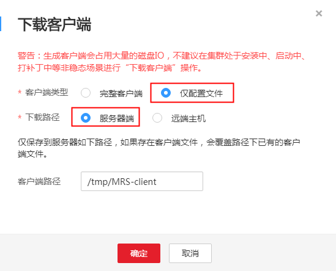

# 从零开始使用Kudu<a name="ZH-CN_TOPIC_0194144430"></a>

Kudu是专为Apache Hadoop平台开发的列式存储管理器。Kudu具有Hadoop生态系统应用程序的共同技术特性：可水平扩展，并支持高可用性操作。

## 背景信息<a name="section19493164011271"></a>

MRS集群创建成功后，默认在集群所有节点的“/opt/client”目录安装保存了原始客户端。在使用客户端前，需要下载并更新客户端配置文件，确认MRS Manager的主管理节点后才能使用客户端。

## 操作步骤<a name="section10873172642318"></a>

1.  下载客户端配置文件。
    1.  登录MRS控制台，在左侧导航栏选择“集群列表  \>  现有集群“  ，单击集群名称。
    2.  选择“组件管理”。
    3.  单击“下载客户端“。

        “客户端类型“选择“仅配置文件“，“下载路径“选择“服务器端“，单击“确定“开始生成客户端配置文件，文件生成后默认保存在主管理节点“/tmp/MRS-client”。

        **图 1**  仅下载配置文件<a name="fig944109133910"></a>  
        

2.  在集群中任意一个Core节点上使用MRS客户端，具体请参考[ 在Core节点使用客户端。](集群内节点使用MRS客户端.md#li5670555716594)
3.  运行Kudu命令行工具。

    直接执行Kudu组件的命令行工具，查看帮助。

    **kudu -h**

    回显信息如下：

    ```
    Usage: ./kudu <command> [<args>]
     
    <command> can be one of the following:
             cluster   Operate on a Kudu cluster
            diagnose   Diagnostic tools for Kudu servers and clusters
                  fs   Operate on a local Kudu filesystem
                 hms   Operate on remote Hive Metastores
       local_replica   Operate on local tablet replicas via the local filesystem
              master   Operate on a Kudu Master
                 pbc   Operate on PBC (protobuf container) files
                perf   Measure the performance of a Kudu cluster
      remote_replica   Operate on remote tablet replicas on a Kudu Tablet Server
               table   Operate on Kudu tables
              tablet   Operate on remote Kudu tablets
                test   Various test actions
             tserver   Operate on a Kudu Tablet Server
                 wal   Operate on WAL (write-ahead log) files
    ```

    > **说明：**   
    >kudu命令行工具不提供DDL、DML等操作，但提供针对cluster、master、tserver、fs、table等的细化查询功能。  

    **常用操作：**

    -   查看当前集群下有哪些表。

        **./kudu table list  _KuduMaster实例IP1:7051, KuduMaster实例IP2:7051, KuduMaster实例IP3:7051_**

    -   查询Kudu服务KuduMaster实例的配置信息。

        **./kudu master get\_flags  _KuduMaster实例IP:7051_**

    -   查询表的schema。

        **./kudu table describe  _KuduMaster实例IP1:7051, KuduMaster实例IP2:7051, KuduMaster实例IP3:7051_ _tablename_**

    -   删除表。

        **./kudu table delete  _KuduMaster实例IP1:7051, KuduMaster实例IP2:7051, KuduMaster实例IP3:7051_ _tablename_**

        > **说明：**   
        >KuduMaster实例IP获取方式：在集群详情页面，选择“组件管理 \> Kudu \> 实例”，获取角色KuduMaster的IP地址。  


4.  删除集群。

    请参见《用户指南》中的[删除集群](删除集群.md)章节。


