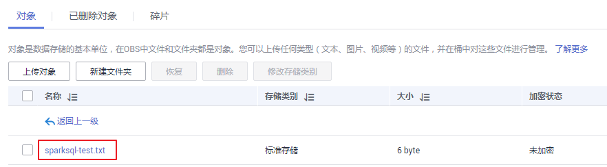

# 从零开始使用Spark SQL<a name="ZH-CN_TOPIC_0173178950"></a>

Spark提供类似SQL的Spark SQL语言操作结构化数据，本章节提供从零开始使用Spark SQL，创建一个名称为src\_data的表，然后在src\_data表中每行写入一条数据，最后将数据存储在“mrs\_20160907“集群中。再使用SQL语句查询src\_data表中的数据，最后可将src\_data表删除。

## 前提条件<a name="sf409cb8b039d45e191bed0dc51e447e3"></a>

将OBS数据源中的数据写入Spark SQL表中时，需要先获取AK/SK。获取方法如下：

1.  登录管理控制台。
2.  单击用户名，在下拉列表中单击“我的凭证“。
3.  单击“访问密钥“。
4.  单击“新增访问密钥“，进入“新增访问密钥“页面。
5.  输入登录密码和短信验证码，单击“确定“，下载密钥，请妥善保。

## 操作步骤<a name="s56e8f18de4d644e58ee2280f2ea5ec88"></a>

1.  准备使用Spark SQL分析的数据源。

    样例txt文件如下：

    ```
    abcd3ghji
    efgh658ko
    1234jjyu9
    7h8kodfg1
    kk99icxz3
    ```

2.  上传数据至OBS。
    1.  登录OBS控制台。
    2.  单击“创建桶“，创建一个名称为sparksql的桶。

        sparksql仅为示例，桶名称必须全局唯一，否则会创建桶失败。

    3.  单击sparksql桶名称，并选择“对象”。
    4.  单击“新建文件夹“，创建input文件夹。
    5.  进入input文件夹，单击“上传对象 \> 添加文件”，选择本地的txt文件，然后单击“上传“。

        上传完成后如[图1](#f5f56c7f43bd1427d89bc3ce200aeb43e)所示。

        **图 1**  上传文件<a name="f5f56c7f43bd1427d89bc3ce200aeb43e"></a>  
        

3.  登录MRS控制台，在左侧导航栏选择“集群列表 \> 现有集群“，单击集群名称。创建集群请参考[自定义购买集群](自定义购买集群.md)。
4.  将OBS中的txt文件导入至HDFS中。
    1.  选择“文件管理“。
    2.  在“HDFS文件列表“页签中单击“新建“，创建一个名称为userinput的文件夹。
    3.  进入userinput文件夹，单击“导入数据“。
    4.  选择OBS和HDFS路径，单击“确定“。

        OBS路径：obs://sparksql/input/sparksql-test.txt

        HDFS路径：/user/userinput

5.  提交Spark SQL语句。
    1.  在MRS控制台选择“作业管理“，具体请参见[运行SparkSql作业](运行SparkSql作业.md)。

        只有“mrs\_20160907“集群处于“运行中“状态时才能提交Spark SQL语句。

    2.  输入创建表的Spark SQL语句。

        输入Spark SQL语句时，总字符数应当小于或等于10000字符，否则会提交语句失败。

        语法格式：

        **CREATE** \[EXTERNAL\] **TABLE** \[IF NOT EXISTS\] _table\_name_ \[\(col\_name data\_type \[COMMENT col\_comment\], ...\)\] \[COMMENT table\_comment\] \[PARTITIONED **BY** \(col\_name data\_type \[COMMENT col\_comment\], ...\)\] \[CLUSTERED **BY** \(col\_name, col\_name, ...\) \[SORTED **BY** \(col\_name \[ASC|DESC\], ...\)\] INTO num\_buckets BUCKETS\] \[ROW FORMAT row\_format\] \[STORED **AS**  file\_format\] \[LOCATION hdfs\_path\];

        创建表样例存在以下两种方式。

        -   方式一：创建一个src\_data表，将数据源中的数据一行一行写入src\_data表中。
            -   数据源存储在HDFS的“/user/omm/userinput“文件夹下：**create external table** _src\_data_**\(line string\) row format delimited fields terminated by '\\\\n' stored as textfile location** '_/user/__omm/__userinput_';
            -   数据源存储在OBS的“/sparksql/input“文件夹下：**create external table** _src\_data_**\(line string\) row format delimited fields terminated by '\\\\n' stored as textfile location** '_obs://AK:SK@sparksql/input_';

                AK/SK获取方法，请参见[前提条件](#sf409cb8b039d45e191bed0dc51e447e3)。

        -   方式二：创建一个表src\_data1，将数据源中的数据批量load到src\_data1表中。

            **create table** _src\_data1_ **\(line string\) row format delimited fields terminated by ','**  ;

            **load data inpath** '_/user/__omm/__userinput/sparksql-test.txt_' **into table** _src\_data1_;

        > **说明：**   
        >采用方式二时，只能将HDFS上的数据load到新建的表中，OBS上的数据不支持直接load到新建的表中。  

    3.  输入查询表的Spark SQL语句。

        语法格式：

        **SELECT** col\_name **FROM** _table\_name_;

        查询表样例，查询src\_data表中的所有数据：

        **select \* from src\_data;**

    4.  输入删除表的Spark SQL语句。

        语法格式：

        **DROP TABLE** \[IF EXISTS\] _table\_name_;

        删除表样例：

        **drop table src\_data;**

    5.  单击“检查“，检查输入语句的语法是否正确。
    6.  单击“确定“。

        Spark SQL语句提交后，是否执行成功会在“执行结果“列中展示。

6.  删除集群。

    请参见[删除集群](删除集群.md)章节。


