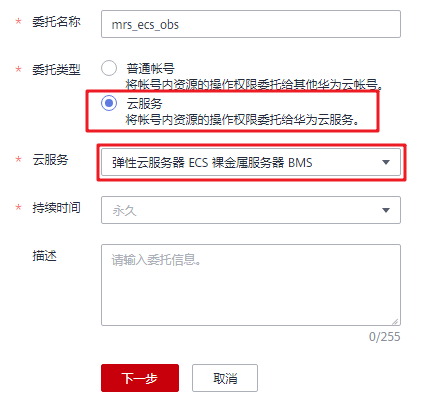

# 使用ECS委托自动获取AK/SK访问OBS

MRS支持通过IAM服务的“委托”机制， 实现使用ECS自动获取的临时AK/SK访问OBS。避免了AK/SK直接暴露在配置文件中的风险。

MRS 2.0.5及之后版本集群支持该功能，目前仅支持Hadoop、Hive、Spark、HBase、Presto、Flink。

## 前提条件

请先在IAM控制台中开通细粒度策略，开通方法请参见：[申请细粒度访问控制公测](https://support.huaweicloud.com/usermanual-iam/iam_01_019.html)。

## （可选）步骤一：创建具有访问OBS权限的ECS委托

> **说明：**   
>MRS在委托列表中预置了MRS\_ECS\_DEFAULT\_AGENCY委托，可在集群创建过程中会代为创建该委托，该委托拥有对象存储服务的OBS Operator权限和在集群所在区域拥有CES Admin（对开启细粒度策略的用户）、CES Adminstrator和KMS Adminstrator权限。同时请勿在IAM修改MRS\_ECS\_DEFAULT\_AGENCY委托。  
>若你想自定义创建委托使用，请参考如下步骤进行创建委托。  

1.  登录IAM服务控制台。
2.  选择“委托 \> 创建委托”。
3.  设置“委托名称”。例如：obs\_operator。
4.  “委托类型”选择“云服务”，在“云服务”中选择“弹性云服务器ECS 裸金属服务器BMS”，授权ECS或BMS调用OBS服务。
5.  “持续时间”选择“永久”。
6.  在“权限选择”区域中，在“对象存储服务”项目中设置“OBS Operator”策略。

    **图 1**  创建委托  
    

## 步骤二：给MRS集群绑定ECS委托

**方法一：在创建集群时绑定**

1.  登录MRS服务控制台。
2.  单击“购买集群”，并选择“自定义购买”集群
3.  配置相关参数，在“高级配置”页签“委托”中选择[（可选）步骤一：创建具有访问OBS权限的ECS委托](#section1566963623113)所创建的委托。

**方法二：在集群创建后绑定**

1.  登录MRS控制台，在导航栏选择“集群列表 \> 现有集群”。
2.  单击集群名称，进入集群详情页面。
3.  在集群详情页的“概览”页签，单击委托右侧的选择需要绑定的委托，或单击“新建委托”进入IAM控制台进行创建后再在此处进行绑定。

