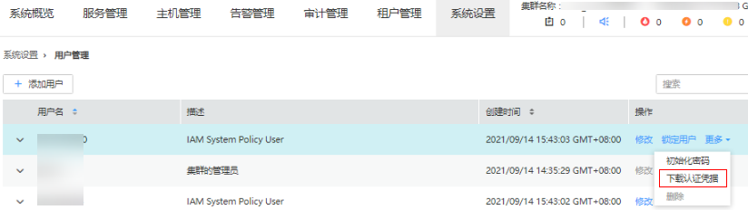
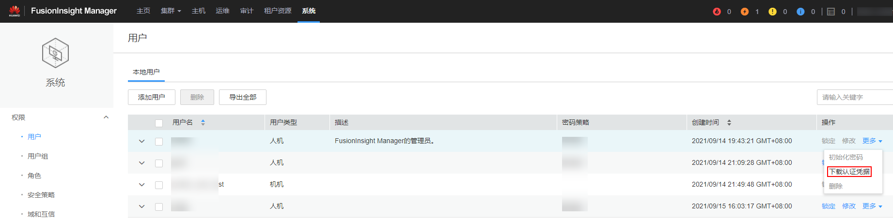
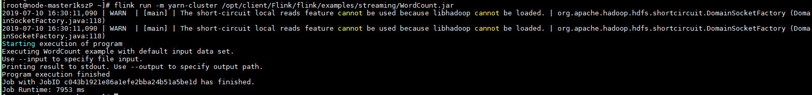
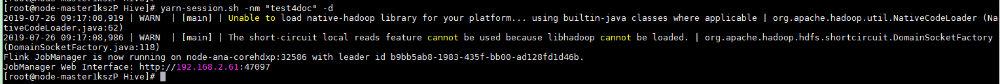
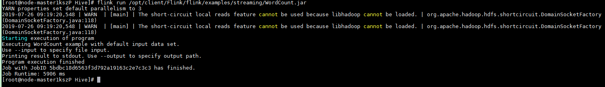
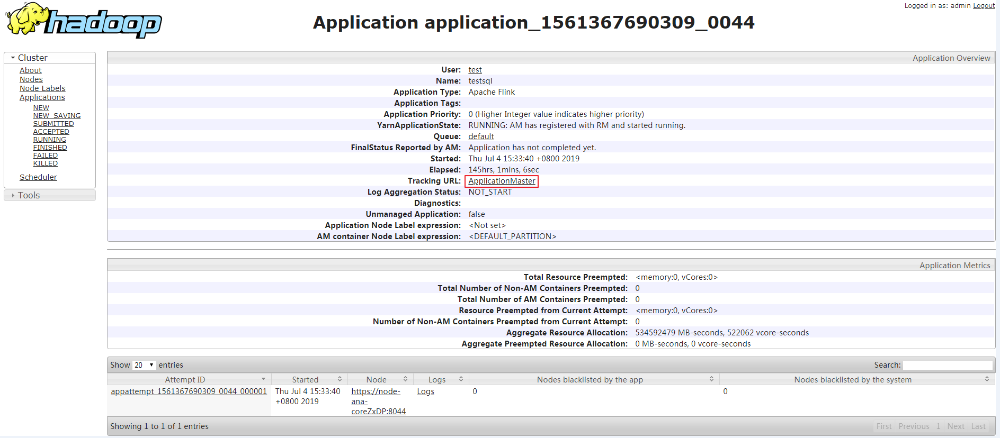

# 使用Flink客户端<a name="mrs_01_24185"></a>

本节提供使用Flink运行wordcount作业的操作指导。

## 前提条件<a name="zh-cn_topic_0264266269_section148416033913"></a>

-   MRS集群中已安装Flink组件。
-   集群正常运行，已安装集群客户端，例如安装目录为“/opt/hadoopclient”。以下操作的客户端目录只是举例，请根据实际安装目录修改。

## 使用Flink客户端（MRS 3.x之前版本）<a name="zh-cn_topic_0264266269_section286111359366"></a>

1.  安装客户端，具体请参考[安装客户端](https://support.huaweicloud.com/usermanual-mrs/mrs_01_0091.html)章节。
2.  以客户端安装用户，登录安装客户端的节点。
3.  执行以下命令，切换到客户端安装目录。

    **cd /opt/hadoopclient**

4.  执行如下命令初始化环境变量。

    **source /opt/hadoopclient/bigdata\_env**

5.  若集群开启Kerberos认证，需要执行以下步骤，若集群未开启Kerberos认证请跳过该步骤。
    1.  准备一个提交Flink作业的用户，具体请参考[准备开发用户](https://support.huaweicloud.com/devg-mrs/mrs_06_0389.html)。
    2.  使用新创建的用户登录Manager页面。

        登录集群的Manager界面，具体请参见[访问Manager](访问Manager-2.md)，选择“系统设置 \> 用户管理”，在已增加用户所在行的“操作”列，选择“更多 \> 下载认证凭据”。

        **图 1**  下载认证凭据<a name="zh-cn_topic_0264266269_fig290311592059"></a>  
        

    3.  将下载的认证凭据压缩包解压缩，并将得到的user.keytab文件拷贝到客户端节点中，例如客户端节点的“/opt/hadoopclient/Flink/flink/conf“目录下。如果是在集群外节点安装的客户端，需要将得到的krb5.conf文件拷贝到该节点的“/etc/”目录下。
    4.  配置安全认证，在“/opt/hadoopclient/Flink/flink/conf/flink-conf.yaml”配置文件中的对应配置添加keytab路径以及用户名。

        security.kerberos.login.keytab: <_user.keytab文件路径_\>

        security.kerberos.login.principal: <_用户名_\>

        例如：

        security.kerberos.login.keytab: /opt/hadoopclient/Flink/flink/conf/user.keytab

        security.kerberos.login.principal: test

    5.  参考[签发证书样例](https://support.huaweicloud.com/cmpntguide-mrs/mrs_01_0621.html)章节生成“generate\_keystore.sh”脚本并放置在Flink的客户端bin目录下，执行如下命令进行安全加固，请参考[认证和加密](https://support.huaweicloud.com/cmpntguide-mrs/mrs_01_1583.html)，password请重新设置为一个用于提交作业的密码。

        **sh generate\_keystore.sh <_password_\>**

        该脚本会自动替换“/opt/hadoopclient/Flink/flink/conf/flink-conf.yaml”中关于SSL的值，针对MRS2.x及之前版本，安全集群默认没有开启外部SSL，用户如果需要启用外部SSL，请参考[安全加固](https://support.huaweicloud.com/cmpntguide-mrs/mrs_01_0594.html)进行配置后再次运行该脚本即可。

        > **说明：** 
        >-   generate\_keystore.sh脚本无需手动生成。
        >-   执行[认证和加密](https://support.huaweicloud.com/cmpntguide-mrs/mrs_01_1583.html)后会将生成的flink.keystore、flink.truststore、security.cookie自动填充到“flink-conf.yaml“对应配置项中。

    6.  客户端访问flink.keystore和flink.truststore文件的路径配置。
        -   绝对路径：执行该脚本后，在flink-conf.yaml文件中将flink.keystore和flink.truststore文件路径自动配置为绝对路径“/opt/hadoopclient/Flink/flink/conf/”，此时需要将conf目录中的flink.keystore和flink.truststore文件分别放置在Flink Client以及Yarn各个节点的该绝对路径上。
        -   相对路径：请执行如下步骤配置flink.keystore和flink.truststore文件路径为相对路径，并确保Flink Client执行命令的目录可以直接访问该相对路径。
            1.  在“/opt/hadoopclient/Flink/flink/conf/”目录下新建目录，例如ssl。
            2.  移动flink.keystore和flink.truststore文件到“/opt/hadoopclient/Flink/flink/conf/ssl/”中。
            3.  修改flink-conf.yaml文件中如下两个参数为相对路径。

                ```
                security.ssl.internal.keystore: ssl/flink.keystore
                security.ssl.internal.truststore: ssl/flink.truststore
                ```


    7.  请在配置文件（如：“**/opt/hadoopclient/Flink/fink/conf/flink-conf.yaml**”**）**如下配置项中追加客户端所在节点的IP，IP地址之间使用英文逗号分隔。

        ```
        web.access-control-allow-origin: xx.xx.xxx.xxx
        jobmanager.web.allow-access-address: xx.xx.xxx.xxx
        ```

6.  运行wordcount作业。

    > **须知：** 
    >用户在Flink提交作业或者运行作业时，应具有如下权限：
    >-   如果启用Ranger鉴权，当前用户必须属于hadoop组或者已在Ranger中为该用户添加“/flink”的读写权限。
    >-   如果停用Ranger鉴权，当前用户必须属于hadoop组。

    -   普通集群（未开启Kerberos认证）
        -   执行如下命令启动session，并在session中提交作业。

            **yarn-session.sh -nm "**_session-name_**"**

            **flink run /opt/hadoopclient/Flink/flink/examples/streaming/WordCount.jar**

        -   执行如下命令在Yarn上提交单个作业。

            **flink run -m yarn-cluster /opt/hadoopclient/Flink/flink/examples/streaming/WordCount.jar**

    -   安全集群（开启Kerberos认证）
        -   flink.keystore和flink.truststore文件路径为绝对路径时：
            -   执行如下命令启动session，并在session中提交作业。

                **yarn-session.sh -nm "**_session-name_**"**

                **flink run /opt/hadoopclient/Flink/flink/examples/streaming/WordCount.jar**

            -   执行如下命令在Yarn上提交单个作业。

                **flink run -m yarn-cluster /opt/hadoopclient/Flink/flink/examples/streaming/WordCount.jar**

        -   flink.keystore和flink.truststore文件路径为相对路径时：
            -   在“ssl”的同级目录下执行如下命令启动session，并在session中提交作业，其中“ssl”是相对路径，如“ssl”所在目录是“opt/hadoopclient/Flink/flink/conf/”，则在“opt/hadoopclient/Flink/flink/conf/”目录下执行命令。

                **yarn-session.sh -t ssl/ -nm "**_session-name_**"**

                **flink run /opt/hadoopclient/Flink/flink/examples/streaming/WordCount.jar**

            -   执行如下命令在Yarn上提交单个作业。

                **flink run -m yarn-cluster -yt ssl/ /opt/hadoopclient/Flink/flink/examples/streaming/WordCount.jar**


7.  作业提交成功后，客户端界面显示如下。

    **图 2**  在Yarn上提交作业成功<a name="zh-cn_topic_0264266269_fig7572041542"></a>  
    

    **图 3**  启动session成功<a name="zh-cn_topic_0264266269_fig2211144410227"></a>  
    

    **图 4**  在session中提交作业成功<a name="zh-cn_topic_0264266269_fig1343995812714"></a>  
    

8.  进入Yarn服务的原生页面，具体操作参考[查看Flink作业信息](https://support.huaweicloud.com/cmpntguide-mrs/mrs_01_0784.html)，找到对应作业的application，单击application名称，进入到作业详情页面。
    -   若作业尚未结束，可单击“Tracking URL”链接进入到Flink的原生页面，查看作业的运行信息。
    -   若作业已运行结束，对于在session中提交的作业，可以单击“Tracking URL”链接登录Flink原生页面查看作业信息。

        **图 5**  application<a name="zh-cn_topic_0264266269_fig1043856121716"></a>  
        


## 使用Flink客户端（MRS 3.x及之后版本）<a name="zh-cn_topic_0264266269_section1160381713011"></a>

1.  安装客户端，具体请参考[安装客户端](https://support.huaweicloud.com/usermanual-mrs/mrs_01_0090.html)章节。
2.  以客户端安装用户，登录安装客户端的节点。
3.  执行以下命令，切换到客户端安装目录。

    **cd /opt/hadoopclient**

4.  执行如下命令初始化环境变量。

    **source /opt/hadoopclient/bigdata\_env**

5.  若集群开启Kerberos认证，需要执行以下步骤，若集群未开启Kerberos认证请跳过该步骤。
    1.  准备一个提交Flink作业的用户，具体请参考[准备开发用户](https://support.huaweicloud.com/devg3-mrs/mrs_07_020002.html)。
    2.  使用新创建的用户登录Manager页面。

        登录集群的Manager界面，具体请参见[访问FusionInsight Manager（MRS 3.x及之后版本）](访问FusionInsight-Manager（MRS-3-x及之后版本）.md)，选择“系统 \> 权限 \> 用户”，在已增加用户所在行的“操作”列，选择“更多 \> 下载认证凭据”。

        **图 6**  下载认证凭据<a name="zh-cn_topic_0264266269_fig1717745717"></a>  
        

    3.  将下载的认证凭据压缩包解压缩，并将得到的user.keytab文件拷贝到客户端节点中，例如客户端节点的“/opt/hadoopclient/Flink/flink/conf“目录下。如果是在集群外节点安装的客户端，需要将得到的krb5.conf文件拷贝到该节点的“/etc/”目录下。
    4.  安全模式下需要将客户端安装节点的业务IP以及Manager的浮动IP追加到“/opt/hadoopclient/Flink/flink/conf/flink-conf.yaml”文件中的“jobmanager.web.allow-access-address“配置项中，IP地址之间使用英文逗号分隔。

        > **说明：** 
        >-   客户端安装节点的业务IP获取方法：
        >    -   集群内节点：
        >        登录MapReduce服务管理控制台，选择“集群列表 \> 现有集群”，选中当前的集群并单击集群名，进入集群信息页面。
        >        在“节点管理”中查看安装客户端所在的节点IP。
        >    -   集群外节点：安装客户端所在的弹性云服务器的IP。
        >-   Manager的浮动IP获取方法：
        >    -   登录MapReduce服务管理控制台，选择“集群列表 \> 现有集群”，选中当前的集群并单击集群名，进入集群信息页面。
        >        在“节点管理”中查看节点名称，名称中包含“master1”的节点为Master1节点，名称中包含“master2”的节点为Master2节点。
        >    -   远程登录Master2节点，执行“ifconfig”命令，系统回显中“eth0:wsom”表示MRS Manager浮动IP地址，请记录“inet”的实际参数值。如果在Master2节点无法查询到MRS Manager的浮动IP地址，请切换到Master1节点查询并记录。如果只有一个Master节点时，直接在该Master节点查询并记录。

    5.  配置安全认证，在“/opt/hadoopclient/Flink/flink/conf/flink-conf.yaml”配置文件中的对应配置添加keytab路径以及用户名。

        security.kerberos.login.keytab: <_user.keytab文件路径_\>

        security.kerberos.login.principal: <_用户名_\>

        例如：

        security.kerberos.login.keytab: /opt/hadoopclient/Flink/flink/conf/user.keytab

        security.kerberos.login.principal: test

    6.  参考[签发证书样例](https://support.huaweicloud.com/cmpntguide-mrs/mrs_01_0621.html)章节生成“generate\_keystore.sh”脚本并放置在Flink的客户端bin目录下，执行如下命令进行安全加固，请参考[认证和加密](https://support.huaweicloud.com/cmpntguide-mrs/mrs_01_1583.html)，password请重新设置为一个用于提交作业的密码。

        **sh generate\_keystore.sh <_password_\>**

        该脚本会自动替换“/opt/hadoopclient/Flink/flink/conf/flink-conf.yaml”中关于SSL的值。

        > **说明：** 
        >执行[认证和加密](https://support.huaweicloud.com/cmpntguide-mrs/mrs_01_1583.html)后会在Flink客户端的“conf”目录下生成“flink.keystore”和“flink.truststore”文件，并且在客户端配置文件“flink-conf.yaml”中将以下配置项进行了默认赋值：
        >-   将配置项“security.ssl.keystore”设置为“flink.keystore”文件所在绝对路径。
        >-   将配置项“security.ssl.truststore”设置为“flink.truststore”文件所在的绝对路径。
        >-   将配置项“security.cookie”设置为“generate\_keystore.sh”脚本自动生成的一串随机规则密码。
        >-   默认“flink-conf.yaml”中“security.ssl.encrypt.enabled: false”，“generate\_keystore.sh”脚本将配置项“security.ssl.key-password”、“security.ssl.keystore-password”和“security.ssl.truststore-password”的值设置为调用“generate\_keystore.sh”脚本时输入的密码。
        >-   如果需要使用密文时，设置“flink-conf.yaml”中“security.ssl.encrypt.enabled: true”，“generate\_keystore.sh”脚本不会配置“security.ssl.key-password”、“security.ssl.keystore-password”和“security.ssl.truststore-password”的值，需要使用Manager明文加密API进行获取，执行**curl -k -i -u **_user name_**:**_password_** -X POST -HContent-type:application/json  -d '\{"plainText":"**_password_**"\}' 'https://**_x.x.x.x_**:28443/web/api/v2/tools/encrypt'**；
        >    其中_user name_**:**password分别为当前系统登录用户名和密码；**"plainText"**的password为调用“generate\_keystore.sh”脚本时的密码；x.x.x.x为集群Manager的浮动IP。

    7.  客户端访问flink.keystore和flink.truststore文件的路径配置。
        -   绝对路径：执行该脚本后，在flink-conf.yaml文件中将flink.keystore和flink.truststore文件路径自动配置为绝对路径“/opt/hadoopclient/Flink/flink/conf/”，此时需要将conf目录中的flink.keystore和flink.truststore文件分别放置在Flink Client以及Yarn各个节点的该绝对路径上。
        -   相对路径：请执行如下步骤配置flink.keystore和flink.truststore文件路径为相对路径，并确保Flink Client执行命令的目录可以直接访问该相对路径。
            1.  在“/opt/hadoopclient/Flink/flink/conf/”目录下新建目录，例如ssl。
            2.  移动flink.keystore和flink.truststore文件到“/opt/hadoopclient/Flink/flink/conf/ssl/”中。
            3.  修改flink-conf.yaml文件中如下两个参数为相对路径。

                ```
                security.ssl.keystore: ssl/flink.keystore
                security.ssl.truststore: ssl/flink.truststore
                ```


    8.  请在配置文件（如：“**/opt/hadoopclient/Flink/fink/conf/flink-conf.yaml**”**）**如下配置项中追加客户端所在节点的IP，IP地址之间使用英文逗号分隔。

        ```
        web.access-control-allow-origin: xx.xx.xxx.xxx
        jobmanager.web.allow-access-address: xx.xx.xxx.xxx
        ```

6.  运行wordcount作业。

    > **须知：** 
    >用户在Flink提交作业或者运行作业时，应具有如下权限：
    >-   如果启用Ranger鉴权，当前用户必须属于hadoop组或者已在Ranger中为该用户添加“/flink”的读写权限。
    >-   如果停用Ranger鉴权，当前用户必须属于hadoop组。

    -   普通集群（未开启Kerberos认证）
        -   执行如下命令启动session，并在session中提交作业。

            **yarn-session.sh -nm "**_session-name_**"**

            **flink run /opt/hadoopclient/Flink/flink/examples/streaming/WordCount.jar**

        -   执行如下命令在Yarn上提交单个作业。

            **flink run -m yarn-cluster /opt/hadoopclient/Flink/flink/examples/streaming/WordCount.jar**

    -   安全集群（开启Kerberos认证）
        -   flink.keystore和flink.truststore文件路径为绝对路径时：
            -   执行如下命令启动session，并在session中提交作业。

                **yarn-session.sh -nm "**_session-name_**"**

                **flink run /opt/hadoopclient/Flink/flink/examples/streaming/WordCount.jar**

            -   执行如下命令在Yarn上提交单个作业。

                **flink run -m yarn-cluster /opt/hadoopclient/Flink/flink/examples/streaming/WordCount.jar**

        -   flink.keystore和flink.truststore文件路径为相对路径时：
            -   在“ssl”的同级目录下执行如下命令启动session，并在session中提交作业，其中“ssl”是相对路径，如“ssl”所在目录是“opt/hadoopclient/Flink/flink/conf/”，则在“opt/hadoopclient/Flink/flink/conf/”目录下执行命令。

                **yarn-session.sh -t ssl/ -nm "**_session-name_**"**

                **flink run /opt/hadoopclient/Flink/flink/examples/streaming/WordCount.jar**

            -   执行如下命令在Yarn上提交单个作业。

                **flink run -m yarn-cluster -yt ssl/ /opt/hadoopclient/Flink/flink/examples/streaming/WordCount.jar**


7.  作业提交成功后，客户端界面显示如下。

    **图 7**  在Yarn上提交作业成功<a name="zh-cn_topic_0264266269_fig15340185743012"></a>  
    

    **图 8**  启动session成功<a name="zh-cn_topic_0264266269_fig203401757133017"></a>  
    

    **图 9**  在session中提交作业成功<a name="zh-cn_topic_0264266269_fig03403579301"></a>  
    

8.  进入Yarn服务的原生页面，具体操作参考[查看Flink作业信息](https://support.huaweicloud.com/cmpntguide-mrs/mrs_01_0784.html)，找到对应作业的application，单击application名称，进入到作业详情页面。
    -   若作业尚未结束，可单击“Tracking URL”链接进入到Flink的原生页面，查看作业的运行信息。
    -   若作业已运行结束，对于在session中提交的作业，可以单击“Tracking URL”链接登录Flink原生页面查看作业信息。

        **图 10**  application<a name="zh-cn_topic_0264266269_fig12341157133015"></a>  
        


