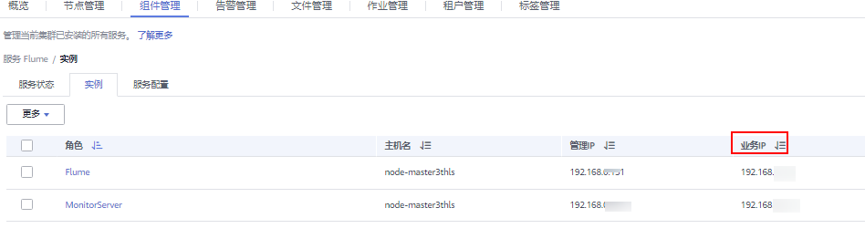

# 使用Flume客户端<a name="mrs_01_24186"></a>

## 操作场景<a name="zh-cn_topic_0264266686_s6020f8e1de5644d2becca6a1c9dd7b98"></a>

Flume支持将采集的日志信息导入到Kafka。

## 前提条件<a name="zh-cn_topic_0264266686_sdd14a34b7dc44c2ab9cabb19599a033a"></a>

-   已创建启用Kerberos认证的流集群。
-   已在日志生成节点安装Flume客户端，例如安装目录为“/opt/Flumeclient”，客户端安装请参见[安装Flume客户端](https://support.huaweicloud.com/cmpntguide-mrs/mrs_01_0392.html)。以下操作的客户端目录只是举例，请根据实际安装目录修改。
-   已配置网络，使日志生成节点与流集群互通。

## 使用Flume客户端（MRS 3.x之前版本）<a name="zh-cn_topic_0264266686_s1f8b9b2a99104941860eb2956cc0057c"></a>

> **说明：** 
>普通集群不需要执行[2](#zh-cn_topic_0264266686_l78730912572649fd8edfda3920dc20cf)-[6](#zh-cn_topic_0264266686_lfde322e0f3de4ccb88b4e195e65f9993)。

1.  客户端安装。

    具体请参考[安装Flume客户端](https://support.huaweicloud.com/cmpntguide-mrs/mrs_01_0392.html)。

2.  <a name="zh-cn_topic_0264266686_l78730912572649fd8edfda3920dc20cf"></a>将Master1节点上的认证服务器配置文件，复制到安装Flume客户端的节点，保存到Flume客户端中“Flume客户端安装目录/fusioninsight-flume-_Flume组件版本号_/conf“目录下。

    文件完整路径为“$\{BIGDATA\_HOME\}/MRS\_Current/1\_X\_KerberosClient/etc/kdc.conf“。

    其中“X“为随机生成的数字，请根据实际情况修改。同时文件需要以Flume客户端安装用户身份保存，例如**root**用户。

3.  查看任一部署Flume角色节点的“业务IP“。

    登录集群详情页面，选择“集群 \> 组件管理 \> Flume \> 实例”，查看任一部署Flume角色节点的“业务IP“。

    > **说明：** 
    >若集群详情页面没有“组件管理”页签，请先完成IAM用户同步（在集群详情页的“概览”页签，单击“IAM用户同步“右侧的“单击同步”进行IAM用户同步）。

    

4.  <a name="zh-cn_topic_0264266686_l762ab29694a642ac8ae1a0609cb97c9b"></a>将此节点上的用户认证文件，复制到安装Flume客户端的节点，保存到Flume客户端中“Flume客户端安装目录/fusioninsight-flume-_Flume组件版本号_/conf“目录下。

    文件完整路径为“$\{BIGDATA\_HOME\}/MRS\_XXX/install/FusionInsight-Flume-Flume组件版本号/flume/conf/flume.keytab“。

    其中“XXX“为产品版本号，请根据实际情况修改。同时文件需要以Flume客户端安装用户身份保存，例如**root**用户。

5.  将此节点上的配置文件“jaas.conf“，复制到安装Flume客户端的节点，保存到Flume客户端中“conf“目录。

    文件完整路径为“$\{BIGDATA\_HOME\}/MRS\_Current/1\_X\_Flume/etc/jaas.conf“。

    其中“X“为随机生成的数字，请根据实际情况修改。同时文件需要以Flume客户端安装用户身份保存，例如**root**用户。

6.  <a name="zh-cn_topic_0264266686_lfde322e0f3de4ccb88b4e195e65f9993"></a>登录安装Flume客户端节点，切换到客户端安装目录，执行以下命令修改文件：

    **vi conf/jaas.conf**

    修改参数“keyTab“定义的用户认证文件完整路径即[4](#zh-cn_topic_0264266686_l762ab29694a642ac8ae1a0609cb97c9b)中保存用户认证文件的目录：“Flume客户端安装目录/fusioninsight-flume-_Flume组件版本号_/conf“，然后保存并退出。

7.  执行以下命令，修改Flume客户端配置文件“flume-env.sh“：

    **vi **_Flume客户端安装目录_/**fusioninsight-flume-**_F__lume组件版本号_**/conf/flume-env.sh**

    在“-XX:+UseCMSCompactAtFullCollection“后面，增加以下内容：

    ```
    -Djava.security.krb5.conf=Flume客户端安装目录/fusioninsight-flume-1.9.0/conf/kdc.conf -Djava.security.auth.login.config=Flume客户端安装目录/fusioninsight-flume-1.9.0/conf/jaas.conf -Dzookeeper.request.timeout=120000
    ```

    例如：**"-XX:+UseCMSCompactAtFullCollection -Djava.security.krb5.conf=**_Flume客户端安装目录_/**fusioninsight-flume-**_F__lume组件版本号_**/conf/kdc.conf -Djava.security.auth.login.config=**_Flume客户端安装目录_/**fusioninsight-flume-**_F__lume组件版本号_**/conf/jaas.conf -Dzookeeper.request.timeout=120000"**

    请根据实际情况，修改“Flume客户端安装目录“，然后保存并退出。

8.  假设Flume客户端安装路径为“/opt/FlumeClient“，执行以下命令，重启Flume客户端：

    **cd /opt/FlumeClient/fusioninsight-flume-**_F__lume组件版本号_**/bin**

    **./flume-manage.sh restart**

9.  执行以下命令，修改Flume客户端配置文件“properties.properties“。

    **vi **_Flume客户端安装目录_**/fusioninsight-flume-**_F__lume组件版本号_**/conf/properties.properties**

    将以下内容保存到文件中：

    ```
    #########################################################################################
    client.sources = static_log_source  
    client.channels = static_log_channel 
    client.sinks = kafka_sink
    #########################################################################################
    #LOG_TO_HDFS_ONLINE_1
    
    client.sources.static_log_source.type = spooldir
    client.sources.static_log_source.spoolDir = PATH
    client.sources.static_log_source.fileSuffix = .COMPLETED
    client.sources.static_log_source.ignorePattern = ^$
    client.sources.static_log_source.trackerDir = PATH
    client.sources.static_log_source.maxBlobLength = 16384
    client.sources.static_log_source.batchSize = 51200
    client.sources.static_log_source.inputCharset = UTF-8
    client.sources.static_log_source.deserializer = LINE
    client.sources.static_log_source.selector.type = replicating
    client.sources.static_log_source.fileHeaderKey = file
    client.sources.static_log_source.fileHeader = false
    client.sources.static_log_source.basenameHeader = true
    client.sources.static_log_source.basenameHeaderKey = basename
    client.sources.static_log_source.deletePolicy = never
    
    client.channels.static_log_channel.type = file
    client.channels.static_log_channel.dataDirs = PATH
    client.channels.static_log_channel.checkpointDir = PATH
    client.channels.static_log_channel.maxFileSize = 2146435071
    client.channels.static_log_channel.capacity = 1000000
    client.channels.static_log_channel.transactionCapacity = 612000
    client.channels.static_log_channel.minimumRequiredSpace = 524288000
    
    client.sinks.kafka_sink.type = org.apache.flume.sink.kafka.KafkaSink
    client.sinks.kafka_sink.kafka.topic = flume_test
    client.sinks.kafka_sink.kafka.bootstrap.servers = XXX.XXX.XXX.XXX:210079092,XXX.XXX.XXX.XXX:21007,XXX.XXX.XXX.XXX:21007
    client.sinks.kafka_sink.flumeBatchSize = 1000
    client.sinks.kafka_sink.kafka.producer.type = sync
    client.sinks.kafka_sink.kafka.security.protocol  = SASL_PLAINTEXT
    client.sinks.kafka_sink.kafka.kerberos.domain.name = hadoop.XXX.com
    client.sinks.kafka_sink.requiredAcks = 0
    
    client.sources.static_log_source.channels = static_log_channel
    client.sinks.kafka_sink.channel = static_log_channel
    ```

    请根据实际情况，修改以下参数，然后保存并退出。

    -   spoolDir
    -   trackerDir
    -   dataDirs
    -   checkpointDir
    -   topic

        如果kafka中该topic不存在，默认情况下会自动创建该topic。

    -   kafka.bootstrap.servers

        默认情况下，安全集群对应端口21007，普通集群对应端口9092。

    -   kafka.security.protocol

        安全集群请配置为SASL\_PLAINTEXT，普通集群请配置为PLAINTEXT。

    -   “kafka.kerberos.domain.name“

        普通集群无需配置此参数。安全集群对应此参数的值为Kafka集群中“kerberos.domain.name”对应的值。

        具体可到Broker实例所在节点上查看“$\{BIGDATA\_HOME\}/MRS\_Current/1\_X\_Broker/etc/server.properties“。

        其中“X“为随机生成的数字，请根据实际情况修改。同时文件需要以Flume客户端安装用户身份保存，例如**root**用户。

10. Flume客户端将自动加载“properties.properties“的内容。

    当“spoolDir“生成新的日志文件，文件内容将发送到Kafka生产者，并支持Kafka消费者消费。


## 使用Flume客户端（MRS 3.x及之后版本）<a name="zh-cn_topic_0264266686_section197021472420"></a>

> **说明：** 
>普通集群不需要执行[2](#zh-cn_topic_0264266686_li81278495417)-[6](#zh-cn_topic_0264266686_li31329494415)。

1.  客户端安装。

    具体请参考[安装Flume客户端](https://support.huaweicloud.com/cmpntguide-mrs/mrs_01_0392.html)。

2.  <a name="zh-cn_topic_0264266686_li81278495417"></a>将Master1节点上的认证服务器配置文件，复制到安装Flume客户端的节点，保存到Flume客户端中“Flume客户端安装目录/fusioninsight-flume-_Flume组件版本号_/conf“目录下。

    文件完整路径为“$\{BIGDATA\_HOME\}/FusionInsight\_Current/1\_X\_KerberosClient/etc/kdc.conf“。其中“X“为随机生成的数字，请根据实际情况修改。同时文件需要以Flume客户端安装用户身份保存，例如**root**用户。

3.  查看任一部署Flume角色节点的“业务IP“。

    登录FusionInsight Manager页面，具体请参见[访问FusionInsight Manager（MRS 3.x及之后版本）](访问FusionInsight-Manager（MRS-3-x及之后版本）.md)，选择“集群 \> 服务 \> Flume \> 实例”。查看任一部署Flume角色节点的“业务IP“。

    > **说明：** 
    >若集群详情页面没有“组件管理”页签，请先完成IAM用户同步（在集群详情页的“概览”页签，单击“IAM用户同步“右侧的“点击同步”进行IAM用户同步）。

4.  <a name="zh-cn_topic_0264266686_li4130849748"></a>将此节点上的用户认证文件，复制到安装Flume客户端的节点，保存到Flume客户端中“Flume客户端安装目录/fusioninsight-flume-_Flume组件版本号_/conf“目录下。

    文件完整路径为“$\{BIGDATA\_HOME\}/FusionInsight\_Porter\_XXX/install/FusionInsight-Flume-Flume组件版本号/flume/conf/flume.keytab“。

    其中“XXX“为产品版本号，请根据实际情况修改。同时文件需要以Flume客户端安装用户身份保存，例如**root**用户。

5.  将此节点上的配置文件“jaas.conf“，复制到安装Flume客户端的节点，保存到Flume客户端中“conf“目录。

    文件完整路径为“$\{BIGDATA\_HOME\}/FusionInsight\_Current/1\_X\_Flume/etc/jaas.conf“。

    其中“X“为随机生成的数字，请根据实际情况修改。同时文件需要以Flume客户端安装用户身份保存，例如**root**用户。

6.  <a name="zh-cn_topic_0264266686_li31329494415"></a>登录安装Flume客户端节点，切换到客户端安装目录，执行以下命令修改文件：

    **vi conf/jaas.conf**

    修改参数“keyTab“定义的用户认证文件完整路径即[4](#zh-cn_topic_0264266686_li4130849748)中保存用户认证文件的目录：“Flume客户端安装目录/fusioninsight-flume-_Flume组件版本号_/conf“，然后保存并退出。

7.  执行以下命令，修改Flume客户端配置文件“flume-env.sh“：

    **vi **_Flume客户端安装目录_/**fusioninsight-flume-**_F__lume组件版本号_**/conf/flume-env.sh**

    在“-XX:+UseCMSCompactAtFullCollection“后面，增加以下内容：

    ```
    -Djava.security.krb5.conf=Flume客户端安装目录/fusioninsight-flume-1.9.0/conf/kdc.conf -Djava.security.auth.login.config=Flume客户端安装目录/fusioninsight-flume-1.9.0/conf/jaas.conf -Dzookeeper.request.timeout=120000
    ```

    例如：**"-XX:+UseCMSCompactAtFullCollection -Djava.security.krb5.conf=**_Flume客户端安装目录_/**fusioninsight-flume-**_F__lume组件版本号_**/conf/kdc.conf -Djava.security.auth.login.config=**_Flume客户端安装目录_/**fusioninsight-flume-**_F__lume组件版本号_**/conf/jaas.conf -Dzookeeper.request.timeout=120000"**

    请根据实际情况，修改“Flume客户端安装目录“，然后保存并退出。

8.  假设Flume客户端安装路径为“/opt/FlumeClient“，执行以下命令，重启Flume客户端：

    **cd /opt/FlumeClient/fusioninsight-flume-**_F__lume组件版本号_**/bin**

    **./flume-manage.sh restart**

9.  执行以下命令，修改Flume客户端配置文件“properties.properties“。

    **vi **_Flume客户端安装目录_**/fusioninsight-flume-**_F__lume组件版本号_**/conf/properties.properties**

    将以下内容保存到文件中：

    ```
    #########################################################################################
    client.sources = static_log_source  
    client.channels = static_log_channel 
    client.sinks = kafka_sink
    #########################################################################################
    #LOG_TO_HDFS_ONLINE_1
    
    client.sources.static_log_source.type = spooldir
    client.sources.static_log_source.spoolDir = PATH
    client.sources.static_log_source.fileSuffix = .COMPLETED
    client.sources.static_log_source.ignorePattern = ^$
    client.sources.static_log_source.trackerDir = PATH
    client.sources.static_log_source.maxBlobLength = 16384
    client.sources.static_log_source.batchSize = 51200
    client.sources.static_log_source.inputCharset = UTF-8
    client.sources.static_log_source.deserializer = LINE
    client.sources.static_log_source.selector.type = replicating
    client.sources.static_log_source.fileHeaderKey = file
    client.sources.static_log_source.fileHeader = false
    client.sources.static_log_source.basenameHeader = true
    client.sources.static_log_source.basenameHeaderKey = basename
    client.sources.static_log_source.deletePolicy = never
    
    client.channels.static_log_channel.type = file
    client.channels.static_log_channel.dataDirs = PATH
    client.channels.static_log_channel.checkpointDir = PATH
    client.channels.static_log_channel.maxFileSize = 2146435071
    client.channels.static_log_channel.capacity = 1000000
    client.channels.static_log_channel.transactionCapacity = 612000
    client.channels.static_log_channel.minimumRequiredSpace = 524288000
    
    client.sinks.kafka_sink.type = org.apache.flume.sink.kafka.KafkaSink
    client.sinks.kafka_sink.kafka.topic = flume_test
    client.sinks.kafka_sink.kafka.bootstrap.servers = XXX.XXX.XXX.XXX:210079092,XXX.XXX.XXX.XXX:21007,XXX.XXX.XXX.XXX:21007
    client.sinks.kafka_sink.flumeBatchSize = 1000
    client.sinks.kafka_sink.kafka.producer.type = sync
    client.sinks.kafka_sink.kafka.security.protocol  = SASL_PLAINTEXT
    client.sinks.kafka_sink.kafka.kerberos.domain.name = hadoop.XXX.com
    client.sinks.kafka_sink.requiredAcks = 0
    
    client.sources.static_log_source.channels = static_log_channel
    client.sinks.kafka_sink.channel = static_log_channel
    ```

    请根据实际情况，修改以下参数，然后保存并退出。

    -   spoolDir
    -   trackerDir
    -   dataDirs
    -   checkpointDir
    -   topic

        如果kafka中该topic不存在，默认情况下会自动创建该topic。

    -   kafka.bootstrap.servers

        默认情况下，安全集群对应端口21007，普通集群对应端口9092。

    -   kafka.security.protocol

        安全集群请配置为SASL\_PLAINTEXT，普通集群请配置为PLAINTEXT。

    -   “kafka.kerberos.domain.name“

        普通集群无需配置此参数。安全集群对应此参数的值为Kafka集群中“kerberos.domain.name”对应的值。

        具体可到Broker实例所在节点上查看“$\{BIGDATA\_HOME\}/FusionInsight\_Current/1\_X\_Broker/etc/server.properties“。

        其中“X“为随机生成的数字，请根据实际情况修改。同时文件需要以Flume客户端安装用户身份保存，例如**root**用户。

10. Flume客户端将自动加载“properties.properties“的内容。

    当“spoolDir“生成新的日志文件，文件内容将发送到Kafka生产者，并支持Kafka消费者消费。


