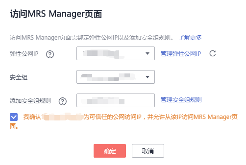
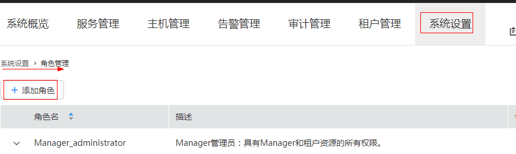
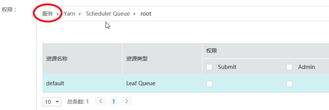
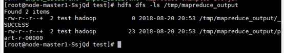
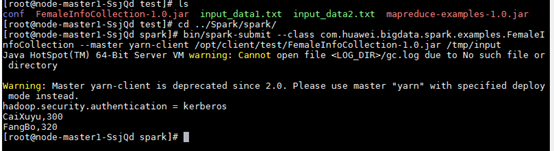
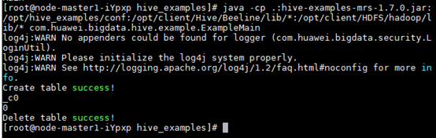

# 使用Kerberos认证集群<a name="ZH-CN_TOPIC_0126275281"></a>

本章节提供从零开始使用安全集群并执行MapReduce程序、Spark程序和Hive程序的操作指导。

## 创建安全集群并登录其Manager<a name="section1884715426338"></a>

当集群版本为**MRS 1.8.0**及以后版本时，执行如下步骤：

1.  创建安全集群，请参见[创建集群](创建集群.md)页面，开启“Kerberos认证“参数开关，并配置“密码“、“确认密码“参数。该密码用于登录MRS Manager，请妥善保管。

    **图 1**  安全集群参数配置<a name="fig671245513449"></a>  
    

2.  登录MRS管理控制台页面。
3.  单击“集群列表“，在“现有集群“ 列表，单击指定的集群名称，进入集群信息页面。
4.  单击“点击查看“，打开“访问MRS Manager页面“。
    -   若用户创建集群时已经绑定弹性公网IP，如[图2](#fig1768919558220)所示。
        1.  添加安全组规则，默认填充的是用户访问公网IP地址9022端口的规则。如需对安全组规则进行查看，修改和删除操作，请单击“管理安全组规则“。

            > **说明：**   
            >-   自动获取的访问公网IP与用户本机IP不一致，属于正常现象，无需处理。  
            >-   9022端口为knox的端口，需要开启访问knox的9022端口权限，才能访问MRS Manager服务。  

        2.  勾选“我确认xx.xx.xx.xx为可信任的公网访问IP，并允许从该IP访问MRS Manager页面。“

            **图 2**  访问MRS Manager页面<a name="fig1768919558220"></a>  
            


    -   若用户创建集群时暂未绑定弹性公网IP，如[图3](#fig7968172954416)所示。

        1.  在弹性公网IP下拉框中选择可用的弹性公网IP或单击“管理弹性公网IP“购买弹性公网IP。
        2.  添加安全组规则，默认填充的是用户访问公网IP地址9022端口的规则。如需对安全组规则进行查看，修改和删除操作，请点击“管理安全组规则“。

            > **说明：**   
            >-   自动获取的访问公网IP与用户本机IP不一致，属于正常现象，无需处理。  
            >-   9022端口为knox的端口，需要开启访问knox的9022端口权限，才能访问MRS Manager服务。  

        3.  勾选“我确认xx.xx.xx.xx为可信任的公网访问IP，并允许从该IP访问MRS Manager页面。“

        **图 3**  访问MRS Manager页面设置<a name="fig7968172954416"></a>  
        


5.  单击“确定“，进入MRS Manager登录页面，如需给其他用户开通访问MRS Manager的权限，请参见[访问支持Kerberos认证的Manager](访问支持Kerberos认证的Manager.md)章节，添加对应用户访问公网的IP地址为可信范围。
6.  输入创建集群时默认的用户名“admin“及设置的密码，单击“登录“进入MRS Manager页面。

当集群版本为**MRS 1.8.0**以前版本时，执行如下步骤：

1.  <a name="li3858195882716"></a>创建安全集群，请参见[创建集群](创建集群.md)页面，开启“Kerberos认证“参数开关，并配置“密码“、“确认密码“参数。该密码用于登录MRS Manager，请妥善保管。

    **图 4**  安全集群参数设置<a name="fig1685319589279"></a>  
    

2.  <a name="zh-cn_topic_0046344332_li1519293110210"></a>在MRS管理控制台，单击“集群列表“。

    > **说明：**   
    >-   访问支持Kerberos认证的Manager方法请参考[2](#zh-cn_topic_0046344332_li1519293110210)-[7](#zh-cn_topic_0046344332_li66227810104856)，或者请参考[创建连接MRS集群的SSH隧道并配置浏览器](创建连接MRS集群的SSH隧道并配置浏览器.md)。  
    >-   分析集群和流式集群访问支持Kerberos认证的Manager方法相同。  

3.  <a name="li5015950919196"></a>在  “现有集群“  列表中，单击已创建的安全集群名称。

    记录集群的“可用分区“、“虚拟私有云“、“集群控制台地址“，以及Master节点的“默认安全组“。

4.  在弹性云服务器管理控制台，创建一个新的弹性云服务器。

    -   弹性云服务器的“可用分区“、“虚拟私有云“、“安全组“，需要和待访问集群的配置相同。
    -   选择一个Windows系统的公共镜像。
    -   其他配置参数详细信息，请参见“弹性云服务器 \> 快速入门 \> 购买并登录Windows弹性云服务器“。

    > **说明：**   
    >如果弹性云服务器的安全组和Master节点的“默认安全组“不同，用户可以选择以下任一种方法修改配置：  
    >-   将弹性云服务器的安全组修改为Master节点的默认安全组，请参见“弹性云服务器  \>  用户指南  \>  网络  \>  更改安全组“。  
    >-   在集群Master节点和Core节点的安全组添加两条安全组规则使弹性云服务器可以访问集群，“协议“需选择为“TCP“，“端口“需分别选择“28443“和“20009“。请参见“虚拟私有云 \> 用户指南 \> 安全性 \> 安全组 \> 添加安全组规则“。  

5.  在虚拟私有云管理控制台，申请一个弹性IP地址，并与弹性云服务器绑定。

    具体请参见“虚拟私有云  \>  用户指南  \>  弹性公网IP  \>  为弹性云服务器申请和绑定弹性公网IP“。

6.  登录弹性云服务器。

    登录弹性云服务器需要Windows系统的帐号、密码，弹性IP地址以及配置安全组规则。具体请参见“弹性云服务器 \> 用户指南 \> 实例 \> 登录Windows弹性云服务器“。

7.  <a name="zh-cn_topic_0046344332_li66227810104856"></a>在Windows的远程桌面中，打开浏览器访问Manager。

    例如Windows 2012操作系统可以使用Internet Explorer 11。

    Manager访问地址形式为**https://_集群控制台地址_:28443/web**。**集群控制台地址**为[3](#li5015950919196)中记录的“集群控制台地址“，访问时需要输入MRS集群的用户名和密码，例如“admin“用户，密码为[1](#li3858195882716)创建集群时开启“Kerberos认证“参数开关时输入的密码。

    > **说明：**   
    >-   如果使用其他MRS集群用户访问Manager，第一次访问时需要修改密码。新密码需要满足集群当前的用户密码复杂度策略。请咨询管理员。  
    >-   默认情况下，在登录时输入5次错误密码将锁定用户，需等待5分钟自动解锁。  


## 创建角色和用户<a name="section189801130519"></a>

开启Kerberos认证的集群，必须通过以下步骤创建一个用户并分配相应权限来允许用户执行程序。

1.  在MRS Manager界面选择“系统设置  \>  角色管理“。
2.  单击“添加角色“，详情请参见[创建角色](创建角色-安全.md)。

    **图 5**  添加角色<a name="fig1545120346519"></a>  
    

    填写如下信息：

    -   填写角色的名称，例如mrrole。
    -   在“权限“的表格中选择“Yarn \> Scheduler Queue \> root“，勾选“Submit“、“Admin“，勾选完全后，不要单击确认，要单击如下图的“服务“，再进行后面权限的选择。
    -   在“权限“表格中选择“HBase \> HBase Scope“  ，勾选global的“Create“、“Read“、“Write“、“Execute“，勾选完全后，不要单击确认，要单击如下图的“服务“，再进行后面权限的选择。
    -   在“权限“的表格中选择“HDFS \> File System \> hdfs://hacluster/“，勾选“Read”、“Write”和“Execute”，勾选完全后，不要单击确认，要单击如下图的“服务“，再进行后面权限的选择。
    -   在“权限“的表格中选择“Hive \> Hive Read Write Privileges”，勾选default的“Create”、“Select”、“Delete”、“Insert”，单击“确定”，完成角色的创建。

        **图 6**  配置服务权限<a name="fig1634253610538"></a>  
        


3.  单击“系统设置 \> 用户组管理 \> 添加用户组”，为样例工程创建一个用户组，例如mrgroup，详情请参见[创建用户组](创建用户组-安全.md)。
4.  单击“系统设置 \> 用户管理 \> 添加用户”，为样例工程创建一个用户，详情请参见[创建用户](创建用户-安全.md)。
    -   填写用户名，例如test，当需要执行Hive程序时，请设置用户名为“hiveuser“。
    -   用户类型为“人机”用户。
    -   输入密码（特别注意该密码在后面运行程序时要用到）。
    -   加入用户组mrgroup和supergroup。
    -   设置其“主组”为supergroup，并绑定角色mrrole取得权限。

        单击“确定”完成用户创建。


5.  <a name="li21001314654"></a>单击“系统设置 \> 用户管理”，在用户名中选择新建用户“test“，单击“更多\>下载认证凭据文件”，保存后解压得到用户的keytab文件与krb5.conf文件。

## 执行MapReduce程序<a name="section7127181117417"></a>

本小节提供执行MapReduce程序的操作指导，旨在指导用户在安全集群模式下运行程序。

**前提条件**

已编译好待运行的程序及对应的数据文件，如mapreduce-examples-1.0.jar、input\_data1.txt和input\_data2.txt，MapReduce程序开发及数据准备请参见[MapReduce应用开发](https://support.huaweicloud.com/devg-mrs/mrs_06_0083.html)。

1.  采用远程登录软件（比如：MobaXterm）通过ssh登录（使用集群弹性IP登录）到安全集群的master节点。
2.  登录成功后分别执行下列命令，在/opt/client目录下创建test文件夹，在test目录下创建conf文件夹：

    ```
    cd /opt/client
    mkdir test
    cd test
    mkdir conf
    ```

3.  使用上传工具（比如：WinScp）将mapreduce-examples-1.0.jar、input\_data1.txt和input\_data2.txt复制到test目录下，将“创建角色和用户“中的[5](#li21001314654)获得的keytab文件和krb5.conf文件复制到conf目录。
4.  执行如下命令配置环境变量并认证已创建用户，例如test。

    ```
    cd /opt/client
    source bigdata_env
    export YARN_USER_CLASSPATH=/opt/client/test/conf/
    kinit test
    ```

    然后按照提示输入密码，无异常提示返回，则完成了用户的kerberos认证。

5.  执行如下命令将数据导入到HDFS中：

    ```
    cd test
    hdfs dfs -mkdir /tmp/input
    hdfs dfs -put input_data* /tmp/input
    ```

6.  执行如下命令运行程序：

    ```
    yarn jar mapreduce-examples-1.0.jar com.huawei.bigdata.mapreduce.examples.FemaleInfoCollector /tmp/input /tmp/mapreduce_output
    ```

    其中：

    /tmp/input指HDFS文件系统中input的路径。

    /tmp/mapreduce\_output指HDFS文件系统中output的路径，该目录必须不存在，否则会报错。

7.  程序运行成功后，执行 hdfs dfs -ls /tmp/mapreduce\_output会显示如下：

    **图 7**  查看程序运行结果<a name="fig6790418123112"></a>  
    


## 执行Spark程序<a name="section450551216915"></a>

本小节提供执行Spark程序的操作指导，旨在指导用户在安全集群模式下运行程序。

**前提条件**

已编译好待运行的程序及对应的数据文件，如FemaleInfoCollection.jar、input\_data1.txt和input\_data2.txt，Spark程序开发及数据准备请参见[Spark应用开发](https://support.huaweicloud.com/devg-mrs/mrs_06_0149.html)。

1.  采用远程登录软件（比如：MobaXterm）通过ssh登录（使用集群弹性IP登录）到安全集群的master节点。
2.  登录成功后分别执行下列命令，在/opt/client目录下创建test文件夹，在test目录下创建conf文件夹：

    ```
    cd /opt/client
    mkdir test
    cd test
    mkdir conf
    ```

3.  使用上传工具（比如：WinScp）将样FemaleInfoCollection.jar、input\_data1.txt和input\_data2.txt复制到test目录下，将“创建角色和用户“中的[5](#li21001314654)获得的keytab文件和krb5.conf文件复制到conf目录。
4.  执行如下命令配置环境变量并认证已创建用户，例如test。

    ```
    cd /opt/client
    source bigdata_env
    export YARN_USER_CLASSPATH=/opt/client/test/conf/
    kinit test
    ```

    然后按照提示输入密码，无异常提示返回，则完成了用户的kerberos认证。

5.  执行如下命令将数据导入到HDFS中：

    ```
    cd test
    hdfs dfs -mkdir /tmp/input
    hdfs dfs -put input_data* /tmp/input
    ```

6.  执行如下命令运行程序：

    ```
    cd /opt/client/Spark/spark
    bin/spark-submit --class com.huawei.bigdata.spark.examples.FemaleInfoCollection --master yarn-client /opt/client/test/FemaleInfoCollection-1.0.jar /tmp/input
    ```

7.  程序运行成功后，会显示如下：

    **图 8**  程序运行结果<a name="fig44151075418"></a>  
    


## 执行Hive程序<a name="section13165135915184"></a>

本小节提供执行Hive程序的操作指导，旨在指导用户在安全集群模式下运行程序。

**前提条件**

已编译好待运行的程序及对应的数据文件，如hive-examples-1.0.jar、input\_data1.txt和input\_data2.txt，Hive程序开发及数据准备请参见[Hive应用开发](https://support.huaweicloud.com/devg-mrs/mrs_06_0053.html)。

1.  采用远程登录软件（比如：MobaXterm）通过ssh登录（使用集群弹性IP登录）到安全集群的master节点。
2.  登录成功后分别执行下列命令，在/opt/client目录下创建test文件夹，在test目录下创建conf文件夹：

    ```
    cd /opt/client
    mkdir test
    cd test
    mkdir conf
    ```

3.  使用上传工具（比如：WinScp）将样FemaleInfoCollection.jar、input\_data1.txt和input\_data2.txt复制到test目录下，将“创建角色和用户“中的[5](#li21001314654)获得的keytab文件和krb5.conf文件复制到conf目录。
4.  执行如下命令配置环境变量并认证已创建用户，例如test。

    ```
    cd /opt/client
    source bigdata_env
    export YARN_USER_CLASSPATH=/opt/client/test/conf/
    kinit test
    ```

    然后按照提示输入密码，无异常提示返回，则完成了用户的kerberos认证。

5.  执行如下命令运行程序：

    ```
    chmod +x /opt/hive_examples -R   cd /opt/hive_examples   java -cp .:hive-examples-1.0.jar:/opt/hive_examples/conf:/opt/client/Hive/Beeline/lib/*:/opt/client/HDFS/hadoop/lib/* com.huawei.bigdata.hive.example.ExampleMain
    ```

6.  程序运行成功后，会显示如下：

    **图 9**  程序运行的结果<a name="fig558512172546"></a>  
    


