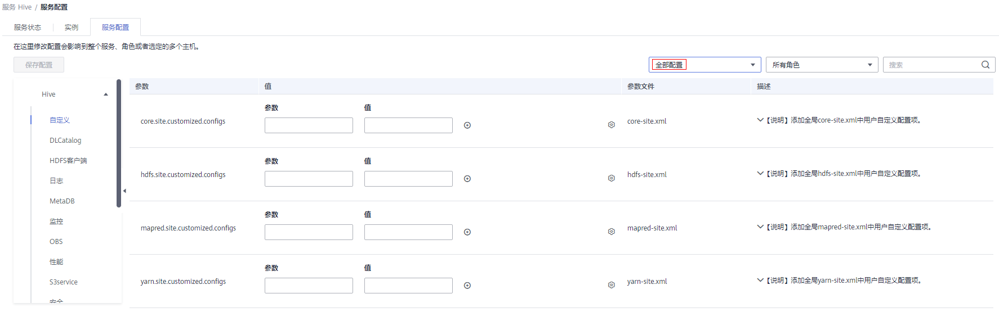

# 使用OBS加密数据运行作业

MRS 1.9.x支持使用OBS文件系统中加密后的数据来运行作业，同时支持将加密后的作业运行结果存储在OBS文件系统中。目前仅支持通过OBS协议访问数据。

OBS支持使用KMS秘钥的加解密方式对数据进行加解密，所有的加解密操作都在OBS完成，同时秘钥管理在DEW服务。

如需在MRS中使用OBS加密功能，用户需要有“KMS Administrator”权限，且需要在相应组件进行如下配置。

> **说明：** 
>如果集群同时开启“[OBS权限控制](配置MRS多用户访问OBS细粒度权限.md)”功能，此时会使用ECS配置的默认委托“MRS\_ECS\_DEFAULT\_AGENCY”或者用户设置的自定义委托的AK/SK访问OBS服务，同时OBS服务会使用接收到的AK/SK访问数据加密服务获取KMS秘钥状态，因此需要在使用的委托上绑定“KMS Administrator”策略，否则在处理加密数据时OBS会返回“403 Forbidden”的错误信息。目前MRS服务会在默认委托“MRS\_ECS\_DEFAULT\_AGENCY”绑定“KMS Administrator”策略，用户使用的自定义委托则需要用户自己绑定。

## 前提条件

如需使用OBS加密功能，请先配置MRS访问OBS功能，具体请参考[配置存算分离集群（委托方式）](配置存算分离集群（委托方式）.md)。

## Hive配置

1.  登录MRS控制台，在左侧导航栏选择“集群列表  \>  现有集群“  ，单击集群名称。
2.  选择“组件管理 \> Hive \> 服务配置”。
3.  将“基础配置”切换为“全部配置”，搜索并配置如下参数：

    

    **表 1**  数据加密参数

    
    <table><thead align="left"><tr id="row792514537215"><th class="cellrowborder" valign="top" width="30%" id="mcps1.2.4.1.1">
参数

    </th>
    <th class="cellrowborder" valign="top" width="20%" id="mcps1.2.4.1.2">
取值

    </th>
    <th class="cellrowborder" valign="top" width="50%" id="mcps1.2.4.1.3">
说明

    </th>
    </tr>
    </thead>
    <tbody><tr id="row69251753192118"><td class="cellrowborder" valign="top" width="30%" headers="mcps1.2.4.1.1 ">
fs.obs.server-side-encryption-type

    </td>
    <td class="cellrowborder" valign="top" width="20%" headers="mcps1.2.4.1.2 ">
SSE-KMS

    </td>
    <td class="cellrowborder" valign="top" width="50%" headers="mcps1.2.4.1.3 "><ul id="ul13677522415"><li>SSE-KMS：表示使用KMS秘钥的加解密方式。</li><li>NONE：表示关闭加密功能。</li></ul>
    </td>
    </tr>
    <tr id="row6925253112115"><td class="cellrowborder" valign="top" width="30%" headers="mcps1.2.4.1.1 ">
fs.obs.server-side-encryption-key

    </td>
    <td class="cellrowborder" valign="top" width="20%" headers="mcps1.2.4.1.2 ">
-

    </td>
    <td class="cellrowborder" valign="top" width="50%" headers="mcps1.2.4.1.3 ">
表示用来加密的KMS密钥ID。该参数可不配置。

    
当参数“fs.obs.server-side-encryption-type”配置为“SSE-KMS”且该参数未配置时，OBS会使用OBS服务的默认KMS密钥完成加密。

    </td>
    </tr>
    <tr id="row792515311214"><td class="cellrowborder" valign="top" width="30%" headers="mcps1.2.4.1.1 ">
fs.obs.connection.ssl.enabled

    </td>
    <td class="cellrowborder" valign="top" width="20%" headers="mcps1.2.4.1.2 ">
true

    </td>
    <td class="cellrowborder" valign="top" width="50%" headers="mcps1.2.4.1.3 ">
标识是否与OBS建立安全连接。

    <ul id="ul118091720113317"><li>true：开启安全连接，当需要使用OBS加解密功能时该参数必须配置为“true”。</li><li>false：关闭安全连接。</li></ul>
    </td>
    </tr>
    </tbody>
    </table>

4.  单击“保存配置”，勾选“重新启动受影响的服务或实例。”并单击“确定”。

## Hadoop配置

**方式一：通过界面配置。**

1.  登录MRS控制台，在左侧导航栏选择“集群列表  \>  现有集群“  ，单击集群名称。
2.  选择“组件管理 \> HDFS \> 服务配置”
3.  将“基础配置”切换为“全部配置”，搜索并配置如下参数：

    **表 2**  数据加密参数

    
    <table><thead align="left"><tr id="zh-cn_topic_0196677182_row792514537215"><th class="cellrowborder" valign="top" width="30%" id="mcps1.2.4.1.1">
参数

    </th>
    <th class="cellrowborder" valign="top" width="20%" id="mcps1.2.4.1.2">
取值

    </th>
    <th class="cellrowborder" valign="top" width="50%" id="mcps1.2.4.1.3">
说明

    </th>
    </tr>
    </thead>
    <tbody><tr id="zh-cn_topic_0196677182_row69251753192118"><td class="cellrowborder" valign="top" width="30%" headers="mcps1.2.4.1.1 ">
fs.obs.server-side-encryption-type

    </td>
    <td class="cellrowborder" valign="top" width="20%" headers="mcps1.2.4.1.2 ">
SSE-KMS

    </td>
    <td class="cellrowborder" valign="top" width="50%" headers="mcps1.2.4.1.3 "><ul id="zh-cn_topic_0196677182_ul13677522415"><li>SSE-KMS：表示使用KMS秘钥的加解密方式。</li><li>NONE：表示关闭加密功能。</li></ul>
    </td>
    </tr>
    <tr id="zh-cn_topic_0196677182_row6925253112115"><td class="cellrowborder" valign="top" width="30%" headers="mcps1.2.4.1.1 ">
fs.obs.server-side-encryption-key

    </td>
    <td class="cellrowborder" valign="top" width="20%" headers="mcps1.2.4.1.2 ">
-

    </td>
    <td class="cellrowborder" valign="top" width="50%" headers="mcps1.2.4.1.3 ">
表示用来加密的KMS密钥ID。该参数可不配置。

    
当参数“fs.obs.server-side-encryption-type”配置为“SSE-KMS”且该参数未配置时，OBS会使用OBS服务的默认KMS密钥完成加密。

    </td>
    </tr>
    <tr id="zh-cn_topic_0196677182_row792515311214"><td class="cellrowborder" valign="top" width="30%" headers="mcps1.2.4.1.1 ">
fs.obs.connection.ssl.enabled

    </td>
    <td class="cellrowborder" valign="top" width="20%" headers="mcps1.2.4.1.2 ">
true

    </td>
    <td class="cellrowborder" valign="top" width="50%" headers="mcps1.2.4.1.3 ">
标识是否与OBS建立安全连接。

    <ul id="zh-cn_topic_0196677182_ul118091720113317"><li>true：开启安全连接，当需要使用OBS加解密功能时该参数必须配置为“true”。</li><li>false：关闭安全连接。</li></ul>
    </td>
    </tr>
    </tbody>
    </table>

4.  单击“保存配置”，勾选“重新启动受影响的服务或实例。”并单击“确定”。
5.  以root用户登录Master节点，密码为用户创建集群时设置的root密码（若集群存在多个Master节点，请分别登录每个Master节点进行[5](#li330464819479)\~[7](#li13507895310)的操作）。
6.  执行以下命令，切换到客户端目录，例如“/opt/Bigdata/client”。

    **cd /opt/Bigdata/client**

7.  执行以下命令更新客户端配置，并输入用户名和密码，用户名为admin，密码为用户创建集群时设置的admin密码。

    **./ autoRefreshConfig.sh**

**方式二：通过客户端配置文件配置。**

在Master节点上的客户端配置文件（例如“/opt/Bigdata/client/HDFS/hadoop/etc/hadoop/core-site.xml”）中的增加如下参数配置（若集群存在多个Master节点，请分别登录每个Master节点进行该操作）。

**表 3**  数据加密参数

<table><thead align="left"><tr id="zh-cn_topic_0196677182_row792514537215_1"><th class="cellrowborder" valign="top" width="30%" id="mcps1.2.4.1.1">
参数

</th>
<th class="cellrowborder" valign="top" width="20%" id="mcps1.2.4.1.2">
取值

</th>
<th class="cellrowborder" valign="top" width="50%" id="mcps1.2.4.1.3">
说明

</th>
</tr>
</thead>
<tbody><tr id="zh-cn_topic_0196677182_row69251753192118_1"><td class="cellrowborder" valign="top" width="30%" headers="mcps1.2.4.1.1 ">
fs.obs.server-side-encryption-type

</td>
<td class="cellrowborder" valign="top" width="20%" headers="mcps1.2.4.1.2 ">
SSE-KMS

</td>
<td class="cellrowborder" valign="top" width="50%" headers="mcps1.2.4.1.3 "><ul id="ul1114313179423"><li>SSE-KMS：表示使用KMS秘钥的加解密方式。</li><li>NONE：表示关闭加密功能。</li></ul>
</td>
</tr>
<tr id="zh-cn_topic_0196677182_row6925253112115_1"><td class="cellrowborder" valign="top" width="30%" headers="mcps1.2.4.1.1 ">
fs.obs.server-side-encryption-key

</td>
<td class="cellrowborder" valign="top" width="20%" headers="mcps1.2.4.1.2 ">
-

</td>
<td class="cellrowborder" valign="top" width="50%" headers="mcps1.2.4.1.3 ">
表示用来加密的KMS密钥ID。该参数可不配置。

当参数“fs.obs.server-side-encryption-type”配置为“SSE-KMS”且该参数未配置时，OBS会使用OBS服务的默认KMS密钥完成加密。

</td>
</tr>
<tr id="zh-cn_topic_0196677182_row792515311214_1"><td class="cellrowborder" valign="top" width="30%" headers="mcps1.2.4.1.1 ">
fs.obs.connection.ssl.enabled

</td>
<td class="cellrowborder" valign="top" width="20%" headers="mcps1.2.4.1.2 ">
true

</td>
<td class="cellrowborder" valign="top" width="50%" headers="mcps1.2.4.1.3 ">
标识是否与OBS建立安全连接。

<ul id="ul514541714218"><li>true：开启安全连接，当需要使用OBS加解密功能时该参数必须配置为“true”。</li><li>false：关闭安全连接。</li></ul>
</td>
</tr>
</tbody>
</table>

## HBase配置

**方式一：通过界面配置。**

1.  登录MRS控制台，在左侧导航栏选择“集群列表  \>  现有集群“  ，单击集群名称。
2.  选择“组件管理 \> HBase \> 服务配置”
3.  将“基础配置”切换为“全部配置”，搜索并配置如下参数：

    **表 4**  数据加密参数

    
    <table><thead align="left"><tr id="zh-cn_topic_0196677182_row792514537215_2"><th class="cellrowborder" valign="top" width="30%" id="mcps1.2.4.1.1">
参数

    </th>
    <th class="cellrowborder" valign="top" width="20%" id="mcps1.2.4.1.2">
取值

    </th>
    <th class="cellrowborder" valign="top" width="50%" id="mcps1.2.4.1.3">
说明

    </th>
    </tr>
    </thead>
    <tbody><tr id="zh-cn_topic_0196677182_row69251753192118_2"><td class="cellrowborder" valign="top" width="30%" headers="mcps1.2.4.1.1 ">
fs.obs.server-side-encryption-type

    </td>
    <td class="cellrowborder" valign="top" width="20%" headers="mcps1.2.4.1.2 ">
SSE-KMS

    </td>
    <td class="cellrowborder" valign="top" width="50%" headers="mcps1.2.4.1.3 "><ul id="ul1515151754215"><li>SSE-KMS：表示使用KMS秘钥的加解密方式。</li><li>NONE：表示关闭加密功能。</li></ul>
    </td>
    </tr>
    <tr id="zh-cn_topic_0196677182_row6925253112115_2"><td class="cellrowborder" valign="top" width="30%" headers="mcps1.2.4.1.1 ">
fs.obs.server-side-encryption-key

    </td>
    <td class="cellrowborder" valign="top" width="20%" headers="mcps1.2.4.1.2 ">
-

    </td>
    <td class="cellrowborder" valign="top" width="50%" headers="mcps1.2.4.1.3 ">
表示用来加密的KMS密钥ID。该参数可不配置。

    
当参数“fs.obs.server-side-encryption-type”配置为“SSE-KMS”且该参数未配置时，OBS会使用OBS服务的默认KMS密钥完成加密。

    </td>
    </tr>
    <tr id="zh-cn_topic_0196677182_row792515311214_2"><td class="cellrowborder" valign="top" width="30%" headers="mcps1.2.4.1.1 ">
fs.obs.connection.ssl.enabled

    </td>
    <td class="cellrowborder" valign="top" width="20%" headers="mcps1.2.4.1.2 ">
true

    </td>
    <td class="cellrowborder" valign="top" width="50%" headers="mcps1.2.4.1.3 ">
标识是否与OBS建立安全连接。

    <ul id="ul1515418174425"><li>true：开启安全连接，当需要使用OBS加解密功能时该参数必须配置为“true”。</li><li>false：关闭安全连接。</li></ul>
    </td>
    </tr>
    </tbody>
    </table>

4.  单击“保存配置”，勾选“重新启动受影响的服务或实例。”并单击“确定”。
5.  以root用户登录Master节点，密码为用户创建集群时设置的root密码（若集群存在多个Master节点，请分别登录每个Master节点进行[5](#li330464819479)\~[7](#li13507895310)的操作）。
6.  执行以下命令，切换到客户端目录，例如“/opt/Bigdata/client”。

    **cd /opt/Bigdata/client**

7.  执行以下命令更新客户端配置，并输入用户名和密码，用户名为admin，密码为用户创建集群时设置的admin密码。

    **./ autoRefreshConfig.sh**

**方式二：通过客户端配置文件配置。**

在Master节点上的客户端配置文件（例如“/opt/Bigdata/client/HBase/hbase/conf/core-site.xml”）中的增加如下参数配置（若集群存在多个Master节点，请分别登录每个Master节点进行该操作）。

**表 5**  数据加密参数

<table><thead align="left"><tr id="zh-cn_topic_0196677182_row792514537215_3"><th class="cellrowborder" valign="top" width="30%" id="mcps1.2.4.1.1">
参数

</th>
<th class="cellrowborder" valign="top" width="20%" id="mcps1.2.4.1.2">
取值

</th>
<th class="cellrowborder" valign="top" width="50%" id="mcps1.2.4.1.3">
说明

</th>
</tr>
</thead>
<tbody><tr id="zh-cn_topic_0196677182_row69251753192118_3"><td class="cellrowborder" valign="top" width="30%" headers="mcps1.2.4.1.1 ">
fs.obs.server-side-encryption-type

</td>
<td class="cellrowborder" valign="top" width="20%" headers="mcps1.2.4.1.2 ">
SSE-KMS

</td>
<td class="cellrowborder" valign="top" width="50%" headers="mcps1.2.4.1.3 "><ul id="ul1916141724213"><li>SSE-KMS：表示使用KMS秘钥的加解密方式。</li><li>NONE：表示关闭加密功能。</li></ul>
</td>
</tr>
<tr id="zh-cn_topic_0196677182_row6925253112115_3"><td class="cellrowborder" valign="top" width="30%" headers="mcps1.2.4.1.1 ">
fs.obs.server-side-encryption-key

</td>
<td class="cellrowborder" valign="top" width="20%" headers="mcps1.2.4.1.2 ">
-

</td>
<td class="cellrowborder" valign="top" width="50%" headers="mcps1.2.4.1.3 ">
表示用来加密的KMS密钥ID。该参数可不配置。

当参数“fs.obs.server-side-encryption-type”配置为“SSE-KMS”且该参数未配置时，OBS会使用OBS服务的默认KMS密钥完成加密。

</td>
</tr>
<tr id="zh-cn_topic_0196677182_row792515311214_3"><td class="cellrowborder" valign="top" width="30%" headers="mcps1.2.4.1.1 ">
fs.obs.connection.ssl.enabled

</td>
<td class="cellrowborder" valign="top" width="20%" headers="mcps1.2.4.1.2 ">
true

</td>
<td class="cellrowborder" valign="top" width="50%" headers="mcps1.2.4.1.3 ">
标识是否与OBS建立安全连接。

<ul id="ul81641317174210"><li>true：开启安全连接，当需要使用OBS加解密功能时该参数必须配置为“true”。</li><li>false：关闭安全连接。</li></ul>
</td>
</tr>
</tbody>
</table>

## Spark配置

**方式一：通过界面配置。**

1.  登录MRS控制台，在左侧导航栏选择“集群列表  \>  现有集群“  ，单击集群名称。
2.  选择“组件管理 \> Spark \> 服务配置”
3.  将“基础配置”切换为“全部配置”，搜索并配置如下参数：

    **表 6**  数据加密参数

    
    <table><thead align="left"><tr id="zh-cn_topic_0196677182_row792514537215_4"><th class="cellrowborder" valign="top" width="30%" id="mcps1.2.4.1.1">
参数

    </th>
    <th class="cellrowborder" valign="top" width="20%" id="mcps1.2.4.1.2">
取值

    </th>
    <th class="cellrowborder" valign="top" width="50%" id="mcps1.2.4.1.3">
说明

    </th>
    </tr>
    </thead>
    <tbody><tr id="zh-cn_topic_0196677182_row69251753192118_4"><td class="cellrowborder" valign="top" width="30%" headers="mcps1.2.4.1.1 ">
fs.obs.server-side-encryption-type

    </td>
    <td class="cellrowborder" valign="top" width="20%" headers="mcps1.2.4.1.2 ">
SSE-KMS

    </td>
    <td class="cellrowborder" valign="top" width="50%" headers="mcps1.2.4.1.3 "><ul id="ul111710179424"><li>SSE-KMS：表示使用KMS秘钥的加解密方式。</li><li>NONE：表示关闭加密功能。</li></ul>
    </td>
    </tr>
    <tr id="zh-cn_topic_0196677182_row6925253112115_4"><td class="cellrowborder" valign="top" width="30%" headers="mcps1.2.4.1.1 ">
fs.obs.server-side-encryption-key

    </td>
    <td class="cellrowborder" valign="top" width="20%" headers="mcps1.2.4.1.2 ">
-

    </td>
    <td class="cellrowborder" valign="top" width="50%" headers="mcps1.2.4.1.3 ">
表示用来加密的KMS密钥ID。该参数可不配置。

    
当参数“fs.obs.server-side-encryption-type”配置为“SSE-KMS”且该参数未配置时，OBS会使用OBS服务的默认KMS密钥完成加密。

    </td>
    </tr>
    <tr id="zh-cn_topic_0196677182_row792515311214_4"><td class="cellrowborder" valign="top" width="30%" headers="mcps1.2.4.1.1 ">
fs.obs.connection.ssl.enabled

    </td>
    <td class="cellrowborder" valign="top" width="20%" headers="mcps1.2.4.1.2 ">
true

    </td>
    <td class="cellrowborder" valign="top" width="50%" headers="mcps1.2.4.1.3 ">
标识是否与OBS建立安全连接。

    <ul id="ul11175181716424"><li>true：开启安全连接，当需要使用OBS加解密功能时该参数必须配置为“true”。</li><li>false：关闭安全连接。</li></ul>
    </td>
    </tr>
    </tbody>
    </table>

4.  单击“保存配置”，勾选“重新启动受影响的服务或实例。”并单击“确定”。
5.  以root用户登录Master节点，密码为用户创建集群时设置的root密码（若集群存在多个Master节点，请分别登录每个Master节点进行[5](#li330464819479)\~[7](#li13507895310)的操作）。
6.  执行以下命令，切换到客户端目录，例如“/opt/Bigdata/client”。

    **cd /opt/Bigdata/client**

7.  执行以下命令更新客户端配置，并输入用户名和密码，用户名为admin，密码为用户创建集群时设置的admin密码。

    **./autoRefreshConfig.sh**

**方式二：通过客户端配置文件配置。**

在Master节点上的客户端配置文件（例如“/opt/Bigdata/client/Spark/spark/conf/core-site.xml”）中的增加如下参数配置（若集群存在多个Master节点，请分别登录每个Master节点进行该操作）。

**表 7**  数据加密参数

<table><thead align="left"><tr id="zh-cn_topic_0196677182_row792514537215_5"><th class="cellrowborder" valign="top" width="30%" id="mcps1.2.4.1.1">
参数

</th>
<th class="cellrowborder" valign="top" width="20%" id="mcps1.2.4.1.2">
取值

</th>
<th class="cellrowborder" valign="top" width="50%" id="mcps1.2.4.1.3">
说明

</th>
</tr>
</thead>
<tbody><tr id="zh-cn_topic_0196677182_row69251753192118_5"><td class="cellrowborder" valign="top" width="30%" headers="mcps1.2.4.1.1 ">
fs.obs.server-side-encryption-type

</td>
<td class="cellrowborder" valign="top" width="20%" headers="mcps1.2.4.1.2 ">
SSE-KMS

</td>
<td class="cellrowborder" valign="top" width="50%" headers="mcps1.2.4.1.3 "><ul id="ul16184181704214"><li>SSE-KMS：表示使用KMS秘钥的加解密方式。</li><li>NONE：表示关闭加密功能。</li></ul>
</td>
</tr>
<tr id="zh-cn_topic_0196677182_row6925253112115_5"><td class="cellrowborder" valign="top" width="30%" headers="mcps1.2.4.1.1 ">
fs.obs.server-side-encryption-key

</td>
<td class="cellrowborder" valign="top" width="20%" headers="mcps1.2.4.1.2 ">
-

</td>
<td class="cellrowborder" valign="top" width="50%" headers="mcps1.2.4.1.3 ">
表示用来加密的KMS密钥ID。该参数可不配置。

当参数“fs.obs.server-side-encryption-type”配置为“SSE-KMS”且该参数未配置时，OBS会使用OBS服务的默认KMS密钥完成加密。

</td>
</tr>
<tr id="zh-cn_topic_0196677182_row792515311214_5"><td class="cellrowborder" valign="top" width="30%" headers="mcps1.2.4.1.1 ">
fs.obs.connection.ssl.enabled

</td>
<td class="cellrowborder" valign="top" width="20%" headers="mcps1.2.4.1.2 ">
true

</td>
<td class="cellrowborder" valign="top" width="50%" headers="mcps1.2.4.1.3 ">
标识是否与OBS建立安全连接。

<ul id="ul1818681704220"><li>true：开启安全连接，当需要使用OBS加解密功能时该参数必须配置为“true”。</li><li>false：关闭安全连接。</li></ul>
</td>
</tr>
</tbody>
</table>

## Presto配置

1.  登录MRS控制台，在左侧导航栏选择“集群列表  \>  现有集群“  ，单击集群名称。
2.  选择“组件管理 \> Presto \> 服务配置”
3.  将“基础配置”切换为“全部配置”，搜索并配置如下参数：

    **表 8**  数据加密参数

    
    <table><thead align="left"><tr id="zh-cn_topic_0196677182_row792514537215_6"><th class="cellrowborder" valign="top" width="30%" id="mcps1.2.4.1.1">
参数

    </th>
    <th class="cellrowborder" valign="top" width="20%" id="mcps1.2.4.1.2">
取值

    </th>
    <th class="cellrowborder" valign="top" width="50%" id="mcps1.2.4.1.3">
说明

    </th>
    </tr>
    </thead>
    <tbody><tr id="zh-cn_topic_0196677182_row69251753192118_6"><td class="cellrowborder" valign="top" width="30%" headers="mcps1.2.4.1.1 ">
fs.obs.server-side-encryption-type

    </td>
    <td class="cellrowborder" valign="top" width="20%" headers="mcps1.2.4.1.2 ">
SSE-KMS

    </td>
    <td class="cellrowborder" valign="top" width="50%" headers="mcps1.2.4.1.3 "><ul id="ul7193201711427"><li>SSE-KMS：表示使用KMS秘钥的加解密方式。</li><li>NONE：表示关闭加密功能。</li></ul>
    </td>
    </tr>
    <tr id="zh-cn_topic_0196677182_row6925253112115_6"><td class="cellrowborder" valign="top" width="30%" headers="mcps1.2.4.1.1 ">
fs.obs.server-side-encryption-key

    </td>
    <td class="cellrowborder" valign="top" width="20%" headers="mcps1.2.4.1.2 ">
-

    </td>
    <td class="cellrowborder" valign="top" width="50%" headers="mcps1.2.4.1.3 ">
表示用来加密的KMS密钥ID。该参数可不配置。

    
当参数“fs.obs.server-side-encryption-type”配置为“SSE-KMS”且该参数未配置时，OBS会使用OBS服务的默认KMS密钥完成加密。

    </td>
    </tr>
    <tr id="zh-cn_topic_0196677182_row792515311214_6"><td class="cellrowborder" valign="top" width="30%" headers="mcps1.2.4.1.1 ">
fs.obs.connection.ssl.enabled

    </td>
    <td class="cellrowborder" valign="top" width="20%" headers="mcps1.2.4.1.2 ">
true

    </td>
    <td class="cellrowborder" valign="top" width="50%" headers="mcps1.2.4.1.3 ">
标识是否与OBS建立安全连接。

    <ul id="ul8198217164217"><li>true：开启安全连接，当需要使用OBS加解密功能时该参数必须配置为“true”。</li><li>false：关闭安全连接。</li></ul>
    </td>
    </tr>
    </tbody>
    </table>

4.  单击“保存配置”，勾选“重新启动受影响的服务或实例。”并单击“确定”。

