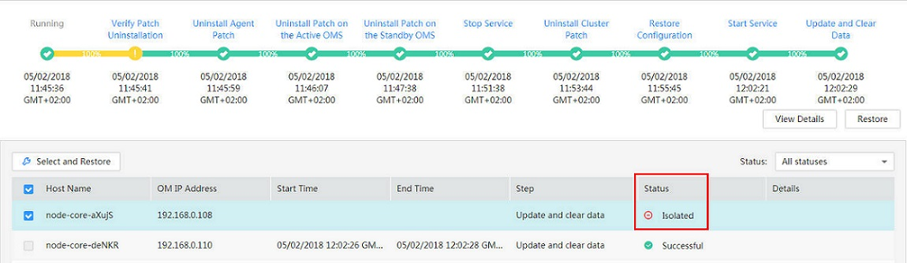

# 修复隔离主机补丁

若集群中存在主机被隔离的情况，集群补丁安装完成后，请参见本节操作对隔离主机进行补丁修复。修复完成后，被隔离的主机节点版本将与其他未被隔离的主机节点一致。

1.  访问MRS Manager，详细操作请参见[访问MRS Manager](访问MRS-Manager.md)或[访问支持Kerberos认证的Manager](访问支持Kerberos认证的Manager.md)。
2.  选择“系统设置 \> 补丁管理“，进入补丁管理页面。
3.  在“操作“列表中，单击“详情“。
4.  在补丁详情界面，选中“Status“是“Isolated“的主机节点。
5.  单击“Select and Restore“，修复被隔离的主机节点。

    **图 1**  修复隔离主机补丁  
    

