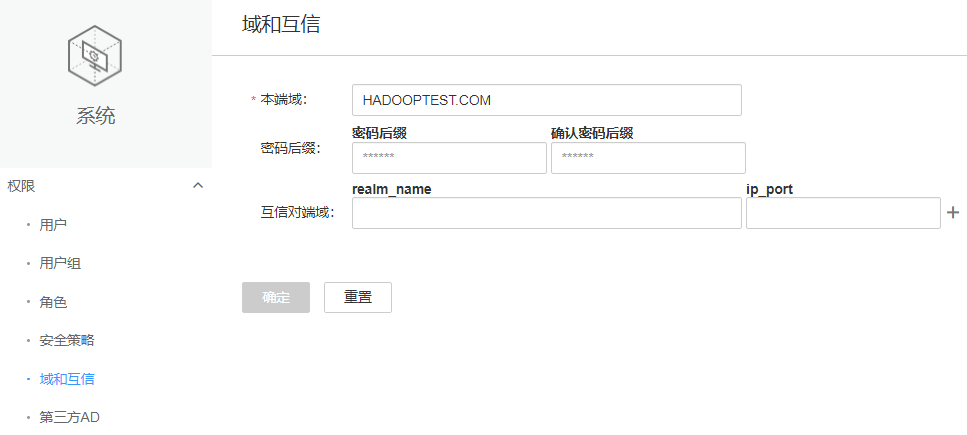

# 修改Manager系统域名<a name="admin_guide_000176"></a>

## 操作场景<a name="s7f05a07a50cc41bbba9c14a5a02b5ac3"></a>

每个系统用户安全使用的范围定义为“域”，不同的系统需要定义唯一的域名。FusionInsight Manager的域名在安装过程中生成，如果需要修改为特定域名，管理员可通过FusionInsight Manager进行配置。

> **须知：** 
>-   修改系统域名为高危操作，在执行本章节操作前，请确认已参考[备份OMS数据](备份OMS数据.md)章节成功备份了OMS数据。

## 对系统的影响<a name="s68ecbbf063cf43b4b10c55212f9d6f74"></a>

-   修改Manager系统域名时，需要重启所有集群，集群在重启期间无法使用。
-   修改域名后，Kerberos管理员与OMS Kerberos管理员的密码将重新初始化，请使用默认密码并重新修改。组件运行用户的密码是系统随机生成的，如果用于身份认证，请参见[导出认证凭据文件](导出认证凭据文件.md)，重新下载keytab文件。
-   修改域名后，“admin”用户、组件运行用户和系统管理员在修改域名以前添加的“人机”用户，密码会重置为相同密码，请重新修改。重置后的密码由两部分组成：系统生成部分和用户设置部分，系统生成部分为Admin@123，用户设置部分规则参照[表2](#zh-cn_topic_0046737082_table66281275)中“密码后缀”参数的说明，默认值为Admin@123。例如：系统生成部分为Admin@123，用户设置部分为Admin\#@123，则此时重置后的密码为Admin@123Admin\#@123。
-   重置后的密码必需满足当前用户密码策略，使用**omm**用户登录主OMS节点后，执行如下工具脚本可以获取到修改域名后的“人机”用户密码。

    **sh $\{BIGDATA\_HOME\}/om-server/om/sbin/get\_reset\_pwd.sh_ _**_密码后缀_**_ _**_user\_name_

    -   _密码后缀_**__**为用户设置的参数，默认值为“Admin@123“。
    -   _user\_name_为可选参数，默认取值为“admin“。

    例如：

    **sh $\{BIGDATA\_HOME\}/om-server/om/sbin/get\_reset\_pwd.sh Admin\#@123**

    ```
    To get the reset password after changing cluster domain name.
      pwd_min_len      : 8
      pwd_char_types   : 4
    The password reset after changing cluster domain name is: "Admin@123Admin#@123"
    ```

    “pwd\_min\_len“和“pwd\_char\_types“分别表示当前用户密码策略“最小密码长度”和“密码字符类型数目”，“Admin@123Admin\#@123”为修改系统域名后的“人机”用户密码。

-   修改系统域名后，重置后的密码由系统生成部分和用户设置部分组成，且必需满足当前用户密码策略，长度不足时在Admin@123和用户设置部分中间，使用一个或多个@补全；字符种类为5时，在Admin@123后补充一个空格。

    当用户设置部分为Test@123，使用默认用户密码策略时，新密码为“Admin@123Test@123”，长度为17字符种类为4。需满足当前用户密码策略时，新密码处理如[表1](#table172285275013)所示。

    **表 1**  满足不同密码策略时的新密码

    <a name="table172285275013"></a>
    <table><thead align="left"><tr id="row18722115215013"><th class="cellrowborder" valign="top" width="18.55814418558144%" id="mcps1.2.5.1.1"><p id="p13722205217506"><a name="p13722205217506"></a><a name="p13722205217506"></a>最小密码长度</p>
    </th>
    <th class="cellrowborder" valign="top" width="21.647835216478352%" id="mcps1.2.5.1.2"><p id="p14722552115016"><a name="p14722552115016"></a><a name="p14722552115016"></a>字符种类</p>
    </th>
    <th class="cellrowborder" valign="top" width="29.897010298970102%" id="mcps1.2.5.1.3"><p id="p772220526509"><a name="p772220526509"></a><a name="p772220526509"></a>对比用户密码策略结果</p>
    </th>
    <th class="cellrowborder" valign="top" width="29.897010298970102%" id="mcps1.2.5.1.4"><p id="p1572225214502"><a name="p1572225214502"></a><a name="p1572225214502"></a>重置后的密码</p>
    </th>
    </tr>
    </thead>
    <tbody><tr id="row372235215017"><td class="cellrowborder" valign="top" width="18.55814418558144%" headers="mcps1.2.5.1.1 "><p id="p97221552145010"><a name="p97221552145010"></a><a name="p97221552145010"></a>8到17位</p>
    </td>
    <td class="cellrowborder" valign="top" width="21.647835216478352%" headers="mcps1.2.5.1.2 "><p id="p177228525501"><a name="p177228525501"></a><a name="p177228525501"></a>4</p>
    </td>
    <td class="cellrowborder" valign="top" width="29.897010298970102%" headers="mcps1.2.5.1.3 "><p id="p1472265215505"><a name="p1472265215505"></a><a name="p1472265215505"></a>已满足用户密码策略</p>
    </td>
    <td class="cellrowborder" valign="top" width="29.897010298970102%" headers="mcps1.2.5.1.4 "><p id="p87222525505"><a name="p87222525505"></a><a name="p87222525505"></a>Admin@123Test@123</p>
    </td>
    </tr>
    <tr id="row207229524503"><td class="cellrowborder" valign="top" width="18.55814418558144%" headers="mcps1.2.5.1.1 "><p id="p1372225219501"><a name="p1372225219501"></a><a name="p1372225219501"></a>18位</p>
    </td>
    <td class="cellrowborder" valign="top" width="21.647835216478352%" headers="mcps1.2.5.1.2 "><p id="p8722165295015"><a name="p8722165295015"></a><a name="p8722165295015"></a>4</p>
    </td>
    <td class="cellrowborder" valign="top" width="29.897010298970102%" headers="mcps1.2.5.1.3 "><p id="p572235213501"><a name="p572235213501"></a><a name="p572235213501"></a>需补充一个@</p>
    </td>
    <td class="cellrowborder" valign="top" width="29.897010298970102%" headers="mcps1.2.5.1.4 "><p id="p172225295012"><a name="p172225295012"></a><a name="p172225295012"></a>Admin@123@Test@123</p>
    </td>
    </tr>
    <tr id="row172214523506"><td class="cellrowborder" valign="top" width="18.55814418558144%" headers="mcps1.2.5.1.1 "><p id="p107222527503"><a name="p107222527503"></a><a name="p107222527503"></a>19位</p>
    </td>
    <td class="cellrowborder" valign="top" width="21.647835216478352%" headers="mcps1.2.5.1.2 "><p id="p972214521500"><a name="p972214521500"></a><a name="p972214521500"></a>4</p>
    </td>
    <td class="cellrowborder" valign="top" width="29.897010298970102%" headers="mcps1.2.5.1.3 "><p id="p1272225212503"><a name="p1272225212503"></a><a name="p1272225212503"></a>需补充两个@</p>
    </td>
    <td class="cellrowborder" valign="top" width="29.897010298970102%" headers="mcps1.2.5.1.4 "><p id="p972213523501"><a name="p972213523501"></a><a name="p972213523501"></a>Admin@123@@Test@123</p>
    </td>
    </tr>
    <tr id="row3722145275019"><td class="cellrowborder" valign="top" width="18.55814418558144%" headers="mcps1.2.5.1.1 "><p id="p11722452115014"><a name="p11722452115014"></a><a name="p11722452115014"></a>8到18位</p>
    </td>
    <td class="cellrowborder" valign="top" width="21.647835216478352%" headers="mcps1.2.5.1.2 "><p id="p272295285013"><a name="p272295285013"></a><a name="p272295285013"></a>5</p>
    </td>
    <td class="cellrowborder" valign="top" width="29.897010298970102%" headers="mcps1.2.5.1.3 "><p id="p2072219529502"><a name="p2072219529502"></a><a name="p2072219529502"></a>需补充一个空格</p>
    </td>
    <td class="cellrowborder" valign="top" width="29.897010298970102%" headers="mcps1.2.5.1.4 "><p id="p137221524508"><a name="p137221524508"></a><a name="p137221524508"></a>Admin@123 Test@123</p>
    </td>
    </tr>
    <tr id="row372295245018"><td class="cellrowborder" valign="top" width="18.55814418558144%" headers="mcps1.2.5.1.1 "><p id="p572235214504"><a name="p572235214504"></a><a name="p572235214504"></a>19位</p>
    </td>
    <td class="cellrowborder" valign="top" width="21.647835216478352%" headers="mcps1.2.5.1.2 "><p id="p472220529503"><a name="p472220529503"></a><a name="p472220529503"></a>5</p>
    </td>
    <td class="cellrowborder" valign="top" width="29.897010298970102%" headers="mcps1.2.5.1.3 "><p id="p177222526508"><a name="p177222526508"></a><a name="p177222526508"></a>需补充一个空格和一个@</p>
    </td>
    <td class="cellrowborder" valign="top" width="29.897010298970102%" headers="mcps1.2.5.1.4 "><p id="p1272205218503"><a name="p1272205218503"></a><a name="p1272205218503"></a>Admin@123 @Test@123</p>
    </td>
    </tr>
    <tr id="row207224525501"><td class="cellrowborder" valign="top" width="18.55814418558144%" headers="mcps1.2.5.1.1 "><p id="p19722135225014"><a name="p19722135225014"></a><a name="p19722135225014"></a>20位</p>
    </td>
    <td class="cellrowborder" valign="top" width="21.647835216478352%" headers="mcps1.2.5.1.2 "><p id="p1722952205014"><a name="p1722952205014"></a><a name="p1722952205014"></a>5</p>
    </td>
    <td class="cellrowborder" valign="top" width="29.897010298970102%" headers="mcps1.2.5.1.3 "><p id="p1472275225013"><a name="p1472275225013"></a><a name="p1472275225013"></a>需补充一个空格和两个@</p>
    </td>
    <td class="cellrowborder" valign="top" width="29.897010298970102%" headers="mcps1.2.5.1.4 "><p id="p1472255265011"><a name="p1472255265011"></a><a name="p1472255265011"></a>Admin@123 @@Test@123</p>
    </td>
    </tr>
    </tbody>
    </table>

-   修改系统域名后，系统管理员在修改域名以前添加的“机机”用户，请重新下载keytab文件。
-   修改系统域名后，请重新下载并安装集群客户端。

## 前提条件<a name="s9a7d8aa4ff0944ba997236d6fa9e516d"></a>

-   管理员已明确业务需求，并规划好不同系统的域名。

    域名只能包含大写字母、数字、圆点（.）及下划线（\_），且只能以字母或数字开头。例如“DOMAINA.HW”和“DOMAINB.HW”。

-   Manager内所有集群全部组件的运行状态均为“良好”。
-   Manager内所有集群的ZooKeeper服务的“acl.compare.shortName”参数需确保为默认值“true”。否则请修改该参数为“true”后重启ZooKeeper服务。

## 操作步骤<a name="section884921910521"></a>

1.  登录FusionInsight Manager。
2.  选择“系统 \> 权限 \> 域和互信”。

    **图 1**  域和互信<a name="fig93701123132613"></a>  
    

3.  修改相关参数。

    **表 2**  相关参数

    <a name="zh-cn_topic_0046737082_table66281275"></a>
    <table><thead align="left"><tr id="zh-cn_topic_0046737082_row16977539"><th class="cellrowborder" valign="top" width="23%" id="mcps1.2.3.1.1"><p id="zh-cn_topic_0046737082_p33003388"><a name="zh-cn_topic_0046737082_p33003388"></a><a name="zh-cn_topic_0046737082_p33003388"></a>参数名</p>
    </th>
    <th class="cellrowborder" valign="top" width="77%" id="mcps1.2.3.1.2"><p id="zh-cn_topic_0046737082_p56028733"><a name="zh-cn_topic_0046737082_p56028733"></a><a name="zh-cn_topic_0046737082_p56028733"></a>描述</p>
    </th>
    </tr>
    </thead>
    <tbody><tr id="zh-cn_topic_0046737082_row42033519"><td class="cellrowborder" valign="top" width="23%" headers="mcps1.2.3.1.1 "><p id="zh-cn_topic_0046737082_p49271865"><a name="zh-cn_topic_0046737082_p49271865"></a><a name="zh-cn_topic_0046737082_p49271865"></a>本端域</p>
    </td>
    <td class="cellrowborder" valign="top" width="77%" headers="mcps1.2.3.1.2 "><p id="zh-cn_topic_0046737082_p31598148"><a name="zh-cn_topic_0046737082_p31598148"></a><a name="zh-cn_topic_0046737082_p31598148"></a>填写本系统规划好的域名。</p>
    </td>
    </tr>
    <tr id="zh-cn_topic_0046737082_row15947881"><td class="cellrowborder" valign="top" width="23%" headers="mcps1.2.3.1.1 "><p id="zh-cn_topic_0046737082_p16710008"><a name="zh-cn_topic_0046737082_p16710008"></a><a name="zh-cn_topic_0046737082_p16710008"></a>密码后缀</p>
    </td>
    <td class="cellrowborder" valign="top" width="77%" headers="mcps1.2.3.1.2 "><p id="zh-cn_topic_0046737082_p11333403"><a name="zh-cn_topic_0046737082_p11333403"></a><a name="zh-cn_topic_0046737082_p11333403"></a>“人机”用户密码重置后的用户设置密码部分，默认值为Admin@123。</p>
    <div class="note" id="zh-cn_topic_0046737082_note34891768"><a name="zh-cn_topic_0046737082_note34891768"></a><a name="zh-cn_topic_0046737082_note34891768"></a><span class="notetitle"> 说明： </span><div class="notebody"><p class="textintable" id="zh-cn_topic_0046737082_p45590459"><a name="zh-cn_topic_0046737082_p45590459"></a><a name="zh-cn_topic_0046737082_p45590459"></a>该参数只有在修改了“本端域”参数后，才会生效。且需满足以下条件：</p>
    <a name="zh-cn_topic_0046737082_ul7660949"></a><a name="zh-cn_topic_0046737082_ul7660949"></a><ul id="zh-cn_topic_0046737082_ul7660949"><li>密码字符长度为8到16位。</li><li>至少需要包含大写字母、小写字母、数字、特殊字符中的三种类型字符。支持的特殊字符为`~!@#$%^&amp;*()-_=+|[{}];:',&lt;.&gt;/?和空格。</li></ul>
    </div></div>
    </td>
    </tr>
    </tbody>
    </table>

4.  单击“确定”，等待修改配置完成后再继续执行后续步骤，完成前请勿提前执行后续步骤。
5.  以**omm**用户登录主管理节点。
6.  执行以下命令，重启更新域配置。

    **sh $\{BIGDATA\_HOME\}/om-server/om/sbin/restart-RealmConfig.sh**

    提示以下信息表示命令执行成功。

    ```
    Modify realm successfully. Use the new password to log into FusionInsight again.  
    ```

    > **说明：** 
    >重启后部分主机与服务可能无法访问并触发告警，执行“restart-RealmConfig.sh”后大约需要1分钟自动恢复。


1.  使用重置后的admin用户及密码（例如Admin@123Admin@123）登录FusionInsight Manager，单击主页上待操作集群名称后的，单击“重启”，重启集群。

    在弹出窗口中输入当前登录的用户密码确认身份，然后单击“确定”。

    在确认重启集群的对话框中单击“确定”，等待界面提示“操作成功。”，单击“完成”。

2.  退出FusionInsight Manager，重新登录正常表示配置已成功。
3.  使用**omm**用户登录主管理节点，执行以下命令刷新作业提交客户端配置：

    **sh /opt/executor/bin/refresh-client-config.sh**


