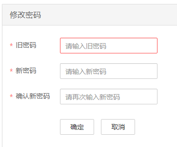

# 修改admin密码

该任务指导用户定期修改集群用户“admin“的密码，以提升系统运维安全性。

修改该密码会导致已经下载的用户凭证不可用，请修改该密码后重新下载认证凭据并替换旧凭据。

## 在集群节点修改admin密码

1.  更新主管理节点客户端，具体请参看[更新客户端](更新客户端.md)。
2.  登录主管理节点。
3.  （可选）若想要使用omm用户修改密码，请执行以下命令切换用户。

    **sudo su - omm**

4.  执行以下命令切换到客户端目录。

    **cd /opt/client**

5.  执行以下命令配置环境变量。

    **source bigdata\_env**

6.  执行以下命令，修改“admin“密码。此操作在整个集群中生效。

    **kpasswd admin**

    先输入旧密码，再输入两次新密码。

    MRS 1.6.2及以后集群中，默认的密码复杂度要求：

    -   密码字符长度至少8位。
    -   至少需要包含大写字母、小写字母、数字、空格、特殊字符'\~!@\#$%^&\*\(\)-\_=+\\|\[\{\}\];:'",<.\>/?中的3种类型字符。
    -   不能与用户名或倒序的用户名相同。

## 在MRS Manager页面修改admin密码

开启Kerberos认证的集群和开启弹性公网IP功能未开启Kerberos认证的集群支持通过MRS Manager界面修改admin密码。

1.  用admin账户登录MRS Manager页面，具体请参见[访问MRS Manager](访问MRS-Manager.md)。
2.  单击页面右上角用户名，选择“修改密码”。
3.  在修改密码页面，输入“旧密码”、“新密码”、“确认新密码”。

    **图 1**  修改admin密码  
    

    > **说明：**   
    >默认的密码复杂度要求：  
    >-   密码字符长度为8～32位。  
    >-   至少需要包含大写字母、小写字母、数字、空格、特殊字符'\~!@\#$%^&\*\(\)-\_=+\\|\[\{\}\];:'",<.\>/?中的3种类型字符。  
    >-   不能与用户名或倒序的用户名相同。  

4.  单击“确定”完成密码修改，使用新密码重新登录MRS Manager页面。

