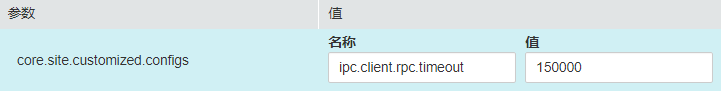

# 修改服务自定义配置参数

## 操作场景

MRS集群各个组件支持开源的所有参数，其中部分关键使用场景的参数支持在FusionInsight Manager界面进行修改，且部分组件的客户端可能不包含开源特性的所有参数。如果需要修改其他Manager未直接支持的组件参数，管理员可以在Manager通过自定义配置项功能为组件添加新参数。添加的新参数最终将保存在组件的配置文件中并在重启后生效。

## 对系统的影响

-   配置服务属性后，需要重启此服务，重启期间该服务不可用。如果不重启，则服务“配置状态“为“配置过期“。
-   修改服务配置参数并重启生效后，需要重新下载并安装客户端，或者下载配置文件刷新客户端。

## 前提条件

管理员已充分了解需要新添加的参数意义、生效的配置文件以及对组件的影响。

## 操作步骤

1.  登录FusionInsight Manager。
2.  选择“集群 \>  _待操作集群_的_名称_   \> 服务”。
3.  单击服务视图中指定的服务名称。
4.  选择“配置  \>  全部配置“。
5.  在左侧导航栏定位到某个一级节点，并选择“自定义”，Manager将显示当前组件的自定义参数。

    “参数文件”显示保存管理员新添加的自定义参数的配置文件。每个配置文件中可能支持相同名称的开源参数，设置不同参数值后生效结果由组件加载配置文件的顺序决定。自定义参数支持服务级别与角色级别，请根据业务实际需要选择。不支持单个角色实例添加自定义参数。

6.  在对应参数项所在行“名称”列输入组件支持的参数名，在“值”列输入此参数的参数值。

    支持单击“＋“或“－“增加或删除一条自定义参数。

7.  单击“保存”，在弹出的“保存配置”窗口中确认修改参数，单击“确定”。界面提示“操作成功。”，单击“完成”，配置保存成功。

    保存完成后请重新启动配置过期的服务或实例以使配置生效。

## 任务示例（配置Hive自定义参数）

Hive依赖于HDFS，默认情况下hive访问HDFS使用的是HDFS的客户端，生效的配置参数统一由HDFS控制。例如HDFS参数“ipc.client.rpc.timeout”影响所有客户端连接HDFS服务端的RPC超时时间，如果管理员需要单独修改Hive连接HDFS的超时时间，可以使用自定义配置项功能进行设置。在Hive的“core-site.xml”文件增加此参数可被Hive服务识别并代替HDFS的设置。

1.  在FusionInsight Manager界面，选择“集群 \>  _待操作集群_的_名称_   \> 服务”。
2.  选择“Hive  \>  配置  \>  全部配置“。
3.  在左侧导航栏选择Hive服务级别“自定义”，Manager将显示Hive支持的服务级别自定义参数。
4.  在“core-site.xml”对应参数“core.site.customized.configs”的“名称”输入“ipc.client.rpc.timeout”，“值”输入新的参数值，例如“150000”。单位为毫秒。

    **图 1**  添加自定义参数  
    

5.  单击“保存”，在弹出的“保存配置”窗口中确认修改参数并单击“确定”。界面提示“操作成功。”，单击“完成”，配置保存成功。

    保存完成后请重新启动配置过期的服务或实例以使配置生效。

