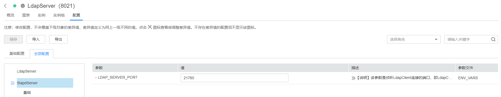

# 修改服务配置参数

## 操作场景

为了满足实际业务的需求，管理员可以在FusionInsight Manager中快速查看及修改服务默认的配置。请务必参照配置描述中的建议进行参数配置。

> **说明：** 
>集群中只剩下一个DBService角色实例时，不支持修改DBService服务的参数。

## 对系统的影响

-   配置服务属性后，需要重启此服务，重启期间该服务不可用。如果不重启，则服务“配置状态“为“配置过期“。
-   修改服务配置参数并重启生效后，需要重新下载并安装客户端，或者下载配置文件刷新客户端。例如HBase、HDFS、Hive、Spark、Yarn、Mapreduce。

## 操作步骤

1.  登录FusionInsight Manager。
2.  选择“集群 \>  _待操作集群_的_名称_   \> 服务”。
3.  单击服务视图中指定的服务名称。
4.  单击“配置”。

    默认显示“基础配置”，如果需要修改更多参数，请选择“全部配置”，界面上将显示该服务的全部配置参数导航树，导航树从上到下的一级节点分别为服务名称和角色名称。展开一级节点后显示参数分类。

    例如下图所示，第一个“LdapServer”表示服务名称，配置项针对整个服务；第二个“SlapdServer”表示角色名称，配置项针对角色的全部实例。

    **图 1**  配置参数导航树  
    

5.  在导航树选择指定的参数分类，并在右侧修改参数值。

    > **说明：** 
    >对于端口类参数值请从右侧描述中的取值范围中选取，请确保同一个服务中所有参数项配置的值均在取值范围内且唯一，否则会导致服务启动失败。

    不确定参数的具体位置时，支持在右上角输入参数名，Manager将实时进行搜索并显示结果。

6.  单击“保存”，并在确认对话框中单击“确定”。

    等待界面提示“操作成功”，单击“完成”，配置已修改。

    > **说明：** 
    >-   更新Yarn服务队列的配置且不重启服务时，选择“更多 \> 刷新队列”更新队列使配置生效。
    >-   配置Flume参数“flume.config.file”时，支持“上传文件”和“下载文件”功能。上传配置文件后旧文件将被覆盖，再下载文件只能获取新文件。如果未保存配置并重启服务，那么新文件设置未生效，请及时保存配置。
    >-   修改服务配置参数后如需重启服务使配置生效，可在服务页面单击右上角“更多 \> 重启服务”。

