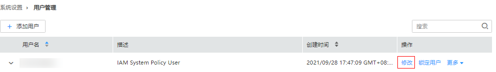

# 修改用户信息

## 操作场景

该任务指导管理员用户在Manager修改已创建的用户信息，包括修改用户组、主组、角色和描述。

开启Kerberos认证的集群或开启弹性公网IP功能的普通集群支持该操作。

> **说明：** 
>该章节操作仅适用于**MRS 3.x**之前版本集群。
>**MRS 3.x**及之后版本集群请参考[修改用户信息](修改用户信息.md)章节。

## 操作步骤

1.  访问MRS Manager，详细操作请参见[访问MRS Manager（MRS 2.x及之前版本）](访问MRS-Manager（MRS-2-x及之前版本）.md)。
2.  在MRS Manager，单击“系统设置”。
3.  在“权限配置”区域，单击“用户管理”。
4.  在要修改用户所在的行，单击“修改“，修改用户信息。

    

    > **说明：** 
    >为用户修改用户组或分配的角色权限，最长可能需要3分钟时间生效。

5.  单击“确定”完成修改操作。

