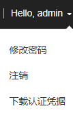

# 修改用户密码

## 操作场景

出于安全的考虑，“人机”类型系统用户密码必须定期修改。

如果用户具备使用FusionInsight Manager的权限时，可以通过FusionInsight Manager完成修改自身密码工作。

如果用户不具备使用FusionInsight Manager的权限时，可以通过客户端修改自身密码。

## 前提条件

-   从管理员获取当前的密码策略。
-   已在集群内的任一节点安装了客户端，并获取此节点IP地址。请联系管理员获取客户端安装用户密码。

## 使用FusionInsight Manager修改密码

1.  登录FusionInsight Manager。
2.  移动鼠标到界面右上角的用户名。

    在弹出菜单中单击“修改密码”。

    **图 1**  修改密码  
    

3.  在“密码修改界面”分别输入“旧密码”、“新密码”、“确认新密码”，单击“确定”完成修改。

    默认密码复杂度要求：

    -   密码字符长度最小为8位。
    -   至少需要包含大写字母、小写字母、数字、空格、特殊字符5种类型字符中的4种。支持的特殊字符为\`\~!@\#$%^&\*\(\)-\_=+|\[\{\}\];',<.\>/\\?。
    -   不可和用户名相同或用户名的倒序字符相同。
    -   不可以为常见的易破解密码，例如Admin@12345。
    -   不可与最近N次使用过的密码相同，N为[配置密码策略](配置密码策略.md#admin_guide_000150)中“重复使用规则”的值。

## 使用客户端修改密码

1.  以客户端安装用户登录安装客户端的节点。
2.  执行以下命令，切换到客户端目录，例如“/opt/Bigdata/client”。

    **cd /opt/Bigdata/client**

3.  执行以下命令，配置环境变量。

    **source bigdata\_env**

4.  执行以下命令，修改系统用户密码。此操作对所有服务器生效。

    **kpasswd **_系统用户名称_

    例如，修改系统用户“test1”，执行**kpasswd test1**。

    默认密码复杂度要求：

    -   密码字符长度最小为8位。
    -   至少需要包含大写字母、小写字母、数字、空格、特殊字符5种类型字符中的4种。支持的特殊字符为\`\~!@\#$%^&\*\(\)-\_=+|\[\{\}\];',<.\>/\\?。
    -   不可和用户名相同或用户名的倒序字符相同。
    -   不可以为常见的易破解密码，例如Admin@12345。
    -   不可与最近N次使用过的密码相同，N为[配置密码策略](配置密码策略.md#admin_guide_000150)中“重复使用规则”的值。

    > **说明：** 
    >如果kpasswd命令运行出错，可以尝试：
    >-   关闭ssh会话再重新打开。
    >-   执行**kdestroy**命令后再执行**kpasswd**。

