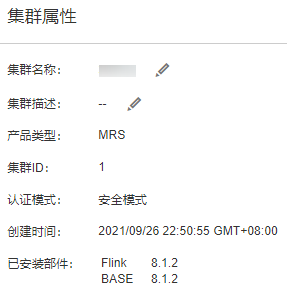

# 修改集群属性

## 操作场景

FusionInsight Manager支持用户在集群安装完成后查看基本属性。

## 操作步骤

1.  登录FusionInsight Manager。
2.  选择“集群  \>  _待操作集群的名称_  \> 集群属性“。

    默认可查看集群名称、集群描述、产品类型、集群ID、认证模式、创建时间和已安装部件信息。

    **图 1**  集群属性  
    

3.  修改“集群名称”。
    1.  单击，填入新的名称。

        支持的命名规则：集群名称只能包含汉字、字母、数字、下划线（\_）、中划线（-）和空格，仅以汉字、字母、数字、下划线（\_）或中划线（-）开头，只能在中间包含空格，并且最小长度为2个字符，最大长度不能超过199个字符。

    2.  单击“确定”使新的集群名称生效。

4.  修改“集群描述”。
    1.  单击，填入新的描述信息。

        只能包含汉字、英文字母、数字、中英文逗号、中英文句号、下划线（\_）、空格和换行符，并且不能超过199个字符。

    2.  单击“确定”使新的描述生效。

