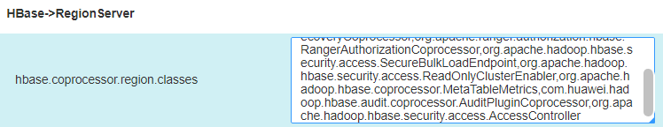
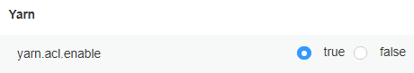
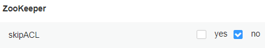

# 修改集群组件鉴权配置开关

## 操作场景

集群部署为安全模式或者普通模式时，HDFS和ZooKeeper默认会对访问服务的用户进行鉴权，没有权限的用户无法访问HDFS和ZooKeeper中的资源。集群部署为普通模式时，HBase和Yarn默认不会对访问用户进行鉴权，所有用户可以访问HBase和Yarn中的资源。

管理员可以根据业务实际需要，在普通模式集群中配置开启HBase和Yarn鉴权，或关闭HDFS和ZooKeeper鉴权。

## 对系统的影响

修改开关后服务的配置将过期，需要重启对应的服务使配置生效。

## 开启HBase鉴权

1.  登录FusionInsight Manager。
2.  选择“集群 \>  _待操作集群的名称_  \> 服务 \> HBase \> 配置”。
3.  单击“全部配置”。
4.  搜索参数“hbase.coprocessor.region.classes”、“hbase.coprocessor.master.classes”和“hbase.coprocessor.regionserver.classes”。

    将协处理器参数“org.apache.hadoop.hbase.security.access.AccessController”添加到以上参数原有参数值末尾，使用英文逗号与原有协处理器分隔。

    **图 1**  hbase.coprocessor.region.classes参数  
    

5.  单击“保存”，单击“确定”。

    等待界面提示操作完成。

## 关闭HBase鉴权

> **说明：** 
>关闭HBase鉴权后，原有的权限数据会继续保留。如果需要删除权限信息，请在关闭鉴权后，进入hbase shell删除表hbase:acl。

1.  登录FusionInsight Manager。
2.  选择“集群 \>  _待操作集群的名称_  \> 服务 \> HBase \> 配置”。
3.  单击“全部配置”。
4.  搜索参数“hbase.coprocessor.region.classes”、“hbase.coprocessor.master.classes”和“hbase.coprocessor.regionserver.classes”。

    将协处理器参数“org.apache.hadoop.hbase.security.access.AccessController”去除。

5.  单击“保存”，单击“确定”。

    等待界面提示操作完成。

## 关闭HDFS鉴权

1.  登录FusionInsight Manager。
2.  选择“集群 \>  _待操作集群的名称_  \> 服务 \> HDFS \> 配置”。
3.  单击“全部配置”。
4.  搜索参数“dfs.namenode.acls.enabled”和“dfs.permissions.enabled”。
    -   “dfs.namenode.acls.enabled”表示是否启用HDFS ACL，默认为“true”启用ACL，请修改为“false”。
    -   “dfs.permissions.enabled”表示是否为HDFS启用权限检查，默认为“true”启用权限检查，请修改为“false”。修改后HDFS中的目录和文件的属主、属组以及权限信息保持不变。

5.  单击“保存”，单击“确定”。

    等待界面提示操作完成。

## 开启Yarn鉴权

1.  登录FusionInsight Manager。
2.  选择“集群 \>  _待操作集群的名称_  \> 服务 \> Yarn \> 配置”。
3.  单击“全部配置”。
4.  搜索参数“yarn.acl.enable”。

    “yarn.acl.enable”表示是否为Yarn启用权限检查。

    -   普通模式下默认为“false”不启用权限检查，如果要启用，请修改为“true”。
    -   安全模式下默认为“true”，表示开启鉴权。

    **图 2**  配置参数“yarn.acl.enable”  
    

5.  单击“保存”，单击“确定”。

    等待界面提示操作完成。

## 关闭ZooKeeper鉴权

1.  登录FusionInsight Manager。
2.  选择“集群 \>  _待操作集群的名称_  \> 服务 \> ZooKeeper \> 配置”。
3.  单击“全部配置”。
4.  搜索参数“skipACL”。

    “skipACL”表示是否跳过ZooKeeper权限检查，默认为“no”启用权限检查，请修改为“yes”。

    **图 3**  配置参数“skipACL”  
    

5.  单击“保存”，单击“确定”。

    等待界面提示操作完成。

