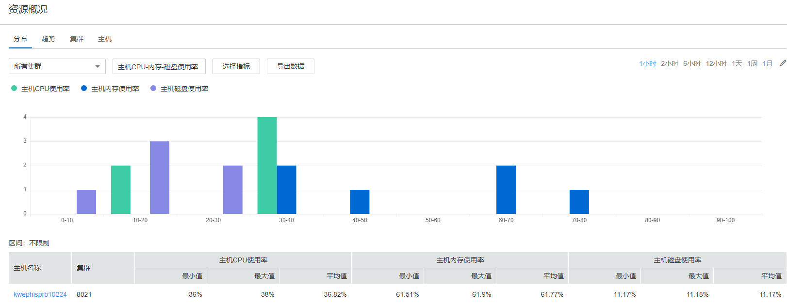

# 分布

选择“主机 \> 资源概况 \> 分布”，可查看各集群的资源分布监控，如[图1](#zh-cn_topic_0263899231_fig10343181024812)所示，默认显示1小时的监控数据。用户可单击自定义时间区间，缺省时间区间包括：1小时、2小时、6小时、12小时、1天、1周、1月。

**图 1**  资源分布概况  

-   单击“选择指标“可以自定义所需查看的指标项，详细指标项如[表1](#zh-cn_topic_0263899231_table1190415121488)所示。选择指标后，页面会显示在各个区间的主机分布图。
-   鼠标停留在某个色块时，会显示处于当前区间的主机数量，如[图1](#zh-cn_topic_0263899231_fig10343181024812)所示。单击色块，页面会显示处于当前区间的主机列表。
    -   单击列表中某主机“主机名称“，会跳转至该主机的详细信息页面；
    -   单击列表中某主机“查看趋势“，会显示当前指标项整个集群的最大值、平均值、最小值、当前主机值。当前集群中，当指标为“主机CPU-内存-磁盘使用率”时，不能进行“查看趋势”操作。

-   单击“导出数据“，可以导出当前指标项集群中所有节点在选中的时间区域内的最大值、最小值、平均值。

**表 1**  指标项

<table><thead align="left"><tr id="zh-cn_topic_0263899231_row1990481212813"><th class="cellrowborder" valign="top" width="36%" id="mcps1.2.3.1.1">
指标分类

</th>
<th class="cellrowborder" valign="top" width="64%" id="mcps1.2.3.1.2">
指标项

</th>
</tr>
</thead>
<tbody><tr id="zh-cn_topic_0263899231_row1884616171347"><td class="cellrowborder" valign="top" width="36%" headers="mcps1.2.3.1.1 ">
进程

</td>
<td class="cellrowborder" valign="top" width="64%" headers="mcps1.2.3.1.2 "><ul id="zh-cn_topic_0263899231_ul55601697517"><li>运行的进程总数</li><li>进程总数</li><li>omm进程总数</li><li>D状态进程总数</li></ul>
</td>
</tr>
<tr id="zh-cn_topic_0263899231_row198511211451"><td class="cellrowborder" valign="top" width="36%" headers="mcps1.2.3.1.1 ">
网络状态

</td>
<td class="cellrowborder" valign="top" width="64%" headers="mcps1.2.3.1.2 "><ul id="zh-cn_topic_0263899231_ul194436131660"><li>主机网络数据包冲突数</li><li>LAST_ACK状态数量</li><li>CLOSING状态数量</li><li>LISTENING状态数量</li><li>CLOSED状态数量</li><li>ESTABLISHED状态数量</li><li>SYN_RECV状态数量</li><li>TIME_WAITING状态数量</li><li>FIN_WAIT2状态数量</li><li>FIN_WAIT1状态数量</li><li>CLOSE_WAIT状态数量</li><li>DNS解析时长</li><li>TCP临时端口使用率</li><li>主机网络数据包帧错误数</li></ul>
</td>
</tr>
<tr id="zh-cn_topic_0263899231_row13740173018512"><td class="cellrowborder" valign="top" width="36%" headers="mcps1.2.3.1.1 ">
网络读信息

</td>
<td class="cellrowborder" valign="top" width="64%" headers="mcps1.2.3.1.2 "><ul id="zh-cn_topic_0263899231_ul124439131662"><li>主机网络读包数</li><li>主机网络读包丢包数</li><li>主机网络读包错误数</li><li>主机网络接收速率</li></ul>
</td>
</tr>
<tr id="zh-cn_topic_0263899231_row133071837356"><td class="cellrowborder" valign="top" width="36%" headers="mcps1.2.3.1.1 ">
磁盘

</td>
<td class="cellrowborder" valign="top" width="64%" headers="mcps1.2.3.1.2 "><ul id="zh-cn_topic_0263899231_ul144431713661"><li>主机磁盘写速率</li><li>主机磁盘已使用大小</li><li>主机磁盘未使用大小</li><li>主机磁盘读速率</li><li>主机磁盘使用率</li></ul>
</td>
</tr>
<tr id="zh-cn_topic_0263899231_row1090420127813"><td class="cellrowborder" valign="top" width="36%" headers="mcps1.2.3.1.1 ">
内存

</td>
<td class="cellrowborder" valign="top" width="64%" headers="mcps1.2.3.1.2 "><ul id="zh-cn_topic_0263899231_ul134447131367"><li>未使用内存</li><li>缓存内存大小</li><li>内核缓存的内存总量</li><li>共享内存大小</li><li>主机内存使用率</li><li>已使用内存</li></ul>
</td>
</tr>
<tr id="zh-cn_topic_0263899231_row15904201217813"><td class="cellrowborder" valign="top" width="36%" headers="mcps1.2.3.1.1 ">
网络写信息

</td>
<td class="cellrowborder" valign="top" width="64%" headers="mcps1.2.3.1.2 "><ul id="zh-cn_topic_0263899231_ul174441613662"><li>主机网络写包数</li><li>主机网络写包错误数</li><li>主机网络发送速率</li><li>主机网络写包丢包数</li></ul>
</td>
</tr>
<tr id="zh-cn_topic_0263899231_row159041512386"><td class="cellrowborder" valign="top" width="36%" headers="mcps1.2.3.1.1 ">
CPU

</td>
<td class="cellrowborder" valign="top" width="64%" headers="mcps1.2.3.1.2 "><ul id="zh-cn_topic_0263899231_ul4444161312617"><li>改变过优先级的进程占CPU的百分比</li><li>用户空间占用CPU百分比</li><li>内核空间占用CPU百分比</li><li>主机CPU使用率</li><li>CPU总时间</li><li>CPU闲置时间</li></ul>
</td>
</tr>
<tr id="zh-cn_topic_0263899231_row790416128810"><td class="cellrowborder" valign="top" width="36%" headers="mcps1.2.3.1.1 ">
主机状态

</td>
<td class="cellrowborder" valign="top" width="64%" headers="mcps1.2.3.1.2 "><ul id="zh-cn_topic_0263899231_ul14444101315619"><li>主机文件句柄使用率</li><li>每1分钟系统平均负载</li><li>每5分钟系统平均负载</li><li>每15分钟系统平均负载</li><li>主机PID使用率</li></ul>
</td>
</tr>
</tbody>
</table>

