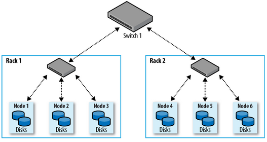
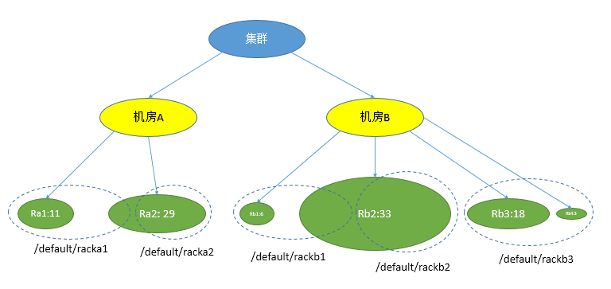

# 分配机架

## 操作场景

大型集群的所有主机通常分布在多个机架上，不同机架间的主机通过交换机进行数据通信，且同一机架上的不同机器间的网络带宽要远大于不同机架机器间的网络带宽。在这种情况下网络拓扑规划应满足以下要求：

-   为了提高通信速率，希望不同主机之间的通信能够尽量发生在同一个机架之内，而不是跨机架。
-   为了提高容错能力，分布式服务的进程或数据需要尽可能存在多个机架的不同主机上。

Hadoop使用一种类似于文件目录结构的方式来表示主机。两层网络的集群如[图1](#zh-cn_topic_0263899338_zh-cn_topic_0046737063_network)所示，Node1的Rack建议设置为**/Switch1/Rack1**，Node4的Rack建议设置为**/Switch1/Rack2**。

**图 1**  两层网络结构  

由于HDFS不能自动判断集群中各个DataNode的网络拓扑情况，管理员需设置机架名称来确定主机所处的机架，NameNode才能绘出DataNode的网络拓扑图，并尽可能将DataNode的数据备份在不同机架中。同理，YARN需要获取机架信息，在可允许的范围内将任务分配给不同的NodeManager执行。

当集群网络拓扑发生变化时，需要使用FusionInsight Manager为主机重新分配机架，相关服务才会自动调整。

## 对系统的影响

修改主机机架名称，将影响HDFS的副本存放策略、Yarn的任务分配及Kafka的Partition存储位置。修改后需重启HDFS、Yarn和Kafka，使配置信息生效。

不合理的机架配置会导致集群的节点之间的负载（包括CPU、内存、磁盘、网络）不平衡，降低集群的可靠性，影响集群的稳定运行。所以在分配机架之前，需要进行全局的统筹，合理地设置机架。

## 机架分配策略

> **说明：** 
>物理机架：主机所在的真实的机架。
>逻辑机架：在FusionInsight Manager中给主机设置的机架名称。

策略 1：每个逻辑机架包含的主机个数基本一致。

策略 2：主机所设置的逻辑机架要尽量符合其所在的物理机架。

策略 3：如果一个物理机架的主机个数很少，则需要和其他的主机较少的物理机架合并为一个逻辑机架，以满足策略1。不能将两个机房的主机合并为一个逻辑机架，否则会引起性能问题。

策略 4：如果一个物理机架的主机个数很多，则需要将其分隔为多个逻辑机架，以满足策略1。不建议物理机架中包含的主机有太大的差异，这样会降低集群的可靠性。

策略 5：建议机架的第一层为默认的“default”或其他值，但在集群中保持一致。

策略 6：每个机架所包含的主机个数不能小于3。

策略 7：一个集群的逻辑机架数，不建议多于50个（过多则不便于维护）。

## 最佳实践示例

假设一个集群，共有主机100台，分别在两个机房中：机房A有40台主机，机房B有60台主机。在机房A中，物理机架Ra1有11台主机，物理机架Ra2有29台。在机房B中，物理机架Rb1有6台主机，物理机架Rb2有33台主机，物理机架Rb3有18台主机，物理机架Rb4有3台主机。

根据以上的“机架分配策略”，我们设置每个逻辑机架包含20个主机，具体分配如下：

-   逻辑机架 /default/racka1: 包含物理机架Ra1的11台主机，Ra2的9台主机。
-   逻辑机架 /default/racka2: 包含物理机架Ra2的剩余的20台主机。
-   逻辑机架 /default/rackb1: 包含物理机架Rb1的6台主机，Rb2的13台主机。
-   逻辑机架 /default/rackb2: 包含物理机架Rb2的剩余的20台主机。
-   逻辑机架 /default/rackb3: 包含物理机架Rb3的18台主机，Rb4的3台主机。

机架划分示例如下：

## 操作步骤

1.  登录FusionInsight Manager。
2.  单击“主机“。
3.  勾选待操作主机前的复选框。
4.  在“更多“选择“设置机架”。
    -   机架名称需遵循实际网络拓扑结构，以层级形式表示；各层级间以斜线“/”隔开。
    -   机架命名规则为：“/level1/level2/…”，级别至少为一级，名称不能为空。机架名称由字母、数字及下划线“\_”组成，且总长度不超过200个字符。

        例如“/default/rack0”。

    -   如果待修改机架中所包含的主机中有DataNode实例，请确保所有DataNode实例所在主机的机架名称的层级一致。否则，会导致配置下发失败。

5.  单击“确定”，完成机架分配设置。

