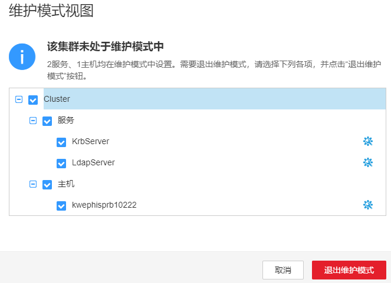

# 切换维护模式

## 操作场景

FusionInsight Manager支持将集群、服务、主机或者OMS配置为维护模式，进入维护模式的对象将不再上报告警，避免在升级等维护变更期间系统产生大量无意义的告警，影响运维人员对集群状态的判断。

-   集群维护模式

    集群未正式上线或暂时离线进行运维操作时（例如非滚动方式的升级），可将整个集群配置为维护模式。

-   服务维护模式

    对特定服务进行维护操作时（例如对该服务的实例进行批量重启等可能影响业务的调试操作、对该服务相关的节点进行直接上下电或修复服务等），可仅将涉及的服务配置为维护模式。

-   主机维护模式

    对主机进行维护操作时（例如节点上下电、隔离主机、重装主机、升级操作系统、替换节点等），可仅将涉及的主机配置为维护模式。

-   OMS维护模式

    对OMS节点进行重启、替换、修复等操作时，可将OMS配置为维护模式。

## 对系统影响

设置维护模式后，非维护操作引起的告警也将被抑制无法上报，直至退出维护模式后，仍然存在的故障才能上报告警，请谨慎操作。

## 操作步骤

1.  登录FusionInsight Manager。
2.  配置维护模式。

    根据实际操作场景，确认需要配置维护模式的对象，参考[表1](#table8578183123419)进行操作。

    **表 1**  切换维护模式

    
    <table><thead align="left"><tr id="row145795315343"><th class="cellrowborder" valign="top" width="23.31%" id="mcps1.2.3.1.1">
场景

    </th>
    <th class="cellrowborder" valign="top" width="76.69%" id="mcps1.2.3.1.2">
步骤

    </th>
    </tr>
    </thead>
    <tbody><tr id="row95796312342"><td class="cellrowborder" valign="top" width="23.31%" headers="mcps1.2.3.1.1 ">
配置集群进入维护模式

    </td>
    <td class="cellrowborder" valign="top" width="76.69%" headers="mcps1.2.3.1.2 "><ol id="ol14820165218359"><li>在管理界面主页，选择待操作集群名称后的“ &gt; 进入维护模式”。</li><li>在弹出的窗口中单击“确定”。
集群进入维护状态后，集群名称后的状态显示为。维护操作完成后，单击“退出维护模式”，集群将退出维护模式。

    </li></ol>
    </td>
    </tr>
    <tr id="row1579123110349"><td class="cellrowborder" valign="top" width="23.31%" headers="mcps1.2.3.1.1 ">
配置服务进入维护模式

    </td>
    <td class="cellrowborder" valign="top" width="76.69%" headers="mcps1.2.3.1.2 "><ol id="ol14602115154"><li>在管理界面选择“集群 &gt; <em id="i13234164892713">待操作的集群名称</em> &gt; 服务 &gt; <em id="i32661756162715">服务名称</em>”。</li><li>在服务详情页面选择“更多 &gt; 进入维护模式”。</li><li>在弹出的窗口中单击“确定”。
服务进入维护状态后，服务列表的对应服务名称后的状态显示为。维护操作完成后，单击“退出维护模式”，服务将退出维护模式。

    
 说明： 

配置某服务进入维护模式时，建议将依赖该服务的其他上层服务也都设置为维护模式。

    

    </li></ol>
    </td>
    </tr>
    <tr id="row028719915361"><td class="cellrowborder" valign="top" width="23.31%" headers="mcps1.2.3.1.1 ">
配置主机进入维护模式

    </td>
    <td class="cellrowborder" valign="top" width="76.69%" headers="mcps1.2.3.1.2 "><ol id="ol91128453411"><li>在管理界面单击“主机”。</li><li>在主机页面勾选待操作的主机，选择“更多 &gt; 进入维护模式”。</li><li>在弹出的窗口中单击“确定”。
主机进入维护状态后，主机列表的对应主机名称后的状态显示为。维护操作完成后，单击“退出维护模式”，主机将退出维护模式。

    </li></ol>
    </td>
    </tr>
    <tr id="row125802031193411"><td class="cellrowborder" valign="top" width="23.31%" headers="mcps1.2.3.1.1 ">
配置OMS进入维护模式

    </td>
    <td class="cellrowborder" valign="top" width="76.69%" headers="mcps1.2.3.1.2 "><ol id="ol8584133185315"><li>在管理界面选择“系统 &gt; OMS &gt; 进入维护模式”。</li><li>在弹出的窗口中单击“确定”。
OMS进入维护状态后，OMS状态显示为。维护操作完成后，单击“退出维护模式”，OMS将退出维护模式。

    </li></ol>
    </td>
    </tr>
    </tbody>
    </table>

3.  查看集群维护视图。

    在管理界面主页，选择待操作集群名称后的“  \> 维护模式视图”，在弹出的窗口中可查看当前集群内处于维护模式的服务及主机，方便查询。

    维护操作完成后，可在维护模式视图中批量勾选服务与主机，然后单击“退出维护模式”，即可批量退出维护模式。

    **图 1**  批量退出维护模式  
    

