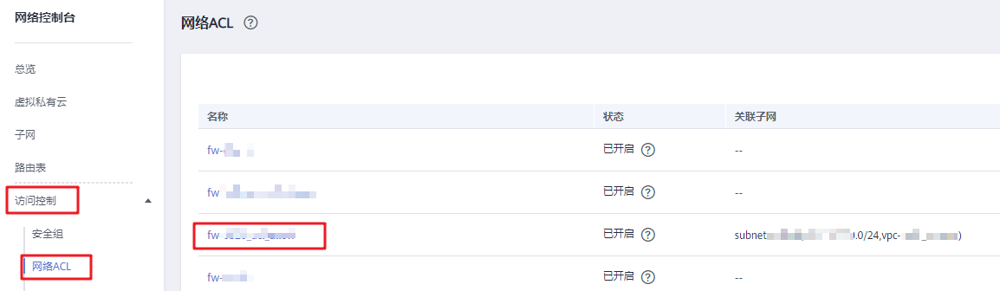
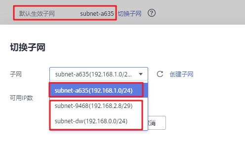

# 切换集群子网

MRS支持当子网IP不足时，切换子网到当前集群相同VPC下的其他子网，实现可用子网IP的扩充。切换子网不会影响当前已有节点的IP地址和子网。

如需对网络ACL出规则进行配置请参考[如何配置网络ACL出规则？](#section1070017367443)。

## 未关联网络ACL时切换子网

1.  登录MRS控制台。
2.  单击集群名称进入集群详情页。
3.  在“默认生效子网”右侧单击“切换子网”。

    **图 1**  切换子网  
    

4.  选择待切换子网，并单击“确定”完成切换。

    若没有可用子网，请单击“创建子网”进入VPC控制台创建子网后，再在此处引用。

    **图 2**  选择待切换子网  
    

## 关联网络ACL时切换子网

1.  登录MRS控制台，单击集群名称进入集群详情页。
2.  在MRS集群详情页，查看“虚拟私有云”。
3.  进入VPC控制台，在左侧导航处选择“虚拟私有云”，获取[2](#li169975160296)中查询的“虚拟私有云”对应的“IPv4网段”。

    **图 3**  获取IPv4网段地址  
    

4.  在VPC控制台左侧导航处选择“访问控制 \> 网络ACL”，单击MRS集群默认生效子网和切换后子网关联的网络ACL名称，选择“入方向规则”页签。

    > **说明：** 
    >若集群的默认生效子网和切换后子网均关联网络ACL，则两个子网关联的网络ACL中均需参考[5](#li1734493314818)-[7](#li13751204692115)增加入方向规则。

    **图 4**  网络ACL  
    

5.  在第一条规则的“操作”列，选择“更多 \> 向前插规则”。

    **图 5**  向前插规则  
    

6.  添加网络ACL规则，其中“策略”选择“允许”，“源地址”填入[3](#li16830135519358)中获取的“虚拟私有云”对应的“IPv4网段”，其他值保持默认即可。

    **图 6**  添加ACL规则  
    

7.  单击“确定”完成网络ACL规则添加。

    > **说明：** 
    >如果您不想放开VPC对应的全部IPv4网段的规则，请参考[8](#li211072116246)-[12](#li7329647202914)添加切换前后两个子网对应的IPv4网段地址。若已完成VPC对应IPv4网段的规则添加，则无需执行[8](#li211072116246)-[12](#li7329647202914)的操作。

8.  登录MRS控制台。
9.  单击集群名称进入集群详情页。
10. 在“默认生效子网”右侧单击“切换子网”。

    **图 7**  切换子网  
    

11. 获取“默认生效子网”和待切换子网对应的IPv4网段。

    > **须知：** 
    >此时请勿单击切换子网的“确定”按钮，否则默认生效子网将更新为切换后的子网，切换前的子网不易查询，请谨慎操作。

    **图 8**  获取子网IP  
    

12. 参考[4](#li69549305519)-[7](#li13751204692115)添加“默认生效子网”和待切换子网的IPv4网段地址到切换前后子网绑定的网络ACL入方向规则中。
13. 登录MRS控制台。
14. 单击集群名称进入集群详情页。
15. 在“默认生效子网”右侧单击“切换子网”。

    **图 9**  切换子网  
    

16. 选择待切换子网，并单击“确定”完成切换。

    **图 10**  选择待切换子网  
    

## 如何配置网络ACL出规则？

-   方案一：

    放通网络ACL所有出站流量，此方案能保证集群正常创建与使用，优先建议使用此方案。

    **图 11**  放通网络ACL所有出站流量配置示例  
    

-   方案二：

    放通保证集群创建成功的最小出规则，此方案可能在后续使用中因出方向规则遗漏导致集群使用问题，不建议使用方案。若出现集群使用问题请联系运维人员支撑处理。

    配置示例：参照方案一中示例，配置策略为“允许”，目的地址为通信安全授权地址、NTP、OBS、Openstack及DNS地址的出方向规则。

