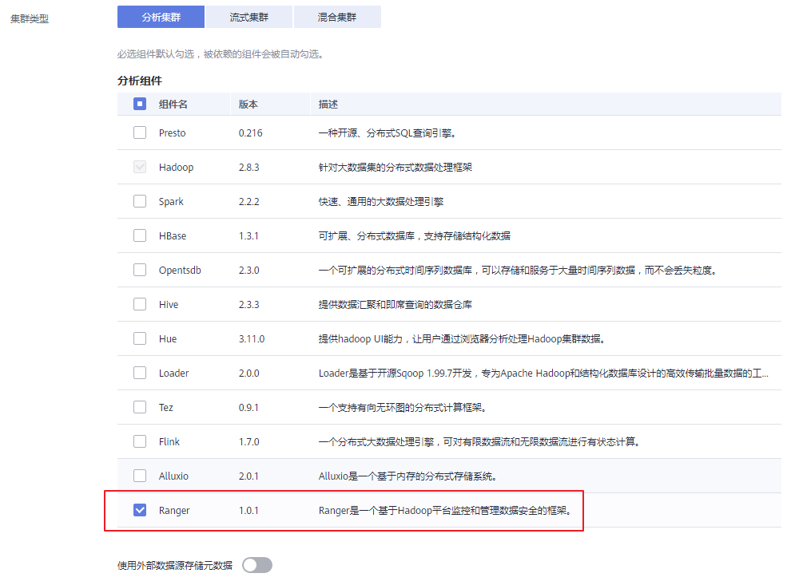
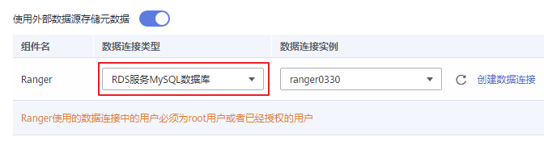

# 创建Ranger集群<a name="ZH-CN_TOPIC_0207621830"></a>

1.  参考[自定义购买集群](自定义购买集群.md)创建集群，组件选择时勾选Ranger组件（当前仅MRS 1.9.1版本支持）。

    目前仅普通集群支持Ranger组件，开启Kerberos认证的安全集群不支持Ranger组件。

    **图 1**  选择Ranger组件<a name="fig2069815285286"></a>  
    

2.  选择是否开启“使用外部数据源存储元数据“功能。
    -   开启：使用外置的Mysql数据库存储Ranger组件的User/Group/Policy等数据。
    -   关闭：Ranger组件的User/Group/Policy等数据默认存放在当前集群本地数据库中。

3.  当“使用外部数据源存储元数据“开启时，选择数据连接类型为“RDS服务MySQL数据库“，数据连接实例选择已创建的数据连接实例，或单击[创建数据连接](管理数据连接.md)新创建一个数据连接。

    **图 2**  使用RDS服务MySQL数据库<a name="fig172432954912"></a>  
    

    > **说明：**   
    >当用户选择的数据连接为“RDS服务MySQL数据库“时，请确保使用的数据库用户为root用户。如果为非root用户，需要先以root用户登录到数据库执行如下SQL命令为该数据库用户进行赋权，其中$\{db\_name\}与$\{db\_user\}为用户新建数据连接时输入的数据库名与用户名。  
    >```  
    >grant select on mysql.user to ${db_user};  
    >grant all privileges on ${db_name}.* to '${db_user}'@'%' with grant option;  
    >grant reload on *.* to '${db_user}'@'%' with grant option;  
    >flush privileges;  
    >```  

4.  继续参考[自定义购买集群](自定义购买集群.md)配置其他参数并创建集群。

    > **说明：**   
    >-   在集群创建完成后，此时Ranger不会对用户访问Hive和HBase组件的权限进行控制。  
    >-   使用Ranger管理各组件权限时，如管理hive表权限，在页面或者客户端提交hive作业（操作hive数据表），可能会提示当前用户没有权限，需要在Ranger中给提交作业的用户配置具体数据库或者表权限，以免影响用户使用提交作业功能，具体请参考[在Ranger中配置Hive的访问权限](在Ranger中配置Hive的访问权限.md)或[在Ranger中配置HBase的访问权限](在Ranger中配置HBase的访问权限.md)页面的添加策略步骤。  


