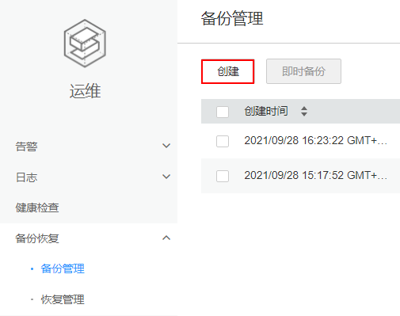

# 创建备份任务

## 操作场景

FusionInsight Manager支持在界面上创建备份任务，运行备份任务将对指定的数据进行备份。

## 操作步骤

1.  登录FusionInsight Manager。
2.  选择“运维  \>  备份恢复  \>  备份管理  \>  创建“。

    **图 1**  创建备份管理  
    

3.  设置“备份对象”为“OMS”或需要备份数据的集群。
4.  在“任务名称“输入参数值。
5.  在“备份类型“选择任务执行属性。

    **表 1**  备份类型说明

    
    <table><thead align="left"><tr id="row12391652113617"><th class="cellrowborder" valign="top" width="15%" id="mcps1.2.4.1.1">
类型

    </th>
    <th class="cellrowborder" valign="top" width="25%" id="mcps1.2.4.1.2">
参数

    </th>
    <th class="cellrowborder" valign="top" width="60%" id="mcps1.2.4.1.3">
说明

    </th>
    </tr>
    </thead>
    <tbody><tr id="row439120526365"><td class="cellrowborder" rowspan="3" valign="top" width="15%" headers="mcps1.2.4.1.1 ">
周期备份

    </td>
    <td class="cellrowborder" valign="top" width="25%" headers="mcps1.2.4.1.2 ">
开始时间

    </td>
    <td class="cellrowborder" valign="top" width="60%" headers="mcps1.2.4.1.3 ">
表示周期备份任务第一次启动的时间

    </td>
    </tr>
    <tr id="row10363131033720"><td class="cellrowborder" valign="top" headers="mcps1.2.4.1.1 ">
周期

    </td>
    <td class="cellrowborder" valign="top" headers="mcps1.2.4.1.2 ">
表示任务下次启动，与上一次运行的时间间隔，支持“小时”或“天”

    </td>
    </tr>
    <tr id="row12391105210367"><td class="cellrowborder" valign="top" headers="mcps1.2.4.1.1 ">
备份策略

    </td>
    <td class="cellrowborder" valign="top" headers="mcps1.2.4.1.2 ">
可以选择下策略：

    <ul id="ul165931532103918"><li>首次全量备份，后续增量备份</li><li>每次都全量备份</li><li>每n次进行一次全量备份</li></ul>
    </td>
    </tr>
    <tr id="row139185215366"><td class="cellrowborder" valign="top" width="15%" headers="mcps1.2.4.1.1 ">
手动备份

    </td>
    <td class="cellrowborder" valign="top" width="25%" headers="mcps1.2.4.1.2 ">
无

    </td>
    <td class="cellrowborder" valign="top" width="60%" headers="mcps1.2.4.1.3 ">
需要手动运行任务才能进行备份

    </td>
    </tr>
    </tbody>
    </table>

6.  在“备份配置“指定需要备份的数据。
    -   支持备份元数据和业务数据。
    -   各组件不同数据的备份任务操作请参考[备份恢复管理](备份恢复管理.md)。

7.  单击“确定“保存。
8.  在备份任务列表，可以查看刚创建的备份任务。

    在指定的备份任务“操作”列，选择“更多  \>  即时备份“，可以立即运行备份任务。

